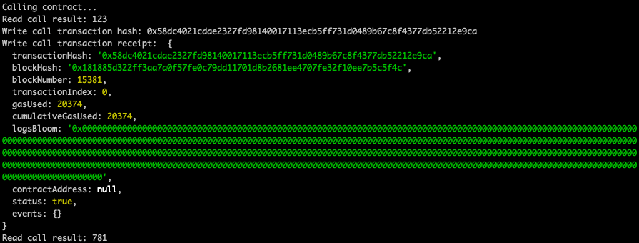

1. Call contract:

   

2. Txid: 0x58dc4021cdae2327fd98140017113ecb5ff731d0489b67c8f4377db52212e9ca
3. Contract: 0x589991B03d68c9C48FfB2644B71A7942FB5576B0
4. ABI
```
[
    {
      "inputs": [],
      "stateMutability": "payable",
      "type": "constructor"
    },
    {
      "inputs": [
        {
          "internalType": "uint256",
          "name": "x",
          "type": "uint256"
        }
      ],
      "name": "set",
      "outputs": [],
      "stateMutability": "payable",
      "type": "function"
    },
    {
      "inputs": [],
      "name": "get",
      "outputs": [
        {
          "internalType": "uint256",
          "name": "",
          "type": "uint256"
        }
      ],
      "stateMutability": "view",
      "type": "function"
    }
]
```
 
