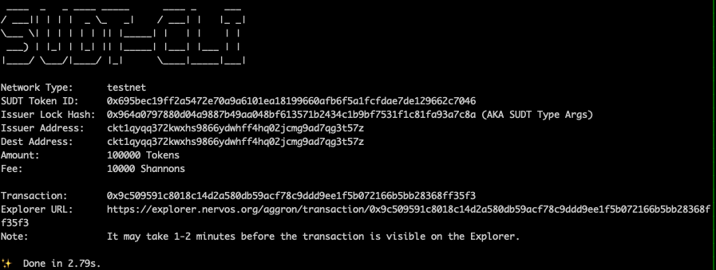
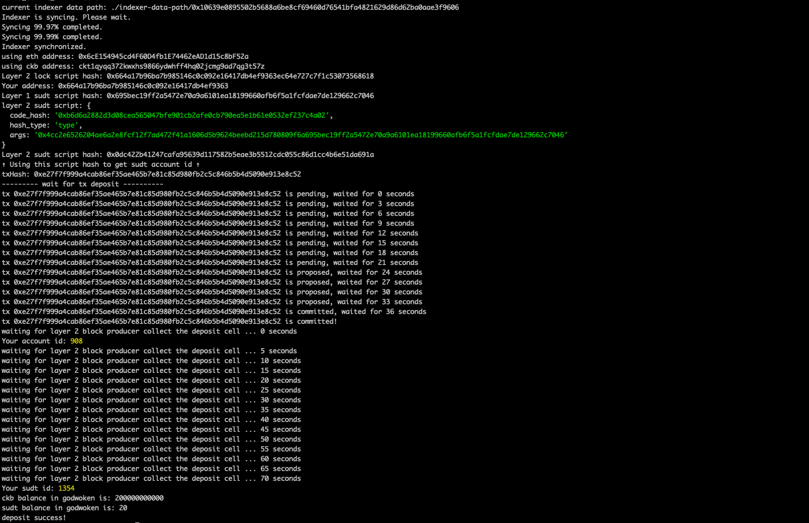

1. Layer1 address: ckt1qyqq372kwxhs9866ydwhff4hq02jcmg9ad7qg3t57z 
2. sudt:

   

3. Txid: https://explorer.nervos.org/aggron/transaction/0x9c509591c8018c14d2a580db59acf78c9ddd9ee1f5b072166b5bb28368ff35f3 
4. Layer2 deposit

  

5. sudt id: 1354
