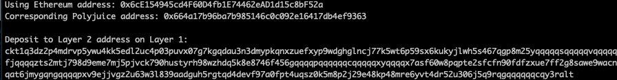

1. receiver address png: 
2. receiver address txt:   ckt1q3dz2p4mdrvp5ywu4kk5edl2uc4p03puvx07g7kgqdau3n3dmypkqnxzuefxyp9wdghglncj77k5wt6p59sx6kukyjlwh5s467qgp8m25yqqqqqsqqqqqvqqqqqfjqqqqzts2mtj798d9eme7mj5pjvck790hustyrh98wzhdq5k8e8746f456gqqqqpqqqqqqcqqqqqxyqqqqx7asf60w8pqpte2sfcfn90fdfzxue7ff2g8sawe9wacnqat6jmygqngqqqqpxv9ejjvgz2u63w3l839aadguh5rgtqd4devf97a0fpt4uqsz0k5m8p2j29e48kp48mre6yvt4dr52u306j5q9rqgqqqqqqcqy3ralt 
3. 0x6cE154945cd4F60D4fb1E74462eAD1d15c8bF52a
4. https://rinkeby.etherscan.io/tx/0x63bdc278b60ea45644a3222066e08b9c34087d32d36cca43e0e251aef7ccb7da 
5. https://explorer.nervos.org/aggron/transaction/0xd2798f535b80bf21806eb512690276fdbe5cef52c10a40f64f74358afcd3ef7b 
