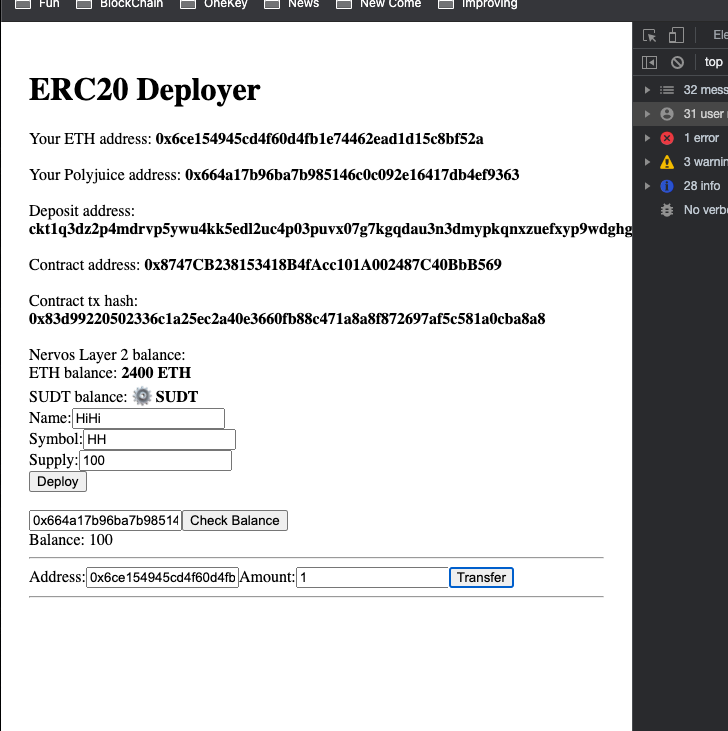

1. App:
  
2. [Project](https://github.com/huazhouwang/gitcoin_ckb/tree/main/task7/app)
3. Txid: 0x83d99220502336c1a25ec2a40e3660fb88c471a8a8f872697af5c581a0cba8a8, Contract: 0x8747CB238153418B4fAcc101A002487C40BbB569, ABI:
```
{
  "contractName": "ERC20",
  "abi": [
    {
      "inputs": [
        {
          "internalType": "string",
          "name": "_name",
          "type": "string"
        },
        {
          "internalType": "string",
          "name": "_symbol",
          "type": "string"
        },
        {
          "internalType": "uint256",
          "name": "_supply",
          "type": "uint256"
        }
      ],
      "stateMutability": "nonpayable",
      "type": "constructor"
    },
    {
      "inputs": [],
      "name": "decimals",
      "outputs": [
        {
          "internalType": "uint8",
          "name": "",
          "type": "uint8"
        }
      ],
      "stateMutability": "view",
      "type": "function"
    },
    {
      "inputs": [],
      "name": "name",
      "outputs": [
        {
          "internalType": "string",
          "name": "",
          "type": "string"
        }
      ],
      "stateMutability": "view",
      "type": "function"
    },
    {
      "inputs": [],
      "name": "symbol",
      "outputs": [
        {
          "internalType": "string",
          "name": "",
          "type": "string"
        }
      ],
      "stateMutability": "view",
      "type": "function"
    },
    {
      "inputs": [
        {
          "internalType": "address",
          "name": "recipient",
          "type": "address"
        },
        {
          "internalType": "uint256",
          "name": "value",
          "type": "uint256"
        }
      ],
      "name": "transfer",
      "outputs": [],
      "stateMutability": "nonpayable",
      "type": "function"
    },
    {
      "inputs": [
        {
          "internalType": "address",
          "name": "account",
          "type": "address"
        }
      ],
      "name": "balanceOf",
      "outputs": [
        {
          "internalType": "uint256",
          "name": "",
          "type": "uint256"
        }
      ],
      "stateMutability": "nonpayable",
      "type": "function"
    }
  ],
  "metadata": "{\"compiler\":{\"version\":\"0.8.3+commit.8d00100c\"},\"language\":\"Solidity\",\"output\":{\"abi\":[{\"inputs\":[{\"internalType\":\"string\",\"name\":\"_name\",\"type\":\"string\"},{\"internalType\":\"string\",\"name\":\"_symbol\",\"type\":\"string\"},{\"internalType\":\"uint256\",\"name\":\"_supply\",\"type\":\"uint256\"}],\"stateMutability\":\"nonpayable\",\"type\":\"constructor\"},{\"inputs\":[{\"internalType\":\"address\",\"name\":\"account\",\"type\":\"address\"}],\"name\":\"balanceOf\",\"outputs\":[{\"internalType\":\"uint256\",\"name\":\"\",\"type\":\"uint256\"}],\"stateMutability\":\"nonpayable\",\"type\":\"function\"},{\"inputs\":[],\"name\":\"decimals\",\"outputs\":[{\"internalType\":\"uint8\",\"name\":\"\",\"type\":\"uint8\"}],\"stateMutability\":\"view\",\"type\":\"function\"},{\"inputs\":[],\"name\":\"name\",\"outputs\":[{\"internalType\":\"string\",\"name\":\"\",\"type\":\"string\"}],\"stateMutability\":\"view\",\"type\":\"function\"},{\"inputs\":[],\"name\":\"symbol\",\"outputs\":[{\"internalType\":\"string\",\"name\":\"\",\"type\":\"string\"}],\"stateMutability\":\"view\",\"type\":\"function\"},{\"inputs\":[{\"internalType\":\"address\",\"name\":\"recipient\",\"type\":\"address\"},{\"internalType\":\"uint256\",\"name\":\"value\",\"type\":\"uint256\"}],\"name\":\"transfer\",\"outputs\":[],\"stateMutability\":\"nonpayable\",\"type\":\"function\"}],\"devdoc\":{\"kind\":\"dev\",\"methods\":{},\"version\":1},\"userdoc\":{\"kind\":\"user\",\"methods\":{},\"version\":1}},\"settings\":{\"compilationTarget\":{\"/Users/huazhou/gitcoin_ckb/blockchain-workshop-ethereum-simple/contracts/ERC20.sol\":\"ERC20\"},\"evmVersion\":\"istanbul\",\"libraries\":{},\"metadata\":{\"bytecodeHash\":\"ipfs\"},\"optimizer\":{\"enabled\":false,\"runs\":200},\"remappings\":[]},\"sources\":{\"/Users/huazhou/gitcoin_ckb/blockchain-workshop-ethereum-simple/contracts/ERC20.sol\":{\"keccak256\":\"0x1c9ecf7348fc8ccb350df74a66feaffb497af59fb33267ffb45294c1100d6fbe\",\"urls\":[\"bzz-raw://816532320328c0972f685304afb656c02c7006a7a3038b14e52b7e7059b450b8\",\"dweb:/ipfs/QmVPZi3M68TZvTpNAK8gfabyVcuu34yxqvK9J72654SvTT\"]}},\"version\":1}",
  "bytecode": "0x60806040526012600260006101000a81548160ff021916908360ff1602179055503480156200002d57600080fd5b5060405162000b1838038062000b18833981810160405281019062000053919062000212565b82600090805190602001906200006b929190620000d9565b50816001908051906020019062000084929190620000d9565b508060038190555080600460003373ffffffffffffffffffffffffffffffffffffffff1673ffffffffffffffffffffffffffffffffffffffff168152602001908152602001600020819055505050506200042e565b828054620000e79062000339565b90600052602060002090601f0160209004810192826200010b576000855562000157565b82601f106200012657805160ff191683800117855562000157565b8280016001018555821562000157579182015b828111156200015657825182559160200191906001019062000139565b5b5090506200016691906200016a565b5090565b5b80821115620001855760008160009055506001016200016b565b5090565b6000620001a06200019a84620002c3565b6200029a565b905082815260208101848484011115620001b957600080fd5b620001c684828562000303565b509392505050565b600082601f830112620001e057600080fd5b8151620001f284826020860162000189565b91505092915050565b6000815190506200020c8162000414565b92915050565b6000806000606084860312156200022857600080fd5b600084015167ffffffffffffffff8111156200024357600080fd5b6200025186828701620001ce565b935050602084015167ffffffffffffffff8111156200026f57600080fd5b6200027d86828701620001ce565b92505060406200029086828701620001fb565b9150509250925092565b6000620002a6620002b9565b9050620002b482826200036f565b919050565b6000604051905090565b600067ffffffffffffffff821115620002e157620002e0620003d4565b5b620002ec8262000403565b9050602081019050919050565b6000819050919050565b60005b838110156200032357808201518184015260208101905062000306565b8381111562000333576000848401525b50505050565b600060028204905060018216806200035257607f821691505b60208210811415620003695762000368620003a5565b5b50919050565b6200037a8262000403565b810181811067ffffffffffffffff821117156200039c576200039b620003d4565b5b80604052505050565b7f4e487b7100000000000000000000000000000000000000000000000000000000600052602260045260246000fd5b7f4e487b7100000000000000000000000000000000000000000000000000000000600052604160045260246000fd5b6000601f19601f8301169050919050565b6200041f81620002f9565b81146200042b57600080fd5b50565b6106da806200043e6000396000f3fe608060405234801561001057600080fd5b50600436106100575760003560e01c806306fdde031461005c578063313ce5671461007a57806370a082311461009857806395d89b41146100c8578063a9059cbb146100e6575b600080fd5b610064610102565b604051610071919061045b565b60405180910390f35b610082610190565b60405161008f9190610498565b60405180910390f35b6100b260048036038101906100ad919061039f565b6101a3565b6040516100bf919061047d565b60405180910390f35b6100d06101ec565b6040516100dd919061045b565b60405180910390f35b61010060048036038101906100fb91906103c8565b61027a565b005b6000805461010f906105d5565b80601f016020809104026020016040519081016040528092919081815260200182805461013b906105d5565b80156101885780601f1061015d57610100808354040283529160200191610188565b820191906000526020600020905b81548152906001019060200180831161016b57829003601f168201915b505050505081565b600260009054906101000a900460ff1681565b6000600460008373ffffffffffffffffffffffffffffffffffffffff1673ffffffffffffffffffffffffffffffffffffffff168152602001908152602001600020549050919050565b600180546101f9906105d5565b80601f0160208091040260200160405190810160405280929190818152602001828054610225906105d5565b80156102725780601f1061024757610100808354040283529160200191610272565b820191906000526020600020905b81548152906001019060200180831161025557829003601f168201915b505050505081565b80600460003373ffffffffffffffffffffffffffffffffffffffff1673ffffffffffffffffffffffffffffffffffffffff16815260200190815260200160002054116102c557600080fd5b80600460003373ffffffffffffffffffffffffffffffffffffffff1673ffffffffffffffffffffffffffffffffffffffff16815260200190815260200160002060008282546103149190610525565b9250508190555080600460008473ffffffffffffffffffffffffffffffffffffffff1673ffffffffffffffffffffffffffffffffffffffff168152602001908152602001600020600082825461036a91906104cf565b925050819055505050565b60008135905061038481610676565b92915050565b6000813590506103998161068d565b92915050565b6000602082840312156103b157600080fd5b60006103bf84828501610375565b91505092915050565b600080604083850312156103db57600080fd5b60006103e985828601610375565b92505060206103fa8582860161038a565b9150509250929050565b600061040f826104b3565b61041981856104be565b93506104298185602086016105a2565b61043281610665565b840191505092915050565b6104468161058b565b82525050565b61045581610595565b82525050565b600060208201905081810360008301526104758184610404565b905092915050565b6000602082019050610492600083018461043d565b92915050565b60006020820190506104ad600083018461044c565b92915050565b600081519050919050565b600082825260208201905092915050565b60006104da8261058b565b91506104e58361058b565b9250827fffffffffffffffffffffffffffffffffffffffffffffffffffffffffffffffff0382111561051a57610519610607565b5b828201905092915050565b60006105308261058b565b915061053b8361058b565b92508282101561054e5761054d610607565b5b828203905092915050565b60006105648261056b565b9050919050565b600073ffffffffffffffffffffffffffffffffffffffff82169050919050565b6000819050919050565b600060ff82169050919050565b60005b838110156105c05780820151818401526020810190506105a5565b838111156105cf576000848401525b50505050565b600060028204905060018216806105ed57607f821691505b6020821081141561060157610600610636565b5b50919050565b7f4e487b7100000000000000000000000000000000000000000000000000000000600052601160045260246000fd5b7f4e487b7100000000000000000000000000000000000000000000000000000000600052602260045260246000fd5b6000601f19601f8301169050919050565b61067f81610559565b811461068a57600080fd5b50565b6106968161058b565b81146106a157600080fd5b5056fea2646970667358221220bbe61c05a234c3c6c3f7aaed5f86d466ddaa9552009786e9234b2c77a11fa16664736f6c63430008030033",
  "deployedBytecode": "0x608060405234801561001057600080fd5b50600436106100575760003560e01c806306fdde031461005c578063313ce5671461007a57806370a082311461009857806395d89b41146100c8578063a9059cbb146100e6575b600080fd5b610064610102565b604051610071919061045b565b60405180910390f35b610082610190565b60405161008f9190610498565b60405180910390f35b6100b260048036038101906100ad919061039f565b6101a3565b6040516100bf919061047d565b60405180910390f35b6100d06101ec565b6040516100dd919061045b565b60405180910390f35b61010060048036038101906100fb91906103c8565b61027a565b005b6000805461010f906105d5565b80601f016020809104026020016040519081016040528092919081815260200182805461013b906105d5565b80156101885780601f1061015d57610100808354040283529160200191610188565b820191906000526020600020905b81548152906001019060200180831161016b57829003601f168201915b505050505081565b600260009054906101000a900460ff1681565b6000600460008373ffffffffffffffffffffffffffffffffffffffff1673ffffffffffffffffffffffffffffffffffffffff168152602001908152602001600020549050919050565b600180546101f9906105d5565b80601f0160208091040260200160405190810160405280929190818152602001828054610225906105d5565b80156102725780601f1061024757610100808354040283529160200191610272565b820191906000526020600020905b81548152906001019060200180831161025557829003601f168201915b505050505081565b80600460003373ffffffffffffffffffffffffffffffffffffffff1673ffffffffffffffffffffffffffffffffffffffff16815260200190815260200160002054116102c557600080fd5b80600460003373ffffffffffffffffffffffffffffffffffffffff1673ffffffffffffffffffffffffffffffffffffffff16815260200190815260200160002060008282546103149190610525565b9250508190555080600460008473ffffffffffffffffffffffffffffffffffffffff1673ffffffffffffffffffffffffffffffffffffffff168152602001908152602001600020600082825461036a91906104cf565b925050819055505050565b60008135905061038481610676565b92915050565b6000813590506103998161068d565b92915050565b6000602082840312156103b157600080fd5b60006103bf84828501610375565b91505092915050565b600080604083850312156103db57600080fd5b60006103e985828601610375565b92505060206103fa8582860161038a565b9150509250929050565b600061040f826104b3565b61041981856104be565b93506104298185602086016105a2565b61043281610665565b840191505092915050565b6104468161058b565b82525050565b61045581610595565b82525050565b600060208201905081810360008301526104758184610404565b905092915050565b6000602082019050610492600083018461043d565b92915050565b60006020820190506104ad600083018461044c565b92915050565b600081519050919050565b600082825260208201905092915050565b60006104da8261058b565b91506104e58361058b565b9250827fffffffffffffffffffffffffffffffffffffffffffffffffffffffffffffffff0382111561051a57610519610607565b5b828201905092915050565b60006105308261058b565b915061053b8361058b565b92508282101561054e5761054d610607565b5b828203905092915050565b60006105648261056b565b9050919050565b600073ffffffffffffffffffffffffffffffffffffffff82169050919050565b6000819050919050565b600060ff82169050919050565b60005b838110156105c05780820151818401526020810190506105a5565b838111156105cf576000848401525b50505050565b600060028204905060018216806105ed57607f821691505b6020821081141561060157610600610636565b5b50919050565b7f4e487b7100000000000000000000000000000000000000000000000000000000600052601160045260246000fd5b7f4e487b7100000000000000000000000000000000000000000000000000000000600052602260045260246000fd5b6000601f19601f8301169050919050565b61067f81610559565b811461068a57600080fd5b50565b6106968161058b565b81146106a157600080fd5b5056fea2646970667358221220bbe61c05a234c3c6c3f7aaed5f86d466ddaa9552009786e9234b2c77a11fa16664736f6c63430008030033",
  "immutableReferences": {},
  "generatedSources": [
    {
      "ast": {
        "nodeType": "YulBlock",
        "src": "0:3782:2",
        "statements": [
          {
            "body": {
              "nodeType": "YulBlock",
              "src": "102:259:2",
              "statements": [
                {
                  "nodeType": "YulAssignment",
                  "src": "112:75:2",
                  "value": {
                    "arguments": [
                      {
                        "arguments": [
                          {
                            "name": "length",
                            "nodeType": "YulIdentifier",
                            "src": "179:6:2"
                          }
                        ],
                        "functionName": {
                          "name": "array_allocation_size_t_string_memory_ptr",
                          "nodeType": "YulIdentifier",
                          "src": "137:41:2"
                        },
                        "nodeType": "YulFunctionCall",
                        "src": "137:49:2"
                      }
                    ],
                    "functionName": {
                      "name": "allocate_memory",
                      "nodeType": "YulIdentifier",
                      "src": "121:15:2"
                    },
                    "nodeType": "YulFunctionCall",
                    "src": "121:66:2"
                  },
                  "variableNames": [
                    {
                      "name": "array",
                      "nodeType": "YulIdentifier",
                      "src": "112:5:2"
                    }
                  ]
                },
                {
                  "expression": {
                    "arguments": [
                      {
                        "name": "array",
                        "nodeType": "YulIdentifier",
                        "src": "203:5:2"
                      },
                      {
                        "name": "length",
                        "nodeType": "YulIdentifier",
                        "src": "210:6:2"
                      }
                    ],
                    "functionName": {
                      "name": "mstore",
                      "nodeType": "YulIdentifier",
                      "src": "196:6:2"
                    },
                    "nodeType": "YulFunctionCall",
                    "src": "196:21:2"
                  },
                  "nodeType": "YulExpressionStatement",
                  "src": "196:21:2"
                },
                {
                  "nodeType": "YulVariableDeclaration",
                  "src": "226:27:2",
                  "value": {
                    "arguments": [
                      {
                        "name": "array",
                        "nodeType": "YulIdentifier",
                        "src": "241:5:2"
                      },
                      {
                        "kind": "number",
                        "nodeType": "YulLiteral",
                        "src": "248:4:2",
                        "type": "",
                        "value": "0x20"
                      }
                    ],
                    "functionName": {
                      "name": "add",
                      "nodeType": "YulIdentifier",
                      "src": "237:3:2"
                    },
                    "nodeType": "YulFunctionCall",
                    "src": "237:16:2"
                  },
                  "variables": [
                    {
                      "name": "dst",
                      "nodeType": "YulTypedName",
                      "src": "230:3:2",
                      "type": ""
                    }
                  ]
                },
                {
                  "body": {
                    "nodeType": "YulBlock",
                    "src": "291:16:2",
                    "statements": [
                      {
                        "expression": {
                          "arguments": [
                            {
                              "kind": "number",
                              "nodeType": "YulLiteral",
                              "src": "300:1:2",
                              "type": "",
                              "value": "0"
                            },
                            {
                              "kind": "number",
                              "nodeType": "YulLiteral",
                              "src": "303:1:2",
                              "type": "",
                              "value": "0"
                            }
                          ],
                          "functionName": {
                            "name": "revert",
                            "nodeType": "YulIdentifier",
                            "src": "293:6:2"
                          },
                          "nodeType": "YulFunctionCall",
                          "src": "293:12:2"
                        },
                        "nodeType": "YulExpressionStatement",
                        "src": "293:12:2"
                      }
                    ]
                  },
                  "condition": {
                    "arguments": [
                      {
                        "arguments": [
                          {
                            "name": "src",
                            "nodeType": "YulIdentifier",
                            "src": "272:3:2"
                          },
                          {
                            "name": "length",
                            "nodeType": "YulIdentifier",
                            "src": "277:6:2"
                          }
                        ],
                        "functionName": {
                          "name": "add",
                          "nodeType": "YulIdentifier",
                          "src": "268:3:2"
                        },
                        "nodeType": "YulFunctionCall",
                        "src": "268:16:2"
                      },
                      {
                        "name": "end",
                        "nodeType": "YulIdentifier",
                        "src": "286:3:2"
                      }
                    ],
                    "functionName": {
                      "name": "gt",
                      "nodeType": "YulIdentifier",
                      "src": "265:2:2"
                    },
                    "nodeType": "YulFunctionCall",
                    "src": "265:25:2"
                  },
                  "nodeType": "YulIf",
                  "src": "262:2:2"
                },
                {
                  "expression": {
                    "arguments": [
                      {
                        "name": "src",
                        "nodeType": "YulIdentifier",
                        "src": "338:3:2"
                      },
                      {
                        "name": "dst",
                        "nodeType": "YulIdentifier",
                        "src": "343:3:2"
                      },
                      {
                        "name": "length",
                        "nodeType": "YulIdentifier",
                        "src": "348:6:2"
                      }
                    ],
                    "functionName": {
                      "name": "copy_memory_to_memory",
                      "nodeType": "YulIdentifier",
                      "src": "316:21:2"
                    },
                    "nodeType": "YulFunctionCall",
                    "src": "316:39:2"
                  },
                  "nodeType": "YulExpressionStatement",
                  "src": "316:39:2"
                }
              ]
            },
            "name": "abi_decode_available_length_t_string_memory_ptr_fromMemory",
            "nodeType": "YulFunctionDefinition",
            "parameters": [
              {
                "name": "src",
                "nodeType": "YulTypedName",
                "src": "75:3:2",
                "type": ""
              },
              {
                "name": "length",
                "nodeType": "YulTypedName",
                "src": "80:6:2",
                "type": ""
              },
              {
                "name": "end",
                "nodeType": "YulTypedName",
                "src": "88:3:2",
                "type": ""
              }
            ],
            "returnVariables": [
              {
                "name": "array",
                "nodeType": "YulTypedName",
                "src": "96:5:2",
                "type": ""
              }
            ],
            "src": "7:354:2"
          },
          {
            "body": {
              "nodeType": "YulBlock",
              "src": "454:215:2",
              "statements": [
                {
                  "body": {
                    "nodeType": "YulBlock",
                    "src": "503:16:2",
                    "statements": [
                      {
                        "expression": {
                          "arguments": [
                            {
                              "kind": "number",
                              "nodeType": "YulLiteral",
                              "src": "512:1:2",
                              "type": "",
                              "value": "0"
                            },
                            {
                              "kind": "number",
                              "nodeType": "YulLiteral",
                              "src": "515:1:2",
                              "type": "",
                              "value": "0"
                            }
                          ],
                          "functionName": {
                            "name": "revert",
                            "nodeType": "YulIdentifier",
                            "src": "505:6:2"
                          },
                          "nodeType": "YulFunctionCall",
                          "src": "505:12:2"
                        },
                        "nodeType": "YulExpressionStatement",
                        "src": "505:12:2"
                      }
                    ]
                  },
                  "condition": {
                    "arguments": [
                      {
                        "arguments": [
                          {
                            "arguments": [
                              {
                                "name": "offset",
                                "nodeType": "YulIdentifier",
                                "src": "482:6:2"
                              },
                              {
                                "kind": "number",
                                "nodeType": "YulLiteral",
                                "src": "490:4:2",
                                "type": "",
                                "value": "0x1f"
                              }
                            ],
                            "functionName": {
                              "name": "add",
                              "nodeType": "YulIdentifier",
                              "src": "478:3:2"
                            },
                            "nodeType": "YulFunctionCall",
                            "src": "478:17:2"
                          },
                          {
                            "name": "end",
                            "nodeType": "YulIdentifier",
                            "src": "497:3:2"
                          }
                        ],
                        "functionName": {
                          "name": "slt",
                          "nodeType": "YulIdentifier",
                          "src": "474:3:2"
                        },
                        "nodeType": "YulFunctionCall",
                        "src": "474:27:2"
                      }
                    ],
                    "functionName": {
                      "name": "iszero",
                      "nodeType": "YulIdentifier",
                      "src": "467:6:2"
                    },
                    "nodeType": "YulFunctionCall",
                    "src": "467:35:2"
                  },
                  "nodeType": "YulIf",
                  "src": "464:2:2"
                },
                {
                  "nodeType": "YulVariableDeclaration",
                  "src": "528:27:2",
                  "value": {
                    "arguments": [
                      {
                        "name": "offset",
                        "nodeType": "YulIdentifier",
                        "src": "548:6:2"
                      }
                    ],
                    "functionName": {
                      "name": "mload",
                      "nodeType": "YulIdentifier",
                      "src": "542:5:2"
                    },
                    "nodeType": "YulFunctionCall",
                    "src": "542:13:2"
                  },
                  "variables": [
                    {
                      "name": "length",
                      "nodeType": "YulTypedName",
                      "src": "532:6:2",
                      "type": ""
                    }
                  ]
                },
                {
                  "nodeType": "YulAssignment",
                  "src": "564:99:2",
                  "value": {
                    "arguments": [
                      {
                        "arguments": [
                          {
                            "name": "offset",
                            "nodeType": "YulIdentifier",
                            "src": "636:6:2"
                          },
                          {
                            "kind": "number",
                            "nodeType": "YulLiteral",
                            "src": "644:4:2",
                            "type": "",
                            "value": "0x20"
                          }
                        ],
                        "functionName": {
                          "name": "add",
                          "nodeType": "YulIdentifier",
                          "src": "632:3:2"
                        },
                        "nodeType": "YulFunctionCall",
                        "src": "632:17:2"
                      },
                      {
                        "name": "length",
                        "nodeType": "YulIdentifier",
                        "src": "651:6:2"
                      },
                      {
                        "name": "end",
                        "nodeType": "YulIdentifier",
                        "src": "659:3:2"
                      }
                    ],
                    "functionName": {
                      "name": "abi_decode_available_length_t_string_memory_ptr_fromMemory",
                      "nodeType": "YulIdentifier",
                      "src": "573:58:2"
                    },
                    "nodeType": "YulFunctionCall",
                    "src": "573:90:2"
                  },
                  "variableNames": [
                    {
                      "name": "array",
                      "nodeType": "YulIdentifier",
                      "src": "564:5:2"
                    }
                  ]
                }
              ]
            },
            "name": "abi_decode_t_string_memory_ptr_fromMemory",
            "nodeType": "YulFunctionDefinition",
            "parameters": [
              {
                "name": "offset",
                "nodeType": "YulTypedName",
                "src": "432:6:2",
                "type": ""
              },
              {
                "name": "end",
                "nodeType": "YulTypedName",
                "src": "440:3:2",
                "type": ""
              }
            ],
            "returnVariables": [
              {
                "name": "array",
                "nodeType": "YulTypedName",
                "src": "448:5:2",
                "type": ""
              }
            ],
            "src": "381:288:2"
          },
          {
            "body": {
              "nodeType": "YulBlock",
              "src": "738:80:2",
              "statements": [
                {
                  "nodeType": "YulAssignment",
                  "src": "748:22:2",
                  "value": {
                    "arguments": [
                      {
                        "name": "offset",
                        "nodeType": "YulIdentifier",
                        "src": "763:6:2"
                      }
                    ],
                    "functionName": {
                      "name": "mload",
                      "nodeType": "YulIdentifier",
                      "src": "757:5:2"
                    },
                    "nodeType": "YulFunctionCall",
                    "src": "757:13:2"
                  },
                  "variableNames": [
                    {
                      "name": "value",
                      "nodeType": "YulIdentifier",
                      "src": "748:5:2"
                    }
                  ]
                },
                {
                  "expression": {
                    "arguments": [
                      {
                        "name": "value",
                        "nodeType": "YulIdentifier",
                        "src": "806:5:2"
                      }
                    ],
                    "functionName": {
                      "name": "validator_revert_t_uint256",
                      "nodeType": "YulIdentifier",
                      "src": "779:26:2"
                    },
                    "nodeType": "YulFunctionCall",
                    "src": "779:33:2"
                  },
                  "nodeType": "YulExpressionStatement",
                  "src": "779:33:2"
                }
              ]
            },
            "name": "abi_decode_t_uint256_fromMemory",
            "nodeType": "YulFunctionDefinition",
            "parameters": [
              {
                "name": "offset",
                "nodeType": "YulTypedName",
                "src": "716:6:2",
                "type": ""
              },
              {
                "name": "end",
                "nodeType": "YulTypedName",
                "src": "724:3:2",
                "type": ""
              }
            ],
            "returnVariables": [
              {
                "name": "value",
                "nodeType": "YulTypedName",
                "src": "732:5:2",
                "type": ""
              }
            ],
            "src": "675:143:2"
          },
          {
            "body": {
              "nodeType": "YulBlock",
              "src": "955:677:2",
              "statements": [
                {
                  "body": {
                    "nodeType": "YulBlock",
                    "src": "1001:16:2",
                    "statements": [
                      {
                        "expression": {
                          "arguments": [
                            {
                              "kind": "number",
                              "nodeType": "YulLiteral",
                              "src": "1010:1:2",
                              "type": "",
                              "value": "0"
                            },
                            {
                              "kind": "number",
                              "nodeType": "YulLiteral",
                              "src": "1013:1:2",
                              "type": "",
                              "value": "0"
                            }
                          ],
                          "functionName": {
                            "name": "revert",
                            "nodeType": "YulIdentifier",
                            "src": "1003:6:2"
                          },
                          "nodeType": "YulFunctionCall",
                          "src": "1003:12:2"
                        },
                        "nodeType": "YulExpressionStatement",
                        "src": "1003:12:2"
                      }
                    ]
                  },
                  "condition": {
                    "arguments": [
                      {
                        "arguments": [
                          {
                            "name": "dataEnd",
                            "nodeType": "YulIdentifier",
                            "src": "976:7:2"
                          },
                          {
                            "name": "headStart",
                            "nodeType": "YulIdentifier",
                            "src": "985:9:2"
                          }
                        ],
                        "functionName": {
                          "name": "sub",
                          "nodeType": "YulIdentifier",
                          "src": "972:3:2"
                        },
                        "nodeType": "YulFunctionCall",
                        "src": "972:23:2"
                      },
                      {
                        "kind": "number",
                        "nodeType": "YulLiteral",
                        "src": "997:2:2",
                        "type": "",
                        "value": "96"
                      }
                    ],
                    "functionName": {
                      "name": "slt",
                      "nodeType": "YulIdentifier",
                      "src": "968:3:2"
                    },
                    "nodeType": "YulFunctionCall",
                    "src": "968:32:2"
                  },
                  "nodeType": "YulIf",
                  "src": "965:2:2"
                },
                {
                  "nodeType": "YulBlock",
                  "src": "1027:224:2",
                  "statements": [
                    {
                      "nodeType": "YulVariableDeclaration",
                      "src": "1042:38:2",
                      "value": {
                        "arguments": [
                          {
                            "arguments": [
                              {
                                "name": "headStart",
                                "nodeType": "YulIdentifier",
                                "src": "1066:9:2"
                              },
                              {
                                "kind": "number",
                                "nodeType": "YulLiteral",
                                "src": "1077:1:2",
                                "type": "",
                                "value": "0"
                              }
                            ],
                            "functionName": {
                              "name": "add",
                              "nodeType": "YulIdentifier",
                              "src": "1062:3:2"
                            },
                            "nodeType": "YulFunctionCall",
                            "src": "1062:17:2"
                          }
                        ],
                        "functionName": {
                          "name": "mload",
                          "nodeType": "YulIdentifier",
                          "src": "1056:5:2"
                        },
                        "nodeType": "YulFunctionCall",
                        "src": "1056:24:2"
                      },
                      "variables": [
                        {
                          "name": "offset",
                          "nodeType": "YulTypedName",
                          "src": "1046:6:2",
                          "type": ""
                        }
                      ]
                    },
                    {
                      "body": {
                        "nodeType": "YulBlock",
                        "src": "1127:16:2",
                        "statements": [
                          {
                            "expression": {
                              "arguments": [
                                {
                                  "kind": "number",
                                  "nodeType": "YulLiteral",
                                  "src": "1136:1:2",
                                  "type": "",
                                  "value": "0"
                                },
                                {
                                  "kind": "number",
                                  "nodeType": "YulLiteral",
                                  "src": "1139:1:2",
                                  "type": "",
                                  "value": "0"
                                }
                              ],
                              "functionName": {
                                "name": "revert",
                                "nodeType": "YulIdentifier",
                                "src": "1129:6:2"
                              },
                              "nodeType": "YulFunctionCall",
                              "src": "1129:12:2"
                            },
                            "nodeType": "YulExpressionStatement",
                            "src": "1129:12:2"
                          }
                        ]
                      },
                      "condition": {
                        "arguments": [
                          {
                            "name": "offset",
                            "nodeType": "YulIdentifier",
                            "src": "1099:6:2"
                          },
                          {
                            "kind": "number",
                            "nodeType": "YulLiteral",
                            "src": "1107:18:2",
                            "type": "",
                            "value": "0xffffffffffffffff"
                          }
                        ],
                        "functionName": {
                          "name": "gt",
                          "nodeType": "YulIdentifier",
                          "src": "1096:2:2"
                        },
                        "nodeType": "YulFunctionCall",
                        "src": "1096:30:2"
                      },
                      "nodeType": "YulIf",
                      "src": "1093:2:2"
                    },
                    {
                      "nodeType": "YulAssignment",
                      "src": "1157:84:2",
                      "value": {
                        "arguments": [
                          {
                            "arguments": [
                              {
                                "name": "headStart",
                                "nodeType": "YulIdentifier",
                                "src": "1213:9:2"
                              },
                              {
                                "name": "offset",
                                "nodeType": "YulIdentifier",
                                "src": "1224:6:2"
                              }
                            ],
                            "functionName": {
                              "name": "add",
                              "nodeType": "YulIdentifier",
                              "src": "1209:3:2"
                            },
                            "nodeType": "YulFunctionCall",
                            "src": "1209:22:2"
                          },
                          {
                            "name": "dataEnd",
                            "nodeType": "YulIdentifier",
                            "src": "1233:7:2"
                          }
                        ],
                        "functionName": {
                          "name": "abi_decode_t_string_memory_ptr_fromMemory",
                          "nodeType": "YulIdentifier",
                          "src": "1167:41:2"
                        },
                        "nodeType": "YulFunctionCall",
                        "src": "1167:74:2"
                      },
                      "variableNames": [
                        {
                          "name": "value0",
                          "nodeType": "YulIdentifier",
                          "src": "1157:6:2"
                        }
                      ]
                    }
                  ]
                },
                {
                  "nodeType": "YulBlock",
                  "src": "1261:225:2",
                  "statements": [
                    {
                      "nodeType": "YulVariableDeclaration",
                      "src": "1276:39:2",
                      "value": {
                        "arguments": [
                          {
                            "arguments": [
                              {
                                "name": "headStart",
                                "nodeType": "YulIdentifier",
                                "src": "1300:9:2"
                              },
                              {
                                "kind": "number",
                                "nodeType": "YulLiteral",
                                "src": "1311:2:2",
                                "type": "",
                                "value": "32"
                              }
                            ],
                            "functionName": {
                              "name": "add",
                              "nodeType": "YulIdentifier",
                              "src": "1296:3:2"
                            },
                            "nodeType": "YulFunctionCall",
                            "src": "1296:18:2"
                          }
                        ],
                        "functionName": {
                          "name": "mload",
                          "nodeType": "YulIdentifier",
                          "src": "1290:5:2"
                        },
                        "nodeType": "YulFunctionCall",
                        "src": "1290:25:2"
                      },
                      "variables": [
                        {
                          "name": "offset",
                          "nodeType": "YulTypedName",
                          "src": "1280:6:2",
                          "type": ""
                        }
                      ]
                    },
                    {
                      "body": {
                        "nodeType": "YulBlock",
                        "src": "1362:16:2",
                        "statements": [
                          {
                            "expression": {
                              "arguments": [
                                {
                                  "kind": "number",
                                  "nodeType": "YulLiteral",
                                  "src": "1371:1:2",
                                  "type": "",
                                  "value": "0"
                                },
                                {
                                  "kind": "number",
                                  "nodeType": "YulLiteral",
                                  "src": "1374:1:2",
                                  "type": "",
                                  "value": "0"
                                }
                              ],
                              "functionName": {
                                "name": "revert",
                                "nodeType": "YulIdentifier",
                                "src": "1364:6:2"
                              },
                              "nodeType": "YulFunctionCall",
                              "src": "1364:12:2"
                            },
                            "nodeType": "YulExpressionStatement",
                            "src": "1364:12:2"
                          }
                        ]
                      },
                      "condition": {
                        "arguments": [
                          {
                            "name": "offset",
                            "nodeType": "YulIdentifier",
                            "src": "1334:6:2"
                          },
                          {
                            "kind": "number",
                            "nodeType": "YulLiteral",
                            "src": "1342:18:2",
                            "type": "",
                            "value": "0xffffffffffffffff"
                          }
                        ],
                        "functionName": {
                          "name": "gt",
                          "nodeType": "YulIdentifier",
                          "src": "1331:2:2"
                        },
                        "nodeType": "YulFunctionCall",
                        "src": "1331:30:2"
                      },
                      "nodeType": "YulIf",
                      "src": "1328:2:2"
                    },
                    {
                      "nodeType": "YulAssignment",
                      "src": "1392:84:2",
                      "value": {
                        "arguments": [
                          {
                            "arguments": [
                              {
                                "name": "headStart",
                                "nodeType": "YulIdentifier",
                                "src": "1448:9:2"
                              },
                              {
                                "name": "offset",
                                "nodeType": "YulIdentifier",
                                "src": "1459:6:2"
                              }
                            ],
                            "functionName": {
                              "name": "add",
                              "nodeType": "YulIdentifier",
                              "src": "1444:3:2"
                            },
                            "nodeType": "YulFunctionCall",
                            "src": "1444:22:2"
                          },
                          {
                            "name": "dataEnd",
                            "nodeType": "YulIdentifier",
                            "src": "1468:7:2"
                          }
                        ],
                        "functionName": {
                          "name": "abi_decode_t_string_memory_ptr_fromMemory",
                          "nodeType": "YulIdentifier",
                          "src": "1402:41:2"
                        },
                        "nodeType": "YulFunctionCall",
                        "src": "1402:74:2"
                      },
                      "variableNames": [
                        {
                          "name": "value1",
                          "nodeType": "YulIdentifier",
                          "src": "1392:6:2"
                        }
                      ]
                    }
                  ]
                },
                {
                  "nodeType": "YulBlock",
                  "src": "1496:129:2",
                  "statements": [
                    {
                      "nodeType": "YulVariableDeclaration",
                      "src": "1511:16:2",
                      "value": {
                        "kind": "number",
                        "nodeType": "YulLiteral",
                        "src": "1525:2:2",
                        "type": "",
                        "value": "64"
                      },
                      "variables": [
                        {
                          "name": "offset",
                          "nodeType": "YulTypedName",
                          "src": "1515:6:2",
                          "type": ""
                        }
                      ]
                    },
                    {
                      "nodeType": "YulAssignment",
                      "src": "1541:74:2",
                      "value": {
                        "arguments": [
                          {
                            "arguments": [
                              {
                                "name": "headStart",
                                "nodeType": "YulIdentifier",
                                "src": "1587:9:2"
                              },
                              {
                                "name": "offset",
                                "nodeType": "YulIdentifier",
                                "src": "1598:6:2"
                              }
                            ],
                            "functionName": {
                              "name": "add",
                              "nodeType": "YulIdentifier",
                              "src": "1583:3:2"
                            },
                            "nodeType": "YulFunctionCall",
                            "src": "1583:22:2"
                          },
                          {
                            "name": "dataEnd",
                            "nodeType": "YulIdentifier",
                            "src": "1607:7:2"
                          }
                        ],
                        "functionName": {
                          "name": "abi_decode_t_uint256_fromMemory",
                          "nodeType": "YulIdentifier",
                          "src": "1551:31:2"
                        },
                        "nodeType": "YulFunctionCall",
                        "src": "1551:64:2"
                      },
                      "variableNames": [
                        {
                          "name": "value2",
                          "nodeType": "YulIdentifier",
                          "src": "1541:6:2"
                        }
                      ]
                    }
                  ]
                }
              ]
            },
            "name": "abi_decode_tuple_t_string_memory_ptrt_string_memory_ptrt_uint256_fromMemory",
            "nodeType": "YulFunctionDefinition",
            "parameters": [
              {
                "name": "headStart",
                "nodeType": "YulTypedName",
                "src": "909:9:2",
                "type": ""
              },
              {
                "name": "dataEnd",
                "nodeType": "YulTypedName",
                "src": "920:7:2",
                "type": ""
              }
            ],
            "returnVariables": [
              {
                "name": "value0",
                "nodeType": "YulTypedName",
                "src": "932:6:2",
                "type": ""
              },
              {
                "name": "value1",
                "nodeType": "YulTypedName",
                "src": "940:6:2",
                "type": ""
              },
              {
                "name": "value2",
                "nodeType": "YulTypedName",
                "src": "948:6:2",
                "type": ""
              }
            ],
            "src": "824:808:2"
          },
          {
            "body": {
              "nodeType": "YulBlock",
              "src": "1679:88:2",
              "statements": [
                {
                  "nodeType": "YulAssignment",
                  "src": "1689:30:2",
                  "value": {
                    "arguments": [],
                    "functionName": {
                      "name": "allocate_unbounded",
                      "nodeType": "YulIdentifier",
                      "src": "1699:18:2"
                    },
                    "nodeType": "YulFunctionCall",
                    "src": "1699:20:2"
                  },
                  "variableNames": [
                    {
                      "name": "memPtr",
                      "nodeType": "YulIdentifier",
                      "src": "1689:6:2"
                    }
                  ]
                },
                {
                  "expression": {
                    "arguments": [
                      {
                        "name": "memPtr",
                        "nodeType": "YulIdentifier",
                        "src": "1748:6:2"
                      },
                      {
                        "name": "size",
                        "nodeType": "YulIdentifier",
                        "src": "1756:4:2"
                      }
                    ],
                    "functionName": {
                      "name": "finalize_allocation",
                      "nodeType": "YulIdentifier",
                      "src": "1728:19:2"
                    },
                    "nodeType": "YulFunctionCall",
                    "src": "1728:33:2"
                  },
                  "nodeType": "YulExpressionStatement",
                  "src": "1728:33:2"
                }
              ]
            },
            "name": "allocate_memory",
            "nodeType": "YulFunctionDefinition",
            "parameters": [
              {
                "name": "size",
                "nodeType": "YulTypedName",
                "src": "1663:4:2",
                "type": ""
              }
            ],
            "returnVariables": [
              {
                "name": "memPtr",
                "nodeType": "YulTypedName",
                "src": "1672:6:2",
                "type": ""
              }
            ],
            "src": "1638:129:2"
          },
          {
            "body": {
              "nodeType": "YulBlock",
              "src": "1813:35:2",
              "statements": [
                {
                  "nodeType": "YulAssignment",
                  "src": "1823:19:2",
                  "value": {
                    "arguments": [
                      {
                        "kind": "number",
                        "nodeType": "YulLiteral",
                        "src": "1839:2:2",
                        "type": "",
                        "value": "64"
                      }
                    ],
                    "functionName": {
                      "name": "mload",
                      "nodeType": "YulIdentifier",
                      "src": "1833:5:2"
                    },
                    "nodeType": "YulFunctionCall",
                    "src": "1833:9:2"
                  },
                  "variableNames": [
                    {
                      "name": "memPtr",
                      "nodeType": "YulIdentifier",
                      "src": "1823:6:2"
                    }
                  ]
                }
              ]
            },
            "name": "allocate_unbounded",
            "nodeType": "YulFunctionDefinition",
            "returnVariables": [
              {
                "name": "memPtr",
                "nodeType": "YulTypedName",
                "src": "1806:6:2",
                "type": ""
              }
            ],
            "src": "1773:75:2"
          },
          {
            "body": {
              "nodeType": "YulBlock",
              "src": "1921:241:2",
              "statements": [
                {
                  "body": {
                    "nodeType": "YulBlock",
                    "src": "2026:22:2",
                    "statements": [
                      {
                        "expression": {
                          "arguments": [],
                          "functionName": {
                            "name": "panic_error_0x41",
                            "nodeType": "YulIdentifier",
                            "src": "2028:16:2"
                          },
                          "nodeType": "YulFunctionCall",
                          "src": "2028:18:2"
                        },
                        "nodeType": "YulExpressionStatement",
                        "src": "2028:18:2"
                      }
                    ]
                  },
                  "condition": {
                    "arguments": [
                      {
                        "name": "length",
                        "nodeType": "YulIdentifier",
                        "src": "1998:6:2"
                      },
                      {
                        "kind": "number",
                        "nodeType": "YulLiteral",
                        "src": "2006:18:2",
                        "type": "",
                        "value": "0xffffffffffffffff"
                      }
                    ],
                    "functionName": {
                      "name": "gt",
                      "nodeType": "YulIdentifier",
                      "src": "1995:2:2"
                    },
                    "nodeType": "YulFunctionCall",
                    "src": "1995:30:2"
                  },
                  "nodeType": "YulIf",
                  "src": "1992:2:2"
                },
                {
                  "nodeType": "YulAssignment",
                  "src": "2058:37:2",
                  "value": {
                    "arguments": [
                      {
                        "name": "length",
                        "nodeType": "YulIdentifier",
                        "src": "2088:6:2"
                      }
                    ],
                    "functionName": {
                      "name": "round_up_to_mul_of_32",
                      "nodeType": "YulIdentifier",
                      "src": "2066:21:2"
                    },
                    "nodeType": "YulFunctionCall",
                    "src": "2066:29:2"
                  },
                  "variableNames": [
                    {
                      "name": "size",
                      "nodeType": "YulIdentifier",
                      "src": "2058:4:2"
                    }
                  ]
                },
                {
                  "nodeType": "YulAssignment",
                  "src": "2132:23:2",
                  "value": {
                    "arguments": [
                      {
                        "name": "size",
                        "nodeType": "YulIdentifier",
                        "src": "2144:4:2"
                      },
                      {
                        "kind": "number",
                        "nodeType": "YulLiteral",
                        "src": "2150:4:2",
                        "type": "",
                        "value": "0x20"
                      }
                    ],
                    "functionName": {
                      "name": "add",
                      "nodeType": "YulIdentifier",
                      "src": "2140:3:2"
                    },
                    "nodeType": "YulFunctionCall",
                    "src": "2140:15:2"
                  },
                  "variableNames": [
                    {
                      "name": "size",
                      "nodeType": "YulIdentifier",
                      "src": "2132:4:2"
                    }
                  ]
                }
              ]
            },
            "name": "array_allocation_size_t_string_memory_ptr",
            "nodeType": "YulFunctionDefinition",
            "parameters": [
              {
                "name": "length",
                "nodeType": "YulTypedName",
                "src": "1905:6:2",
                "type": ""
              }
            ],
            "returnVariables": [
              {
                "name": "size",
                "nodeType": "YulTypedName",
                "src": "1916:4:2",
                "type": ""
              }
            ],
            "src": "1854:308:2"
          },
          {
            "body": {
              "nodeType": "YulBlock",
              "src": "2213:32:2",
              "statements": [
                {
                  "nodeType": "YulAssignment",
                  "src": "2223:16:2",
                  "value": {
                    "name": "value",
                    "nodeType": "YulIdentifier",
                    "src": "2234:5:2"
                  },
                  "variableNames": [
                    {
                      "name": "cleaned",
                      "nodeType": "YulIdentifier",
                      "src": "2223:7:2"
                    }
                  ]
                }
              ]
            },
            "name": "cleanup_t_uint256",
            "nodeType": "YulFunctionDefinition",
            "parameters": [
              {
                "name": "value",
                "nodeType": "YulTypedName",
                "src": "2195:5:2",
                "type": ""
              }
            ],
            "returnVariables": [
              {
                "name": "cleaned",
                "nodeType": "YulTypedName",
                "src": "2205:7:2",
                "type": ""
              }
            ],
            "src": "2168:77:2"
          },
          {
            "body": {
              "nodeType": "YulBlock",
              "src": "2300:258:2",
              "statements": [
                {
                  "nodeType": "YulVariableDeclaration",
                  "src": "2310:10:2",
                  "value": {
                    "kind": "number",
                    "nodeType": "YulLiteral",
                    "src": "2319:1:2",
                    "type": "",
                    "value": "0"
                  },
                  "variables": [
                    {
                      "name": "i",
                      "nodeType": "YulTypedName",
                      "src": "2314:1:2",
                      "type": ""
                    }
                  ]
                },
                {
                  "body": {
                    "nodeType": "YulBlock",
                    "src": "2379:63:2",
                    "statements": [
                      {
                        "expression": {
                          "arguments": [
                            {
                              "arguments": [
                                {
                                  "name": "dst",
                                  "nodeType": "YulIdentifier",
                                  "src": "2404:3:2"
                                },
                                {
                                  "name": "i",
                                  "nodeType": "YulIdentifier",
                                  "src": "2409:1:2"
                                }
                              ],
                              "functionName": {
                                "name": "add",
                                "nodeType": "YulIdentifier",
                                "src": "2400:3:2"
                              },
                              "nodeType": "YulFunctionCall",
                              "src": "2400:11:2"
                            },
                            {
                              "arguments": [
                                {
                                  "arguments": [
                                    {
                                      "name": "src",
                                      "nodeType": "YulIdentifier",
                                      "src": "2423:3:2"
                                    },
                                    {
                                      "name": "i",
                                      "nodeType": "YulIdentifier",
                                      "src": "2428:1:2"
                                    }
                                  ],
                                  "functionName": {
                                    "name": "add",
                                    "nodeType": "YulIdentifier",
                                    "src": "2419:3:2"
                                  },
                                  "nodeType": "YulFunctionCall",
                                  "src": "2419:11:2"
                                }
                              ],
                              "functionName": {
                                "name": "mload",
                                "nodeType": "YulIdentifier",
                                "src": "2413:5:2"
                              },
                              "nodeType": "YulFunctionCall",
                              "src": "2413:18:2"
                            }
                          ],
                          "functionName": {
                            "name": "mstore",
                            "nodeType": "YulIdentifier",
                            "src": "2393:6:2"
                          },
                          "nodeType": "YulFunctionCall",
                          "src": "2393:39:2"
                        },
                        "nodeType": "YulExpressionStatement",
                        "src": "2393:39:2"
                      }
                    ]
                  },
                  "condition": {
                    "arguments": [
                      {
                        "name": "i",
                        "nodeType": "YulIdentifier",
                        "src": "2340:1:2"
                      },
                      {
                        "name": "length",
                        "nodeType": "YulIdentifier",
                        "src": "2343:6:2"
                      }
                    ],
                    "functionName": {
                      "name": "lt",
                      "nodeType": "YulIdentifier",
                      "src": "2337:2:2"
                    },
                    "nodeType": "YulFunctionCall",
                    "src": "2337:13:2"
                  },
                  "nodeType": "YulForLoop",
                  "post": {
                    "nodeType": "YulBlock",
                    "src": "2351:19:2",
                    "statements": [
                      {
                        "nodeType": "YulAssignment",
                        "src": "2353:15:2",
                        "value": {
                          "arguments": [
                            {
                              "name": "i",
                              "nodeType": "YulIdentifier",
                              "src": "2362:1:2"
                            },
                            {
                              "kind": "number",
                              "nodeType": "YulLiteral",
                              "src": "2365:2:2",
                              "type": "",
                              "value": "32"
                            }
                          ],
                          "functionName": {
                            "name": "add",
                            "nodeType": "YulIdentifier",
                            "src": "2358:3:2"
                          },
                          "nodeType": "YulFunctionCall",
                          "src": "2358:10:2"
                        },
                        "variableNames": [
                          {
                            "name": "i",
                            "nodeType": "YulIdentifier",
                            "src": "2353:1:2"
                          }
                        ]
                      }
                    ]
                  },
                  "pre": {
                    "nodeType": "YulBlock",
                    "src": "2333:3:2",
                    "statements": []
                  },
                  "src": "2329:113:2"
                },
                {
                  "body": {
                    "nodeType": "YulBlock",
                    "src": "2476:76:2",
                    "statements": [
                      {
                        "expression": {
                          "arguments": [
                            {
                              "arguments": [
                                {
                                  "name": "dst",
                                  "nodeType": "YulIdentifier",
                                  "src": "2526:3:2"
                                },
                                {
                                  "name": "length",
                                  "nodeType": "YulIdentifier",
                                  "src": "2531:6:2"
                                }
                              ],
                              "functionName": {
                                "name": "add",
                                "nodeType": "YulIdentifier",
                                "src": "2522:3:2"
                              },
                              "nodeType": "YulFunctionCall",
                              "src": "2522:16:2"
                            },
                            {
                              "kind": "number",
                              "nodeType": "YulLiteral",
                              "src": "2540:1:2",
                              "type": "",
                              "value": "0"
                            }
                          ],
                          "functionName": {
                            "name": "mstore",
                            "nodeType": "YulIdentifier",
                            "src": "2515:6:2"
                          },
                          "nodeType": "YulFunctionCall",
                          "src": "2515:27:2"
                        },
                        "nodeType": "YulExpressionStatement",
                        "src": "2515:27:2"
                      }
                    ]
                  },
                  "condition": {
                    "arguments": [
                      {
                        "name": "i",
                        "nodeType": "YulIdentifier",
                        "src": "2457:1:2"
                      },
                      {
                        "name": "length",
                        "nodeType": "YulIdentifier",
                        "src": "2460:6:2"
                      }
                    ],
                    "functionName": {
                      "name": "gt",
                      "nodeType": "YulIdentifier",
                      "src": "2454:2:2"
                    },
                    "nodeType": "YulFunctionCall",
                    "src": "2454:13:2"
                  },
                  "nodeType": "YulIf",
                  "src": "2451:2:2"
                }
              ]
            },
            "name": "copy_memory_to_memory",
            "nodeType": "YulFunctionDefinition",
            "parameters": [
              {
                "name": "src",
                "nodeType": "YulTypedName",
                "src": "2282:3:2",
                "type": ""
              },
              {
                "name": "dst",
                "nodeType": "YulTypedName",
                "src": "2287:3:2",
                "type": ""
              },
              {
                "name": "length",
                "nodeType": "YulTypedName",
                "src": "2292:6:2",
                "type": ""
              }
            ],
            "src": "2251:307:2"
          },
          {
            "body": {
              "nodeType": "YulBlock",
              "src": "2615:269:2",
              "statements": [
                {
                  "nodeType": "YulAssignment",
                  "src": "2625:22:2",
                  "value": {
                    "arguments": [
                      {
                        "name": "data",
                        "nodeType": "YulIdentifier",
                        "src": "2639:4:2"
                      },
                      {
                        "kind": "number",
                        "nodeType": "YulLiteral",
                        "src": "2645:1:2",
                        "type": "",
                        "value": "2"
                      }
                    ],
                    "functionName": {
                      "name": "div",
                      "nodeType": "YulIdentifier",
                      "src": "2635:3:2"
                    },
                    "nodeType": "YulFunctionCall",
                    "src": "2635:12:2"
                  },
                  "variableNames": [
                    {
                      "name": "length",
                      "nodeType": "YulIdentifier",
                      "src": "2625:6:2"
                    }
                  ]
                },
                {
                  "nodeType": "YulVariableDeclaration",
                  "src": "2656:38:2",
                  "value": {
                    "arguments": [
                      {
                        "name": "data",
                        "nodeType": "YulIdentifier",
                        "src": "2686:4:2"
                      },
                      {
                        "kind": "number",
                        "nodeType": "YulLiteral",
                        "src": "2692:1:2",
                        "type": "",
                        "value": "1"
                      }
                    ],
                    "functionName": {
                      "name": "and",
                      "nodeType": "YulIdentifier",
                      "src": "2682:3:2"
                    },
                    "nodeType": "YulFunctionCall",
                    "src": "2682:12:2"
                  },
                  "variables": [
                    {
                      "name": "outOfPlaceEncoding",
                      "nodeType": "YulTypedName",
                      "src": "2660:18:2",
                      "type": ""
                    }
                  ]
                },
                {
                  "body": {
                    "nodeType": "YulBlock",
                    "src": "2733:51:2",
                    "statements": [
                      {
                        "nodeType": "YulAssignment",
                        "src": "2747:27:2",
                        "value": {
                          "arguments": [
                            {
                              "name": "length",
                              "nodeType": "YulIdentifier",
                              "src": "2761:6:2"
                            },
                            {
                              "kind": "number",
                              "nodeType": "YulLiteral",
                              "src": "2769:4:2",
                              "type": "",
                              "value": "0x7f"
                            }
                          ],
                          "functionName": {
                            "name": "and",
                            "nodeType": "YulIdentifier",
                            "src": "2757:3:2"
                          },
                          "nodeType": "YulFunctionCall",
                          "src": "2757:17:2"
                        },
                        "variableNames": [
                          {
                            "name": "length",
                            "nodeType": "YulIdentifier",
                            "src": "2747:6:2"
                          }
                        ]
                      }
                    ]
                  },
                  "condition": {
                    "arguments": [
                      {
                        "name": "outOfPlaceEncoding",
                        "nodeType": "YulIdentifier",
                        "src": "2713:18:2"
                      }
                    ],
                    "functionName": {
                      "name": "iszero",
                      "nodeType": "YulIdentifier",
                      "src": "2706:6:2"
                    },
                    "nodeType": "YulFunctionCall",
                    "src": "2706:26:2"
                  },
                  "nodeType": "YulIf",
                  "src": "2703:2:2"
                },
                {
                  "body": {
                    "nodeType": "YulBlock",
                    "src": "2836:42:2",
                    "statements": [
                      {
                        "expression": {
                          "arguments": [],
                          "functionName": {
                            "name": "panic_error_0x22",
                            "nodeType": "YulIdentifier",
                            "src": "2850:16:2"
                          },
                          "nodeType": "YulFunctionCall",
                          "src": "2850:18:2"
                        },
                        "nodeType": "YulExpressionStatement",
                        "src": "2850:18:2"
                      }
                    ]
                  },
                  "condition": {
                    "arguments": [
                      {
                        "name": "outOfPlaceEncoding",
                        "nodeType": "YulIdentifier",
                        "src": "2800:18:2"
                      },
                      {
                        "arguments": [
                          {
                            "name": "length",
                            "nodeType": "YulIdentifier",
                            "src": "2823:6:2"
                          },
                          {
                            "kind": "number",
                            "nodeType": "YulLiteral",
                            "src": "2831:2:2",
                            "type": "",
                            "value": "32"
                          }
                        ],
                        "functionName": {
                          "name": "lt",
                          "nodeType": "YulIdentifier",
                          "src": "2820:2:2"
                        },
                        "nodeType": "YulFunctionCall",
                        "src": "2820:14:2"
                      }
                    ],
                    "functionName": {
                      "name": "eq",
                      "nodeType": "YulIdentifier",
                      "src": "2797:2:2"
                    },
                    "nodeType": "YulFunctionCall",
                    "src": "2797:38:2"
                  },
                  "nodeType": "YulIf",
                  "src": "2794:2:2"
                }
              ]
            },
            "name": "extract_byte_array_length",
            "nodeType": "YulFunctionDefinition",
            "parameters": [
              {
                "name": "data",
                "nodeType": "YulTypedName",
                "src": "2599:4:2",
                "type": ""
              }
            ],
            "returnVariables": [
              {
                "name": "length",
                "nodeType": "YulTypedName",
                "src": "2608:6:2",
                "type": ""
              }
            ],
            "src": "2564:320:2"
          },
          {
            "body": {
              "nodeType": "YulBlock",
              "src": "2933:238:2",
              "statements": [
                {
                  "nodeType": "YulVariableDeclaration",
                  "src": "2943:58:2",
                  "value": {
                    "arguments": [
                      {
                        "name": "memPtr",
                        "nodeType": "YulIdentifier",
                        "src": "2965:6:2"
                      },
                      {
                        "arguments": [
                          {
                            "name": "size",
                            "nodeType": "YulIdentifier",
                            "src": "2995:4:2"
                          }
                        ],
                        "functionName": {
                          "name": "round_up_to_mul_of_32",
                          "nodeType": "YulIdentifier",
                          "src": "2973:21:2"
                        },
                        "nodeType": "YulFunctionCall",
                        "src": "2973:27:2"
                      }
                    ],
                    "functionName": {
                      "name": "add",
                      "nodeType": "YulIdentifier",
                      "src": "2961:3:2"
                    },
                    "nodeType": "YulFunctionCall",
                    "src": "2961:40:2"
                  },
                  "variables": [
                    {
                      "name": "newFreePtr",
                      "nodeType": "YulTypedName",
                      "src": "2947:10:2",
                      "type": ""
                    }
                  ]
                },
                {
                  "body": {
                    "nodeType": "YulBlock",
                    "src": "3112:22:2",
                    "statements": [
                      {
                        "expression": {
                          "arguments": [],
                          "functionName": {
                            "name": "panic_error_0x41",
                            "nodeType": "YulIdentifier",
                            "src": "3114:16:2"
                          },
                          "nodeType": "YulFunctionCall",
                          "src": "3114:18:2"
                        },
                        "nodeType": "YulExpressionStatement",
                        "src": "3114:18:2"
                      }
                    ]
                  },
                  "condition": {
                    "arguments": [
                      {
                        "arguments": [
                          {
                            "name": "newFreePtr",
                            "nodeType": "YulIdentifier",
                            "src": "3055:10:2"
                          },
                          {
                            "kind": "number",
                            "nodeType": "YulLiteral",
                            "src": "3067:18:2",
                            "type": "",
                            "value": "0xffffffffffffffff"
                          }
                        ],
                        "functionName": {
                          "name": "gt",
                          "nodeType": "YulIdentifier",
                          "src": "3052:2:2"
                        },
                        "nodeType": "YulFunctionCall",
                        "src": "3052:34:2"
                      },
                      {
                        "arguments": [
                          {
                            "name": "newFreePtr",
                            "nodeType": "YulIdentifier",
                            "src": "3091:10:2"
                          },
                          {
                            "name": "memPtr",
                            "nodeType": "YulIdentifier",
                            "src": "3103:6:2"
                          }
                        ],
                        "functionName": {
                          "name": "lt",
                          "nodeType": "YulIdentifier",
                          "src": "3088:2:2"
                        },
                        "nodeType": "YulFunctionCall",
                        "src": "3088:22:2"
                      }
                    ],
                    "functionName": {
                      "name": "or",
                      "nodeType": "YulIdentifier",
                      "src": "3049:2:2"
                    },
                    "nodeType": "YulFunctionCall",
                    "src": "3049:62:2"
                  },
                  "nodeType": "YulIf",
                  "src": "3046:2:2"
                },
                {
                  "expression": {
                    "arguments": [
                      {
                        "kind": "number",
                        "nodeType": "YulLiteral",
                        "src": "3150:2:2",
                        "type": "",
                        "value": "64"
                      },
                      {
                        "name": "newFreePtr",
                        "nodeType": "YulIdentifier",
                        "src": "3154:10:2"
                      }
                    ],
                    "functionName": {
                      "name": "mstore",
                      "nodeType": "YulIdentifier",
                      "src": "3143:6:2"
                    },
                    "nodeType": "YulFunctionCall",
                    "src": "3143:22:2"
                  },
                  "nodeType": "YulExpressionStatement",
                  "src": "3143:22:2"
                }
              ]
            },
            "name": "finalize_allocation",
            "nodeType": "YulFunctionDefinition",
            "parameters": [
              {
                "name": "memPtr",
                "nodeType": "YulTypedName",
                "src": "2919:6:2",
                "type": ""
              },
              {
                "name": "size",
                "nodeType": "YulTypedName",
                "src": "2927:4:2",
                "type": ""
              }
            ],
            "src": "2890:281:2"
          },
          {
            "body": {
              "nodeType": "YulBlock",
              "src": "3205:152:2",
              "statements": [
                {
                  "expression": {
                    "arguments": [
                      {
                        "kind": "number",
                        "nodeType": "YulLiteral",
                        "src": "3222:1:2",
                        "type": "",
                        "value": "0"
                      },
                      {
                        "kind": "number",
                        "nodeType": "YulLiteral",
                        "src": "3225:77:2",
                        "type": "",
                        "value": "35408467139433450592217433187231851964531694900788300625387963629091585785856"
                      }
                    ],
                    "functionName": {
                      "name": "mstore",
                      "nodeType": "YulIdentifier",
                      "src": "3215:6:2"
                    },
                    "nodeType": "YulFunctionCall",
                    "src": "3215:88:2"
                  },
                  "nodeType": "YulExpressionStatement",
                  "src": "3215:88:2"
                },
                {
                  "expression": {
                    "arguments": [
                      {
                        "kind": "number",
                        "nodeType": "YulLiteral",
                        "src": "3319:1:2",
                        "type": "",
                        "value": "4"
                      },
                      {
                        "kind": "number",
                        "nodeType": "YulLiteral",
                        "src": "3322:4:2",
                        "type": "",
                        "value": "0x22"
                      }
                    ],
                    "functionName": {
                      "name": "mstore",
                      "nodeType": "YulIdentifier",
                      "src": "3312:6:2"
                    },
                    "nodeType": "YulFunctionCall",
                    "src": "3312:15:2"
                  },
                  "nodeType": "YulExpressionStatement",
                  "src": "3312:15:2"
                },
                {
                  "expression": {
                    "arguments": [
                      {
                        "kind": "number",
                        "nodeType": "YulLiteral",
                        "src": "3343:1:2",
                        "type": "",
                        "value": "0"
                      },
                      {
                        "kind": "number",
                        "nodeType": "YulLiteral",
                        "src": "3346:4:2",
                        "type": "",
                        "value": "0x24"
                      }
                    ],
                    "functionName": {
                      "name": "revert",
                      "nodeType": "YulIdentifier",
                      "src": "3336:6:2"
                    },
                    "nodeType": "YulFunctionCall",
                    "src": "3336:15:2"
                  },
                  "nodeType": "YulExpressionStatement",
                  "src": "3336:15:2"
                }
              ]
            },
            "name": "panic_error_0x22",
            "nodeType": "YulFunctionDefinition",
            "src": "3177:180:2"
          },
          {
            "body": {
              "nodeType": "YulBlock",
              "src": "3391:152:2",
              "statements": [
                {
                  "expression": {
                    "arguments": [
                      {
                        "kind": "number",
                        "nodeType": "YulLiteral",
                        "src": "3408:1:2",
                        "type": "",
                        "value": "0"
                      },
                      {
                        "kind": "number",
                        "nodeType": "YulLiteral",
                        "src": "3411:77:2",
                        "type": "",
                        "value": "35408467139433450592217433187231851964531694900788300625387963629091585785856"
                      }
                    ],
                    "functionName": {
                      "name": "mstore",
                      "nodeType": "YulIdentifier",
                      "src": "3401:6:2"
                    },
                    "nodeType": "YulFunctionCall",
                    "src": "3401:88:2"
                  },
                  "nodeType": "YulExpressionStatement",
                  "src": "3401:88:2"
                },
                {
                  "expression": {
                    "arguments": [
                      {
                        "kind": "number",
                        "nodeType": "YulLiteral",
                        "src": "3505:1:2",
                        "type": "",
                        "value": "4"
                      },
                      {
                        "kind": "number",
                        "nodeType": "YulLiteral",
                        "src": "3508:4:2",
                        "type": "",
                        "value": "0x41"
                      }
                    ],
                    "functionName": {
                      "name": "mstore",
                      "nodeType": "YulIdentifier",
                      "src": "3498:6:2"
                    },
                    "nodeType": "YulFunctionCall",
                    "src": "3498:15:2"
                  },
                  "nodeType": "YulExpressionStatement",
                  "src": "3498:15:2"
                },
                {
                  "expression": {
                    "arguments": [
                      {
                        "kind": "number",
                        "nodeType": "YulLiteral",
                        "src": "3529:1:2",
                        "type": "",
                        "value": "0"
                      },
                      {
                        "kind": "number",
                        "nodeType": "YulLiteral",
                        "src": "3532:4:2",
                        "type": "",
                        "value": "0x24"
                      }
                    ],
                    "functionName": {
                      "name": "revert",
                      "nodeType": "YulIdentifier",
                      "src": "3522:6:2"
                    },
                    "nodeType": "YulFunctionCall",
                    "src": "3522:15:2"
                  },
                  "nodeType": "YulExpressionStatement",
                  "src": "3522:15:2"
                }
              ]
            },
            "name": "panic_error_0x41",
            "nodeType": "YulFunctionDefinition",
            "src": "3363:180:2"
          },
          {
            "body": {
              "nodeType": "YulBlock",
              "src": "3597:54:2",
              "statements": [
                {
                  "nodeType": "YulAssignment",
                  "src": "3607:38:2",
                  "value": {
                    "arguments": [
                      {
                        "arguments": [
                          {
                            "name": "value",
                            "nodeType": "YulIdentifier",
                            "src": "3625:5:2"
                          },
                          {
                            "kind": "number",
                            "nodeType": "YulLiteral",
                            "src": "3632:2:2",
                            "type": "",
                            "value": "31"
                          }
                        ],
                        "functionName": {
                          "name": "add",
                          "nodeType": "YulIdentifier",
                          "src": "3621:3:2"
                        },
                        "nodeType": "YulFunctionCall",
                        "src": "3621:14:2"
                      },
                      {
                        "arguments": [
                          {
                            "kind": "number",
                            "nodeType": "YulLiteral",
                            "src": "3641:2:2",
                            "type": "",
                            "value": "31"
                          }
                        ],
                        "functionName": {
                          "name": "not",
                          "nodeType": "YulIdentifier",
                          "src": "3637:3:2"
                        },
                        "nodeType": "YulFunctionCall",
                        "src": "3637:7:2"
                      }
                    ],
                    "functionName": {
                      "name": "and",
                      "nodeType": "YulIdentifier",
                      "src": "3617:3:2"
                    },
                    "nodeType": "YulFunctionCall",
                    "src": "3617:28:2"
                  },
                  "variableNames": [
                    {
                      "name": "result",
                      "nodeType": "YulIdentifier",
                      "src": "3607:6:2"
                    }
                  ]
                }
              ]
            },
            "name": "round_up_to_mul_of_32",
            "nodeType": "YulFunctionDefinition",
            "parameters": [
              {
                "name": "value",
                "nodeType": "YulTypedName",
                "src": "3580:5:2",
                "type": ""
              }
            ],
            "returnVariables": [
              {
                "name": "result",
                "nodeType": "YulTypedName",
                "src": "3590:6:2",
                "type": ""
              }
            ],
            "src": "3549:102:2"
          },
          {
            "body": {
              "nodeType": "YulBlock",
              "src": "3700:79:2",
              "statements": [
                {
                  "body": {
                    "nodeType": "YulBlock",
                    "src": "3757:16:2",
                    "statements": [
                      {
                        "expression": {
                          "arguments": [
                            {
                              "kind": "number",
                              "nodeType": "YulLiteral",
                              "src": "3766:1:2",
                              "type": "",
                              "value": "0"
                            },
                            {
                              "kind": "number",
                              "nodeType": "YulLiteral",
                              "src": "3769:1:2",
                              "type": "",
                              "value": "0"
                            }
                          ],
                          "functionName": {
                            "name": "revert",
                            "nodeType": "YulIdentifier",
                            "src": "3759:6:2"
                          },
                          "nodeType": "YulFunctionCall",
                          "src": "3759:12:2"
                        },
                        "nodeType": "YulExpressionStatement",
                        "src": "3759:12:2"
                      }
                    ]
                  },
                  "condition": {
                    "arguments": [
                      {
                        "arguments": [
                          {
                            "name": "value",
                            "nodeType": "YulIdentifier",
                            "src": "3723:5:2"
                          },
                          {
                            "arguments": [
                              {
                                "name": "value",
                                "nodeType": "YulIdentifier",
                                "src": "3748:5:2"
                              }
                            ],
                            "functionName": {
                              "name": "cleanup_t_uint256",
                              "nodeType": "YulIdentifier",
                              "src": "3730:17:2"
                            },
                            "nodeType": "YulFunctionCall",
                            "src": "3730:24:2"
                          }
                        ],
                        "functionName": {
                          "name": "eq",
                          "nodeType": "YulIdentifier",
                          "src": "3720:2:2"
                        },
                        "nodeType": "YulFunctionCall",
                        "src": "3720:35:2"
                      }
                    ],
                    "functionName": {
                      "name": "iszero",
                      "nodeType": "YulIdentifier",
                      "src": "3713:6:2"
                    },
                    "nodeType": "YulFunctionCall",
                    "src": "3713:43:2"
                  },
                  "nodeType": "YulIf",
                  "src": "3710:2:2"
                }
              ]
            },
            "name": "validator_revert_t_uint256",
            "nodeType": "YulFunctionDefinition",
            "parameters": [
              {
                "name": "value",
                "nodeType": "YulTypedName",
                "src": "3693:5:2",
                "type": ""
              }
            ],
            "src": "3657:122:2"
          }
        ]
      },
      "contents": "{\n\n    function abi_decode_available_length_t_string_memory_ptr_fromMemory(src, length, end) -> array {\n        array := allocate_memory(array_allocation_size_t_string_memory_ptr(length))\n        mstore(array, length)\n        let dst := add(array, 0x20)\n        if gt(add(src, length), end) { revert(0, 0) }\n        copy_memory_to_memory(src, dst, length)\n    }\n\n    // string\n    function abi_decode_t_string_memory_ptr_fromMemory(offset, end) -> array {\n        if iszero(slt(add(offset, 0x1f), end)) { revert(0, 0) }\n        let length := mload(offset)\n        array := abi_decode_available_length_t_string_memory_ptr_fromMemory(add(offset, 0x20), length, end)\n    }\n\n    function abi_decode_t_uint256_fromMemory(offset, end) -> value {\n        value := mload(offset)\n        validator_revert_t_uint256(value)\n    }\n\n    function abi_decode_tuple_t_string_memory_ptrt_string_memory_ptrt_uint256_fromMemory(headStart, dataEnd) -> value0, value1, value2 {\n        if slt(sub(dataEnd, headStart), 96) { revert(0, 0) }\n\n        {\n\n            let offset := mload(add(headStart, 0))\n            if gt(offset, 0xffffffffffffffff) { revert(0, 0) }\n\n            value0 := abi_decode_t_string_memory_ptr_fromMemory(add(headStart, offset), dataEnd)\n        }\n\n        {\n\n            let offset := mload(add(headStart, 32))\n            if gt(offset, 0xffffffffffffffff) { revert(0, 0) }\n\n            value1 := abi_decode_t_string_memory_ptr_fromMemory(add(headStart, offset), dataEnd)\n        }\n\n        {\n\n            let offset := 64\n\n            value2 := abi_decode_t_uint256_fromMemory(add(headStart, offset), dataEnd)\n        }\n\n    }\n\n    function allocate_memory(size) -> memPtr {\n        memPtr := allocate_unbounded()\n        finalize_allocation(memPtr, size)\n    }\n\n    function allocate_unbounded() -> memPtr {\n        memPtr := mload(64)\n    }\n\n    function array_allocation_size_t_string_memory_ptr(length) -> size {\n        // Make sure we can allocate memory without overflow\n        if gt(length, 0xffffffffffffffff) { panic_error_0x41() }\n\n        size := round_up_to_mul_of_32(length)\n\n        // add length slot\n        size := add(size, 0x20)\n\n    }\n\n    function cleanup_t_uint256(value) -> cleaned {\n        cleaned := value\n    }\n\n    function copy_memory_to_memory(src, dst, length) {\n        let i := 0\n        for { } lt(i, length) { i := add(i, 32) }\n        {\n            mstore(add(dst, i), mload(add(src, i)))\n        }\n        if gt(i, length)\n        {\n            // clear end\n            mstore(add(dst, length), 0)\n        }\n    }\n\n    function extract_byte_array_length(data) -> length {\n        length := div(data, 2)\n        let outOfPlaceEncoding := and(data, 1)\n        if iszero(outOfPlaceEncoding) {\n            length := and(length, 0x7f)\n        }\n\n        if eq(outOfPlaceEncoding, lt(length, 32)) {\n            panic_error_0x22()\n        }\n    }\n\n    function finalize_allocation(memPtr, size) {\n        let newFreePtr := add(memPtr, round_up_to_mul_of_32(size))\n        // protect against overflow\n        if or(gt(newFreePtr, 0xffffffffffffffff), lt(newFreePtr, memPtr)) { panic_error_0x41() }\n        mstore(64, newFreePtr)\n    }\n\n    function panic_error_0x22() {\n        mstore(0, 35408467139433450592217433187231851964531694900788300625387963629091585785856)\n        mstore(4, 0x22)\n        revert(0, 0x24)\n    }\n\n    function panic_error_0x41() {\n        mstore(0, 35408467139433450592217433187231851964531694900788300625387963629091585785856)\n        mstore(4, 0x41)\n        revert(0, 0x24)\n    }\n\n    function round_up_to_mul_of_32(value) -> result {\n        result := and(add(value, 31), not(31))\n    }\n\n    function validator_revert_t_uint256(value) {\n        if iszero(eq(value, cleanup_t_uint256(value))) { revert(0, 0) }\n    }\n\n}\n",
      "id": 2,
      "language": "Yul",
      "name": "#utility.yul"
    }
  ],
  "deployedGeneratedSources": [
    {
      "ast": {
        "nodeType": "YulBlock",
        "src": "0:4926:2",
        "statements": [
          {
            "body": {
              "nodeType": "YulBlock",
              "src": "59:87:2",
              "statements": [
                {
                  "nodeType": "YulAssignment",
                  "src": "69:29:2",
                  "value": {
                    "arguments": [
                      {
                        "name": "offset",
                        "nodeType": "YulIdentifier",
                        "src": "91:6:2"
                      }
                    ],
                    "functionName": {
                      "name": "calldataload",
                      "nodeType": "YulIdentifier",
                      "src": "78:12:2"
                    },
                    "nodeType": "YulFunctionCall",
                    "src": "78:20:2"
                  },
                  "variableNames": [
                    {
                      "name": "value",
                      "nodeType": "YulIdentifier",
                      "src": "69:5:2"
                    }
                  ]
                },
                {
                  "expression": {
                    "arguments": [
                      {
                        "name": "value",
                        "nodeType": "YulIdentifier",
                        "src": "134:5:2"
                      }
                    ],
                    "functionName": {
                      "name": "validator_revert_t_address",
                      "nodeType": "YulIdentifier",
                      "src": "107:26:2"
                    },
                    "nodeType": "YulFunctionCall",
                    "src": "107:33:2"
                  },
                  "nodeType": "YulExpressionStatement",
                  "src": "107:33:2"
                }
              ]
            },
            "name": "abi_decode_t_address",
            "nodeType": "YulFunctionDefinition",
            "parameters": [
              {
                "name": "offset",
                "nodeType": "YulTypedName",
                "src": "37:6:2",
                "type": ""
              },
              {
                "name": "end",
                "nodeType": "YulTypedName",
                "src": "45:3:2",
                "type": ""
              }
            ],
            "returnVariables": [
              {
                "name": "value",
                "nodeType": "YulTypedName",
                "src": "53:5:2",
                "type": ""
              }
            ],
            "src": "7:139:2"
          },
          {
            "body": {
              "nodeType": "YulBlock",
              "src": "204:87:2",
              "statements": [
                {
                  "nodeType": "YulAssignment",
                  "src": "214:29:2",
                  "value": {
                    "arguments": [
                      {
                        "name": "offset",
                        "nodeType": "YulIdentifier",
                        "src": "236:6:2"
                      }
                    ],
                    "functionName": {
                      "name": "calldataload",
                      "nodeType": "YulIdentifier",
                      "src": "223:12:2"
                    },
                    "nodeType": "YulFunctionCall",
                    "src": "223:20:2"
                  },
                  "variableNames": [
                    {
                      "name": "value",
                      "nodeType": "YulIdentifier",
                      "src": "214:5:2"
                    }
                  ]
                },
                {
                  "expression": {
                    "arguments": [
                      {
                        "name": "value",
                        "nodeType": "YulIdentifier",
                        "src": "279:5:2"
                      }
                    ],
                    "functionName": {
                      "name": "validator_revert_t_uint256",
                      "nodeType": "YulIdentifier",
                      "src": "252:26:2"
                    },
                    "nodeType": "YulFunctionCall",
                    "src": "252:33:2"
                  },
                  "nodeType": "YulExpressionStatement",
                  "src": "252:33:2"
                }
              ]
            },
            "name": "abi_decode_t_uint256",
            "nodeType": "YulFunctionDefinition",
            "parameters": [
              {
                "name": "offset",
                "nodeType": "YulTypedName",
                "src": "182:6:2",
                "type": ""
              },
              {
                "name": "end",
                "nodeType": "YulTypedName",
                "src": "190:3:2",
                "type": ""
              }
            ],
            "returnVariables": [
              {
                "name": "value",
                "nodeType": "YulTypedName",
                "src": "198:5:2",
                "type": ""
              }
            ],
            "src": "152:139:2"
          },
          {
            "body": {
              "nodeType": "YulBlock",
              "src": "363:196:2",
              "statements": [
                {
                  "body": {
                    "nodeType": "YulBlock",
                    "src": "409:16:2",
                    "statements": [
                      {
                        "expression": {
                          "arguments": [
                            {
                              "kind": "number",
                              "nodeType": "YulLiteral",
                              "src": "418:1:2",
                              "type": "",
                              "value": "0"
                            },
                            {
                              "kind": "number",
                              "nodeType": "YulLiteral",
                              "src": "421:1:2",
                              "type": "",
                              "value": "0"
                            }
                          ],
                          "functionName": {
                            "name": "revert",
                            "nodeType": "YulIdentifier",
                            "src": "411:6:2"
                          },
                          "nodeType": "YulFunctionCall",
                          "src": "411:12:2"
                        },
                        "nodeType": "YulExpressionStatement",
                        "src": "411:12:2"
                      }
                    ]
                  },
                  "condition": {
                    "arguments": [
                      {
                        "arguments": [
                          {
                            "name": "dataEnd",
                            "nodeType": "YulIdentifier",
                            "src": "384:7:2"
                          },
                          {
                            "name": "headStart",
                            "nodeType": "YulIdentifier",
                            "src": "393:9:2"
                          }
                        ],
                        "functionName": {
                          "name": "sub",
                          "nodeType": "YulIdentifier",
                          "src": "380:3:2"
                        },
                        "nodeType": "YulFunctionCall",
                        "src": "380:23:2"
                      },
                      {
                        "kind": "number",
                        "nodeType": "YulLiteral",
                        "src": "405:2:2",
                        "type": "",
                        "value": "32"
                      }
                    ],
                    "functionName": {
                      "name": "slt",
                      "nodeType": "YulIdentifier",
                      "src": "376:3:2"
                    },
                    "nodeType": "YulFunctionCall",
                    "src": "376:32:2"
                  },
                  "nodeType": "YulIf",
                  "src": "373:2:2"
                },
                {
                  "nodeType": "YulBlock",
                  "src": "435:117:2",
                  "statements": [
                    {
                      "nodeType": "YulVariableDeclaration",
                      "src": "450:15:2",
                      "value": {
                        "kind": "number",
                        "nodeType": "YulLiteral",
                        "src": "464:1:2",
                        "type": "",
                        "value": "0"
                      },
                      "variables": [
                        {
                          "name": "offset",
                          "nodeType": "YulTypedName",
                          "src": "454:6:2",
                          "type": ""
                        }
                      ]
                    },
                    {
                      "nodeType": "YulAssignment",
                      "src": "479:63:2",
                      "value": {
                        "arguments": [
                          {
                            "arguments": [
                              {
                                "name": "headStart",
                                "nodeType": "YulIdentifier",
                                "src": "514:9:2"
                              },
                              {
                                "name": "offset",
                                "nodeType": "YulIdentifier",
                                "src": "525:6:2"
                              }
                            ],
                            "functionName": {
                              "name": "add",
                              "nodeType": "YulIdentifier",
                              "src": "510:3:2"
                            },
                            "nodeType": "YulFunctionCall",
                            "src": "510:22:2"
                          },
                          {
                            "name": "dataEnd",
                            "nodeType": "YulIdentifier",
                            "src": "534:7:2"
                          }
                        ],
                        "functionName": {
                          "name": "abi_decode_t_address",
                          "nodeType": "YulIdentifier",
                          "src": "489:20:2"
                        },
                        "nodeType": "YulFunctionCall",
                        "src": "489:53:2"
                      },
                      "variableNames": [
                        {
                          "name": "value0",
                          "nodeType": "YulIdentifier",
                          "src": "479:6:2"
                        }
                      ]
                    }
                  ]
                }
              ]
            },
            "name": "abi_decode_tuple_t_address",
            "nodeType": "YulFunctionDefinition",
            "parameters": [
              {
                "name": "headStart",
                "nodeType": "YulTypedName",
                "src": "333:9:2",
                "type": ""
              },
              {
                "name": "dataEnd",
                "nodeType": "YulTypedName",
                "src": "344:7:2",
                "type": ""
              }
            ],
            "returnVariables": [
              {
                "name": "value0",
                "nodeType": "YulTypedName",
                "src": "356:6:2",
                "type": ""
              }
            ],
            "src": "297:262:2"
          },
          {
            "body": {
              "nodeType": "YulBlock",
              "src": "648:324:2",
              "statements": [
                {
                  "body": {
                    "nodeType": "YulBlock",
                    "src": "694:16:2",
                    "statements": [
                      {
                        "expression": {
                          "arguments": [
                            {
                              "kind": "number",
                              "nodeType": "YulLiteral",
                              "src": "703:1:2",
                              "type": "",
                              "value": "0"
                            },
                            {
                              "kind": "number",
                              "nodeType": "YulLiteral",
                              "src": "706:1:2",
                              "type": "",
                              "value": "0"
                            }
                          ],
                          "functionName": {
                            "name": "revert",
                            "nodeType": "YulIdentifier",
                            "src": "696:6:2"
                          },
                          "nodeType": "YulFunctionCall",
                          "src": "696:12:2"
                        },
                        "nodeType": "YulExpressionStatement",
                        "src": "696:12:2"
                      }
                    ]
                  },
                  "condition": {
                    "arguments": [
                      {
                        "arguments": [
                          {
                            "name": "dataEnd",
                            "nodeType": "YulIdentifier",
                            "src": "669:7:2"
                          },
                          {
                            "name": "headStart",
                            "nodeType": "YulIdentifier",
                            "src": "678:9:2"
                          }
                        ],
                        "functionName": {
                          "name": "sub",
                          "nodeType": "YulIdentifier",
                          "src": "665:3:2"
                        },
                        "nodeType": "YulFunctionCall",
                        "src": "665:23:2"
                      },
                      {
                        "kind": "number",
                        "nodeType": "YulLiteral",
                        "src": "690:2:2",
                        "type": "",
                        "value": "64"
                      }
                    ],
                    "functionName": {
                      "name": "slt",
                      "nodeType": "YulIdentifier",
                      "src": "661:3:2"
                    },
                    "nodeType": "YulFunctionCall",
                    "src": "661:32:2"
                  },
                  "nodeType": "YulIf",
                  "src": "658:2:2"
                },
                {
                  "nodeType": "YulBlock",
                  "src": "720:117:2",
                  "statements": [
                    {
                      "nodeType": "YulVariableDeclaration",
                      "src": "735:15:2",
                      "value": {
                        "kind": "number",
                        "nodeType": "YulLiteral",
                        "src": "749:1:2",
                        "type": "",
                        "value": "0"
                      },
                      "variables": [
                        {
                          "name": "offset",
                          "nodeType": "YulTypedName",
                          "src": "739:6:2",
                          "type": ""
                        }
                      ]
                    },
                    {
                      "nodeType": "YulAssignment",
                      "src": "764:63:2",
                      "value": {
                        "arguments": [
                          {
                            "arguments": [
                              {
                                "name": "headStart",
                                "nodeType": "YulIdentifier",
                                "src": "799:9:2"
                              },
                              {
                                "name": "offset",
                                "nodeType": "YulIdentifier",
                                "src": "810:6:2"
                              }
                            ],
                            "functionName": {
                              "name": "add",
                              "nodeType": "YulIdentifier",
                              "src": "795:3:2"
                            },
                            "nodeType": "YulFunctionCall",
                            "src": "795:22:2"
                          },
                          {
                            "name": "dataEnd",
                            "nodeType": "YulIdentifier",
                            "src": "819:7:2"
                          }
                        ],
                        "functionName": {
                          "name": "abi_decode_t_address",
                          "nodeType": "YulIdentifier",
                          "src": "774:20:2"
                        },
                        "nodeType": "YulFunctionCall",
                        "src": "774:53:2"
                      },
                      "variableNames": [
                        {
                          "name": "value0",
                          "nodeType": "YulIdentifier",
                          "src": "764:6:2"
                        }
                      ]
                    }
                  ]
                },
                {
                  "nodeType": "YulBlock",
                  "src": "847:118:2",
                  "statements": [
                    {
                      "nodeType": "YulVariableDeclaration",
                      "src": "862:16:2",
                      "value": {
                        "kind": "number",
                        "nodeType": "YulLiteral",
                        "src": "876:2:2",
                        "type": "",
                        "value": "32"
                      },
                      "variables": [
                        {
                          "name": "offset",
                          "nodeType": "YulTypedName",
                          "src": "866:6:2",
                          "type": ""
                        }
                      ]
                    },
                    {
                      "nodeType": "YulAssignment",
                      "src": "892:63:2",
                      "value": {
                        "arguments": [
                          {
                            "arguments": [
                              {
                                "name": "headStart",
                                "nodeType": "YulIdentifier",
                                "src": "927:9:2"
                              },
                              {
                                "name": "offset",
                                "nodeType": "YulIdentifier",
                                "src": "938:6:2"
                              }
                            ],
                            "functionName": {
                              "name": "add",
                              "nodeType": "YulIdentifier",
                              "src": "923:3:2"
                            },
                            "nodeType": "YulFunctionCall",
                            "src": "923:22:2"
                          },
                          {
                            "name": "dataEnd",
                            "nodeType": "YulIdentifier",
                            "src": "947:7:2"
                          }
                        ],
                        "functionName": {
                          "name": "abi_decode_t_uint256",
                          "nodeType": "YulIdentifier",
                          "src": "902:20:2"
                        },
                        "nodeType": "YulFunctionCall",
                        "src": "902:53:2"
                      },
                      "variableNames": [
                        {
                          "name": "value1",
                          "nodeType": "YulIdentifier",
                          "src": "892:6:2"
                        }
                      ]
                    }
                  ]
                }
              ]
            },
            "name": "abi_decode_tuple_t_addresst_uint256",
            "nodeType": "YulFunctionDefinition",
            "parameters": [
              {
                "name": "headStart",
                "nodeType": "YulTypedName",
                "src": "610:9:2",
                "type": ""
              },
              {
                "name": "dataEnd",
                "nodeType": "YulTypedName",
                "src": "621:7:2",
                "type": ""
              }
            ],
            "returnVariables": [
              {
                "name": "value0",
                "nodeType": "YulTypedName",
                "src": "633:6:2",
                "type": ""
              },
              {
                "name": "value1",
                "nodeType": "YulTypedName",
                "src": "641:6:2",
                "type": ""
              }
            ],
            "src": "565:407:2"
          },
          {
            "body": {
              "nodeType": "YulBlock",
              "src": "1070:272:2",
              "statements": [
                {
                  "nodeType": "YulVariableDeclaration",
                  "src": "1080:53:2",
                  "value": {
                    "arguments": [
                      {
                        "name": "value",
                        "nodeType": "YulIdentifier",
                        "src": "1127:5:2"
                      }
                    ],
                    "functionName": {
                      "name": "array_length_t_string_memory_ptr",
                      "nodeType": "YulIdentifier",
                      "src": "1094:32:2"
                    },
                    "nodeType": "YulFunctionCall",
                    "src": "1094:39:2"
                  },
                  "variables": [
                    {
                      "name": "length",
                      "nodeType": "YulTypedName",
                      "src": "1084:6:2",
                      "type": ""
                    }
                  ]
                },
                {
                  "nodeType": "YulAssignment",
                  "src": "1142:78:2",
                  "value": {
                    "arguments": [
                      {
                        "name": "pos",
                        "nodeType": "YulIdentifier",
                        "src": "1208:3:2"
                      },
                      {
                        "name": "length",
                        "nodeType": "YulIdentifier",
                        "src": "1213:6:2"
                      }
                    ],
                    "functionName": {
                      "name": "array_storeLengthForEncoding_t_string_memory_ptr_fromStack",
                      "nodeType": "YulIdentifier",
                      "src": "1149:58:2"
                    },
                    "nodeType": "YulFunctionCall",
                    "src": "1149:71:2"
                  },
                  "variableNames": [
                    {
                      "name": "pos",
                      "nodeType": "YulIdentifier",
                      "src": "1142:3:2"
                    }
                  ]
                },
                {
                  "expression": {
                    "arguments": [
                      {
                        "arguments": [
                          {
                            "name": "value",
                            "nodeType": "YulIdentifier",
                            "src": "1255:5:2"
                          },
                          {
                            "kind": "number",
                            "nodeType": "YulLiteral",
                            "src": "1262:4:2",
                            "type": "",
                            "value": "0x20"
                          }
                        ],
                        "functionName": {
                          "name": "add",
                          "nodeType": "YulIdentifier",
                          "src": "1251:3:2"
                        },
                        "nodeType": "YulFunctionCall",
                        "src": "1251:16:2"
                      },
                      {
                        "name": "pos",
                        "nodeType": "YulIdentifier",
                        "src": "1269:3:2"
                      },
                      {
                        "name": "length",
                        "nodeType": "YulIdentifier",
                        "src": "1274:6:2"
                      }
                    ],
                    "functionName": {
                      "name": "copy_memory_to_memory",
                      "nodeType": "YulIdentifier",
                      "src": "1229:21:2"
                    },
                    "nodeType": "YulFunctionCall",
                    "src": "1229:52:2"
                  },
                  "nodeType": "YulExpressionStatement",
                  "src": "1229:52:2"
                },
                {
                  "nodeType": "YulAssignment",
                  "src": "1290:46:2",
                  "value": {
                    "arguments": [
                      {
                        "name": "pos",
                        "nodeType": "YulIdentifier",
                        "src": "1301:3:2"
                      },
                      {
                        "arguments": [
                          {
                            "name": "length",
                            "nodeType": "YulIdentifier",
                            "src": "1328:6:2"
                          }
                        ],
                        "functionName": {
                          "name": "round_up_to_mul_of_32",
                          "nodeType": "YulIdentifier",
                          "src": "1306:21:2"
                        },
                        "nodeType": "YulFunctionCall",
                        "src": "1306:29:2"
                      }
                    ],
                    "functionName": {
                      "name": "add",
                      "nodeType": "YulIdentifier",
                      "src": "1297:3:2"
                    },
                    "nodeType": "YulFunctionCall",
                    "src": "1297:39:2"
                  },
                  "variableNames": [
                    {
                      "name": "end",
                      "nodeType": "YulIdentifier",
                      "src": "1290:3:2"
                    }
                  ]
                }
              ]
            },
            "name": "abi_encode_t_string_memory_ptr_to_t_string_memory_ptr_fromStack",
            "nodeType": "YulFunctionDefinition",
            "parameters": [
              {
                "name": "value",
                "nodeType": "YulTypedName",
                "src": "1051:5:2",
                "type": ""
              },
              {
                "name": "pos",
                "nodeType": "YulTypedName",
                "src": "1058:3:2",
                "type": ""
              }
            ],
            "returnVariables": [
              {
                "name": "end",
                "nodeType": "YulTypedName",
                "src": "1066:3:2",
                "type": ""
              }
            ],
            "src": "978:364:2"
          },
          {
            "body": {
              "nodeType": "YulBlock",
              "src": "1413:53:2",
              "statements": [
                {
                  "expression": {
                    "arguments": [
                      {
                        "name": "pos",
                        "nodeType": "YulIdentifier",
                        "src": "1430:3:2"
                      },
                      {
                        "arguments": [
                          {
                            "name": "value",
                            "nodeType": "YulIdentifier",
                            "src": "1453:5:2"
                          }
                        ],
                        "functionName": {
                          "name": "cleanup_t_uint256",
                          "nodeType": "YulIdentifier",
                          "src": "1435:17:2"
                        },
                        "nodeType": "YulFunctionCall",
                        "src": "1435:24:2"
                      }
                    ],
                    "functionName": {
                      "name": "mstore",
                      "nodeType": "YulIdentifier",
                      "src": "1423:6:2"
                    },
                    "nodeType": "YulFunctionCall",
                    "src": "1423:37:2"
                  },
                  "nodeType": "YulExpressionStatement",
                  "src": "1423:37:2"
                }
              ]
            },
            "name": "abi_encode_t_uint256_to_t_uint256_fromStack",
            "nodeType": "YulFunctionDefinition",
            "parameters": [
              {
                "name": "value",
                "nodeType": "YulTypedName",
                "src": "1401:5:2",
                "type": ""
              },
              {
                "name": "pos",
                "nodeType": "YulTypedName",
                "src": "1408:3:2",
                "type": ""
              }
            ],
            "src": "1348:118:2"
          },
          {
            "body": {
              "nodeType": "YulBlock",
              "src": "1533:51:2",
              "statements": [
                {
                  "expression": {
                    "arguments": [
                      {
                        "name": "pos",
                        "nodeType": "YulIdentifier",
                        "src": "1550:3:2"
                      },
                      {
                        "arguments": [
                          {
                            "name": "value",
                            "nodeType": "YulIdentifier",
                            "src": "1571:5:2"
                          }
                        ],
                        "functionName": {
                          "name": "cleanup_t_uint8",
                          "nodeType": "YulIdentifier",
                          "src": "1555:15:2"
                        },
                        "nodeType": "YulFunctionCall",
                        "src": "1555:22:2"
                      }
                    ],
                    "functionName": {
                      "name": "mstore",
                      "nodeType": "YulIdentifier",
                      "src": "1543:6:2"
                    },
                    "nodeType": "YulFunctionCall",
                    "src": "1543:35:2"
                  },
                  "nodeType": "YulExpressionStatement",
                  "src": "1543:35:2"
                }
              ]
            },
            "name": "abi_encode_t_uint8_to_t_uint8_fromStack",
            "nodeType": "YulFunctionDefinition",
            "parameters": [
              {
                "name": "value",
                "nodeType": "YulTypedName",
                "src": "1521:5:2",
                "type": ""
              },
              {
                "name": "pos",
                "nodeType": "YulTypedName",
                "src": "1528:3:2",
                "type": ""
              }
            ],
            "src": "1472:112:2"
          },
          {
            "body": {
              "nodeType": "YulBlock",
              "src": "1708:195:2",
              "statements": [
                {
                  "nodeType": "YulAssignment",
                  "src": "1718:26:2",
                  "value": {
                    "arguments": [
                      {
                        "name": "headStart",
                        "nodeType": "YulIdentifier",
                        "src": "1730:9:2"
                      },
                      {
                        "kind": "number",
                        "nodeType": "YulLiteral",
                        "src": "1741:2:2",
                        "type": "",
                        "value": "32"
                      }
                    ],
                    "functionName": {
                      "name": "add",
                      "nodeType": "YulIdentifier",
                      "src": "1726:3:2"
                    },
                    "nodeType": "YulFunctionCall",
                    "src": "1726:18:2"
                  },
                  "variableNames": [
                    {
                      "name": "tail",
                      "nodeType": "YulIdentifier",
                      "src": "1718:4:2"
                    }
                  ]
                },
                {
                  "expression": {
                    "arguments": [
                      {
                        "arguments": [
                          {
                            "name": "headStart",
                            "nodeType": "YulIdentifier",
                            "src": "1765:9:2"
                          },
                          {
                            "kind": "number",
                            "nodeType": "YulLiteral",
                            "src": "1776:1:2",
                            "type": "",
                            "value": "0"
                          }
                        ],
                        "functionName": {
                          "name": "add",
                          "nodeType": "YulIdentifier",
                          "src": "1761:3:2"
                        },
                        "nodeType": "YulFunctionCall",
                        "src": "1761:17:2"
                      },
                      {
                        "arguments": [
                          {
                            "name": "tail",
                            "nodeType": "YulIdentifier",
                            "src": "1784:4:2"
                          },
                          {
                            "name": "headStart",
                            "nodeType": "YulIdentifier",
                            "src": "1790:9:2"
                          }
                        ],
                        "functionName": {
                          "name": "sub",
                          "nodeType": "YulIdentifier",
                          "src": "1780:3:2"
                        },
                        "nodeType": "YulFunctionCall",
                        "src": "1780:20:2"
                      }
                    ],
                    "functionName": {
                      "name": "mstore",
                      "nodeType": "YulIdentifier",
                      "src": "1754:6:2"
                    },
                    "nodeType": "YulFunctionCall",
                    "src": "1754:47:2"
                  },
                  "nodeType": "YulExpressionStatement",
                  "src": "1754:47:2"
                },
                {
                  "nodeType": "YulAssignment",
                  "src": "1810:86:2",
                  "value": {
                    "arguments": [
                      {
                        "name": "value0",
                        "nodeType": "YulIdentifier",
                        "src": "1882:6:2"
                      },
                      {
                        "name": "tail",
                        "nodeType": "YulIdentifier",
                        "src": "1891:4:2"
                      }
                    ],
                    "functionName": {
                      "name": "abi_encode_t_string_memory_ptr_to_t_string_memory_ptr_fromStack",
                      "nodeType": "YulIdentifier",
                      "src": "1818:63:2"
                    },
                    "nodeType": "YulFunctionCall",
                    "src": "1818:78:2"
                  },
                  "variableNames": [
                    {
                      "name": "tail",
                      "nodeType": "YulIdentifier",
                      "src": "1810:4:2"
                    }
                  ]
                }
              ]
            },
            "name": "abi_encode_tuple_t_string_memory_ptr__to_t_string_memory_ptr__fromStack_reversed",
            "nodeType": "YulFunctionDefinition",
            "parameters": [
              {
                "name": "headStart",
                "nodeType": "YulTypedName",
                "src": "1680:9:2",
                "type": ""
              },
              {
                "name": "value0",
                "nodeType": "YulTypedName",
                "src": "1692:6:2",
                "type": ""
              }
            ],
            "returnVariables": [
              {
                "name": "tail",
                "nodeType": "YulTypedName",
                "src": "1703:4:2",
                "type": ""
              }
            ],
            "src": "1590:313:2"
          },
          {
            "body": {
              "nodeType": "YulBlock",
              "src": "2007:124:2",
              "statements": [
                {
                  "nodeType": "YulAssignment",
                  "src": "2017:26:2",
                  "value": {
                    "arguments": [
                      {
                        "name": "headStart",
                        "nodeType": "YulIdentifier",
                        "src": "2029:9:2"
                      },
                      {
                        "kind": "number",
                        "nodeType": "YulLiteral",
                        "src": "2040:2:2",
                        "type": "",
                        "value": "32"
                      }
                    ],
                    "functionName": {
                      "name": "add",
                      "nodeType": "YulIdentifier",
                      "src": "2025:3:2"
                    },
                    "nodeType": "YulFunctionCall",
                    "src": "2025:18:2"
                  },
                  "variableNames": [
                    {
                      "name": "tail",
                      "nodeType": "YulIdentifier",
                      "src": "2017:4:2"
                    }
                  ]
                },
                {
                  "expression": {
                    "arguments": [
                      {
                        "name": "value0",
                        "nodeType": "YulIdentifier",
                        "src": "2097:6:2"
                      },
                      {
                        "arguments": [
                          {
                            "name": "headStart",
                            "nodeType": "YulIdentifier",
                            "src": "2110:9:2"
                          },
                          {
                            "kind": "number",
                            "nodeType": "YulLiteral",
                            "src": "2121:1:2",
                            "type": "",
                            "value": "0"
                          }
                        ],
                        "functionName": {
                          "name": "add",
                          "nodeType": "YulIdentifier",
                          "src": "2106:3:2"
                        },
                        "nodeType": "YulFunctionCall",
                        "src": "2106:17:2"
                      }
                    ],
                    "functionName": {
                      "name": "abi_encode_t_uint256_to_t_uint256_fromStack",
                      "nodeType": "YulIdentifier",
                      "src": "2053:43:2"
                    },
                    "nodeType": "YulFunctionCall",
                    "src": "2053:71:2"
                  },
                  "nodeType": "YulExpressionStatement",
                  "src": "2053:71:2"
                }
              ]
            },
            "name": "abi_encode_tuple_t_uint256__to_t_uint256__fromStack_reversed",
            "nodeType": "YulFunctionDefinition",
            "parameters": [
              {
                "name": "headStart",
                "nodeType": "YulTypedName",
                "src": "1979:9:2",
                "type": ""
              },
              {
                "name": "value0",
                "nodeType": "YulTypedName",
                "src": "1991:6:2",
                "type": ""
              }
            ],
            "returnVariables": [
              {
                "name": "tail",
                "nodeType": "YulTypedName",
                "src": "2002:4:2",
                "type": ""
              }
            ],
            "src": "1909:222:2"
          },
          {
            "body": {
              "nodeType": "YulBlock",
              "src": "2231:120:2",
              "statements": [
                {
                  "nodeType": "YulAssignment",
                  "src": "2241:26:2",
                  "value": {
                    "arguments": [
                      {
                        "name": "headStart",
                        "nodeType": "YulIdentifier",
                        "src": "2253:9:2"
                      },
                      {
                        "kind": "number",
                        "nodeType": "YulLiteral",
                        "src": "2264:2:2",
                        "type": "",
                        "value": "32"
                      }
                    ],
                    "functionName": {
                      "name": "add",
                      "nodeType": "YulIdentifier",
                      "src": "2249:3:2"
                    },
                    "nodeType": "YulFunctionCall",
                    "src": "2249:18:2"
                  },
                  "variableNames": [
                    {
                      "name": "tail",
                      "nodeType": "YulIdentifier",
                      "src": "2241:4:2"
                    }
                  ]
                },
                {
                  "expression": {
                    "arguments": [
                      {
                        "name": "value0",
                        "nodeType": "YulIdentifier",
                        "src": "2317:6:2"
                      },
                      {
                        "arguments": [
                          {
                            "name": "headStart",
                            "nodeType": "YulIdentifier",
                            "src": "2330:9:2"
                          },
                          {
                            "kind": "number",
                            "nodeType": "YulLiteral",
                            "src": "2341:1:2",
                            "type": "",
                            "value": "0"
                          }
                        ],
                        "functionName": {
                          "name": "add",
                          "nodeType": "YulIdentifier",
                          "src": "2326:3:2"
                        },
                        "nodeType": "YulFunctionCall",
                        "src": "2326:17:2"
                      }
                    ],
                    "functionName": {
                      "name": "abi_encode_t_uint8_to_t_uint8_fromStack",
                      "nodeType": "YulIdentifier",
                      "src": "2277:39:2"
                    },
                    "nodeType": "YulFunctionCall",
                    "src": "2277:67:2"
                  },
                  "nodeType": "YulExpressionStatement",
                  "src": "2277:67:2"
                }
              ]
            },
            "name": "abi_encode_tuple_t_uint8__to_t_uint8__fromStack_reversed",
            "nodeType": "YulFunctionDefinition",
            "parameters": [
              {
                "name": "headStart",
                "nodeType": "YulTypedName",
                "src": "2203:9:2",
                "type": ""
              },
              {
                "name": "value0",
                "nodeType": "YulTypedName",
                "src": "2215:6:2",
                "type": ""
              }
            ],
            "returnVariables": [
              {
                "name": "tail",
                "nodeType": "YulTypedName",
                "src": "2226:4:2",
                "type": ""
              }
            ],
            "src": "2137:214:2"
          },
          {
            "body": {
              "nodeType": "YulBlock",
              "src": "2416:40:2",
              "statements": [
                {
                  "nodeType": "YulAssignment",
                  "src": "2427:22:2",
                  "value": {
                    "arguments": [
                      {
                        "name": "value",
                        "nodeType": "YulIdentifier",
                        "src": "2443:5:2"
                      }
                    ],
                    "functionName": {
                      "name": "mload",
                      "nodeType": "YulIdentifier",
                      "src": "2437:5:2"
                    },
                    "nodeType": "YulFunctionCall",
                    "src": "2437:12:2"
                  },
                  "variableNames": [
                    {
                      "name": "length",
                      "nodeType": "YulIdentifier",
                      "src": "2427:6:2"
                    }
                  ]
                }
              ]
            },
            "name": "array_length_t_string_memory_ptr",
            "nodeType": "YulFunctionDefinition",
            "parameters": [
              {
                "name": "value",
                "nodeType": "YulTypedName",
                "src": "2399:5:2",
                "type": ""
              }
            ],
            "returnVariables": [
              {
                "name": "length",
                "nodeType": "YulTypedName",
                "src": "2409:6:2",
                "type": ""
              }
            ],
            "src": "2357:99:2"
          },
          {
            "body": {
              "nodeType": "YulBlock",
              "src": "2558:73:2",
              "statements": [
                {
                  "expression": {
                    "arguments": [
                      {
                        "name": "pos",
                        "nodeType": "YulIdentifier",
                        "src": "2575:3:2"
                      },
                      {
                        "name": "length",
                        "nodeType": "YulIdentifier",
                        "src": "2580:6:2"
                      }
                    ],
                    "functionName": {
                      "name": "mstore",
                      "nodeType": "YulIdentifier",
                      "src": "2568:6:2"
                    },
                    "nodeType": "YulFunctionCall",
                    "src": "2568:19:2"
                  },
                  "nodeType": "YulExpressionStatement",
                  "src": "2568:19:2"
                },
                {
                  "nodeType": "YulAssignment",
                  "src": "2596:29:2",
                  "value": {
                    "arguments": [
                      {
                        "name": "pos",
                        "nodeType": "YulIdentifier",
                        "src": "2615:3:2"
                      },
                      {
                        "kind": "number",
                        "nodeType": "YulLiteral",
                        "src": "2620:4:2",
                        "type": "",
                        "value": "0x20"
                      }
                    ],
                    "functionName": {
                      "name": "add",
                      "nodeType": "YulIdentifier",
                      "src": "2611:3:2"
                    },
                    "nodeType": "YulFunctionCall",
                    "src": "2611:14:2"
                  },
                  "variableNames": [
                    {
                      "name": "updated_pos",
                      "nodeType": "YulIdentifier",
                      "src": "2596:11:2"
                    }
                  ]
                }
              ]
            },
            "name": "array_storeLengthForEncoding_t_string_memory_ptr_fromStack",
            "nodeType": "YulFunctionDefinition",
            "parameters": [
              {
                "name": "pos",
                "nodeType": "YulTypedName",
                "src": "2530:3:2",
                "type": ""
              },
              {
                "name": "length",
                "nodeType": "YulTypedName",
                "src": "2535:6:2",
                "type": ""
              }
            ],
            "returnVariables": [
              {
                "name": "updated_pos",
                "nodeType": "YulTypedName",
                "src": "2546:11:2",
                "type": ""
              }
            ],
            "src": "2462:169:2"
          },
          {
            "body": {
              "nodeType": "YulBlock",
              "src": "2681:261:2",
              "statements": [
                {
                  "nodeType": "YulAssignment",
                  "src": "2691:25:2",
                  "value": {
                    "arguments": [
                      {
                        "name": "x",
                        "nodeType": "YulIdentifier",
                        "src": "2714:1:2"
                      }
                    ],
                    "functionName": {
                      "name": "cleanup_t_uint256",
                      "nodeType": "YulIdentifier",
                      "src": "2696:17:2"
                    },
                    "nodeType": "YulFunctionCall",
                    "src": "2696:20:2"
                  },
                  "variableNames": [
                    {
                      "name": "x",
                      "nodeType": "YulIdentifier",
                      "src": "2691:1:2"
                    }
                  ]
                },
                {
                  "nodeType": "YulAssignment",
                  "src": "2725:25:2",
                  "value": {
                    "arguments": [
                      {
                        "name": "y",
                        "nodeType": "YulIdentifier",
                        "src": "2748:1:2"
                      }
                    ],
                    "functionName": {
                      "name": "cleanup_t_uint256",
                      "nodeType": "YulIdentifier",
                      "src": "2730:17:2"
                    },
                    "nodeType": "YulFunctionCall",
                    "src": "2730:20:2"
                  },
                  "variableNames": [
                    {
                      "name": "y",
                      "nodeType": "YulIdentifier",
                      "src": "2725:1:2"
                    }
                  ]
                },
                {
                  "body": {
                    "nodeType": "YulBlock",
                    "src": "2888:22:2",
                    "statements": [
                      {
                        "expression": {
                          "arguments": [],
                          "functionName": {
                            "name": "panic_error_0x11",
                            "nodeType": "YulIdentifier",
                            "src": "2890:16:2"
                          },
                          "nodeType": "YulFunctionCall",
                          "src": "2890:18:2"
                        },
                        "nodeType": "YulExpressionStatement",
                        "src": "2890:18:2"
                      }
                    ]
                  },
                  "condition": {
                    "arguments": [
                      {
                        "name": "x",
                        "nodeType": "YulIdentifier",
                        "src": "2809:1:2"
                      },
                      {
                        "arguments": [
                          {
                            "kind": "number",
                            "nodeType": "YulLiteral",
                            "src": "2816:66:2",
                            "type": "",
                            "value": "0xffffffffffffffffffffffffffffffffffffffffffffffffffffffffffffffff"
                          },
                          {
                            "name": "y",
                            "nodeType": "YulIdentifier",
                            "src": "2884:1:2"
                          }
                        ],
                        "functionName": {
                          "name": "sub",
                          "nodeType": "YulIdentifier",
                          "src": "2812:3:2"
                        },
                        "nodeType": "YulFunctionCall",
                        "src": "2812:74:2"
                      }
                    ],
                    "functionName": {
                      "name": "gt",
                      "nodeType": "YulIdentifier",
                      "src": "2806:2:2"
                    },
                    "nodeType": "YulFunctionCall",
                    "src": "2806:81:2"
                  },
                  "nodeType": "YulIf",
                  "src": "2803:2:2"
                },
                {
                  "nodeType": "YulAssignment",
                  "src": "2920:16:2",
                  "value": {
                    "arguments": [
                      {
                        "name": "x",
                        "nodeType": "YulIdentifier",
                        "src": "2931:1:2"
                      },
                      {
                        "name": "y",
                        "nodeType": "YulIdentifier",
                        "src": "2934:1:2"
                      }
                    ],
                    "functionName": {
                      "name": "add",
                      "nodeType": "YulIdentifier",
                      "src": "2927:3:2"
                    },
                    "nodeType": "YulFunctionCall",
                    "src": "2927:9:2"
                  },
                  "variableNames": [
                    {
                      "name": "sum",
                      "nodeType": "YulIdentifier",
                      "src": "2920:3:2"
                    }
                  ]
                }
              ]
            },
            "name": "checked_add_t_uint256",
            "nodeType": "YulFunctionDefinition",
            "parameters": [
              {
                "name": "x",
                "nodeType": "YulTypedName",
                "src": "2668:1:2",
                "type": ""
              },
              {
                "name": "y",
                "nodeType": "YulTypedName",
                "src": "2671:1:2",
                "type": ""
              }
            ],
            "returnVariables": [
              {
                "name": "sum",
                "nodeType": "YulTypedName",
                "src": "2677:3:2",
                "type": ""
              }
            ],
            "src": "2637:305:2"
          },
          {
            "body": {
              "nodeType": "YulBlock",
              "src": "2993:146:2",
              "statements": [
                {
                  "nodeType": "YulAssignment",
                  "src": "3003:25:2",
                  "value": {
                    "arguments": [
                      {
                        "name": "x",
                        "nodeType": "YulIdentifier",
                        "src": "3026:1:2"
                      }
                    ],
                    "functionName": {
                      "name": "cleanup_t_uint256",
                      "nodeType": "YulIdentifier",
                      "src": "3008:17:2"
                    },
                    "nodeType": "YulFunctionCall",
                    "src": "3008:20:2"
                  },
                  "variableNames": [
                    {
                      "name": "x",
                      "nodeType": "YulIdentifier",
                      "src": "3003:1:2"
                    }
                  ]
                },
                {
                  "nodeType": "YulAssignment",
                  "src": "3037:25:2",
                  "value": {
                    "arguments": [
                      {
                        "name": "y",
                        "nodeType": "YulIdentifier",
                        "src": "3060:1:2"
                      }
                    ],
                    "functionName": {
                      "name": "cleanup_t_uint256",
                      "nodeType": "YulIdentifier",
                      "src": "3042:17:2"
                    },
                    "nodeType": "YulFunctionCall",
                    "src": "3042:20:2"
                  },
                  "variableNames": [
                    {
                      "name": "y",
                      "nodeType": "YulIdentifier",
                      "src": "3037:1:2"
                    }
                  ]
                },
                {
                  "body": {
                    "nodeType": "YulBlock",
                    "src": "3084:22:2",
                    "statements": [
                      {
                        "expression": {
                          "arguments": [],
                          "functionName": {
                            "name": "panic_error_0x11",
                            "nodeType": "YulIdentifier",
                            "src": "3086:16:2"
                          },
                          "nodeType": "YulFunctionCall",
                          "src": "3086:18:2"
                        },
                        "nodeType": "YulExpressionStatement",
                        "src": "3086:18:2"
                      }
                    ]
                  },
                  "condition": {
                    "arguments": [
                      {
                        "name": "x",
                        "nodeType": "YulIdentifier",
                        "src": "3078:1:2"
                      },
                      {
                        "name": "y",
                        "nodeType": "YulIdentifier",
                        "src": "3081:1:2"
                      }
                    ],
                    "functionName": {
                      "name": "lt",
                      "nodeType": "YulIdentifier",
                      "src": "3075:2:2"
                    },
                    "nodeType": "YulFunctionCall",
                    "src": "3075:8:2"
                  },
                  "nodeType": "YulIf",
                  "src": "3072:2:2"
                },
                {
                  "nodeType": "YulAssignment",
                  "src": "3116:17:2",
                  "value": {
                    "arguments": [
                      {
                        "name": "x",
                        "nodeType": "YulIdentifier",
                        "src": "3128:1:2"
                      },
                      {
                        "name": "y",
                        "nodeType": "YulIdentifier",
                        "src": "3131:1:2"
                      }
                    ],
                    "functionName": {
                      "name": "sub",
                      "nodeType": "YulIdentifier",
                      "src": "3124:3:2"
                    },
                    "nodeType": "YulFunctionCall",
                    "src": "3124:9:2"
                  },
                  "variableNames": [
                    {
                      "name": "diff",
                      "nodeType": "YulIdentifier",
                      "src": "3116:4:2"
                    }
                  ]
                }
              ]
            },
            "name": "checked_sub_t_uint256",
            "nodeType": "YulFunctionDefinition",
            "parameters": [
              {
                "name": "x",
                "nodeType": "YulTypedName",
                "src": "2979:1:2",
                "type": ""
              },
              {
                "name": "y",
                "nodeType": "YulTypedName",
                "src": "2982:1:2",
                "type": ""
              }
            ],
            "returnVariables": [
              {
                "name": "diff",
                "nodeType": "YulTypedName",
                "src": "2988:4:2",
                "type": ""
              }
            ],
            "src": "2948:191:2"
          },
          {
            "body": {
              "nodeType": "YulBlock",
              "src": "3190:51:2",
              "statements": [
                {
                  "nodeType": "YulAssignment",
                  "src": "3200:35:2",
                  "value": {
                    "arguments": [
                      {
                        "name": "value",
                        "nodeType": "YulIdentifier",
                        "src": "3229:5:2"
                      }
                    ],
                    "functionName": {
                      "name": "cleanup_t_uint160",
                      "nodeType": "YulIdentifier",
                      "src": "3211:17:2"
                    },
                    "nodeType": "YulFunctionCall",
                    "src": "3211:24:2"
                  },
                  "variableNames": [
                    {
                      "name": "cleaned",
                      "nodeType": "YulIdentifier",
                      "src": "3200:7:2"
                    }
                  ]
                }
              ]
            },
            "name": "cleanup_t_address",
            "nodeType": "YulFunctionDefinition",
            "parameters": [
              {
                "name": "value",
                "nodeType": "YulTypedName",
                "src": "3172:5:2",
                "type": ""
              }
            ],
            "returnVariables": [
              {
                "name": "cleaned",
                "nodeType": "YulTypedName",
                "src": "3182:7:2",
                "type": ""
              }
            ],
            "src": "3145:96:2"
          },
          {
            "body": {
              "nodeType": "YulBlock",
              "src": "3292:81:2",
              "statements": [
                {
                  "nodeType": "YulAssignment",
                  "src": "3302:65:2",
                  "value": {
                    "arguments": [
                      {
                        "name": "value",
                        "nodeType": "YulIdentifier",
                        "src": "3317:5:2"
                      },
                      {
                        "kind": "number",
                        "nodeType": "YulLiteral",
                        "src": "3324:42:2",
                        "type": "",
                        "value": "0xffffffffffffffffffffffffffffffffffffffff"
                      }
                    ],
                    "functionName": {
                      "name": "and",
                      "nodeType": "YulIdentifier",
                      "src": "3313:3:2"
                    },
                    "nodeType": "YulFunctionCall",
                    "src": "3313:54:2"
                  },
                  "variableNames": [
                    {
                      "name": "cleaned",
                      "nodeType": "YulIdentifier",
                      "src": "3302:7:2"
                    }
                  ]
                }
              ]
            },
            "name": "cleanup_t_uint160",
            "nodeType": "YulFunctionDefinition",
            "parameters": [
              {
                "name": "value",
                "nodeType": "YulTypedName",
                "src": "3274:5:2",
                "type": ""
              }
            ],
            "returnVariables": [
              {
                "name": "cleaned",
                "nodeType": "YulTypedName",
                "src": "3284:7:2",
                "type": ""
              }
            ],
            "src": "3247:126:2"
          },
          {
            "body": {
              "nodeType": "YulBlock",
              "src": "3424:32:2",
              "statements": [
                {
                  "nodeType": "YulAssignment",
                  "src": "3434:16:2",
                  "value": {
                    "name": "value",
                    "nodeType": "YulIdentifier",
                    "src": "3445:5:2"
                  },
                  "variableNames": [
                    {
                      "name": "cleaned",
                      "nodeType": "YulIdentifier",
                      "src": "3434:7:2"
                    }
                  ]
                }
              ]
            },
            "name": "cleanup_t_uint256",
            "nodeType": "YulFunctionDefinition",
            "parameters": [
              {
                "name": "value",
                "nodeType": "YulTypedName",
                "src": "3406:5:2",
                "type": ""
              }
            ],
            "returnVariables": [
              {
                "name": "cleaned",
                "nodeType": "YulTypedName",
                "src": "3416:7:2",
                "type": ""
              }
            ],
            "src": "3379:77:2"
          },
          {
            "body": {
              "nodeType": "YulBlock",
              "src": "3505:43:2",
              "statements": [
                {
                  "nodeType": "YulAssignment",
                  "src": "3515:27:2",
                  "value": {
                    "arguments": [
                      {
                        "name": "value",
                        "nodeType": "YulIdentifier",
                        "src": "3530:5:2"
                      },
                      {
                        "kind": "number",
                        "nodeType": "YulLiteral",
                        "src": "3537:4:2",
                        "type": "",
                        "value": "0xff"
                      }
                    ],
                    "functionName": {
                      "name": "and",
                      "nodeType": "YulIdentifier",
                      "src": "3526:3:2"
                    },
                    "nodeType": "YulFunctionCall",
                    "src": "3526:16:2"
                  },
                  "variableNames": [
                    {
                      "name": "cleaned",
                      "nodeType": "YulIdentifier",
                      "src": "3515:7:2"
                    }
                  ]
                }
              ]
            },
            "name": "cleanup_t_uint8",
            "nodeType": "YulFunctionDefinition",
            "parameters": [
              {
                "name": "value",
                "nodeType": "YulTypedName",
                "src": "3487:5:2",
                "type": ""
              }
            ],
            "returnVariables": [
              {
                "name": "cleaned",
                "nodeType": "YulTypedName",
                "src": "3497:7:2",
                "type": ""
              }
            ],
            "src": "3462:86:2"
          },
          {
            "body": {
              "nodeType": "YulBlock",
              "src": "3603:258:2",
              "statements": [
                {
                  "nodeType": "YulVariableDeclaration",
                  "src": "3613:10:2",
                  "value": {
                    "kind": "number",
                    "nodeType": "YulLiteral",
                    "src": "3622:1:2",
                    "type": "",
                    "value": "0"
                  },
                  "variables": [
                    {
                      "name": "i",
                      "nodeType": "YulTypedName",
                      "src": "3617:1:2",
                      "type": ""
                    }
                  ]
                },
                {
                  "body": {
                    "nodeType": "YulBlock",
                    "src": "3682:63:2",
                    "statements": [
                      {
                        "expression": {
                          "arguments": [
                            {
                              "arguments": [
                                {
                                  "name": "dst",
                                  "nodeType": "YulIdentifier",
                                  "src": "3707:3:2"
                                },
                                {
                                  "name": "i",
                                  "nodeType": "YulIdentifier",
                                  "src": "3712:1:2"
                                }
                              ],
                              "functionName": {
                                "name": "add",
                                "nodeType": "YulIdentifier",
                                "src": "3703:3:2"
                              },
                              "nodeType": "YulFunctionCall",
                              "src": "3703:11:2"
                            },
                            {
                              "arguments": [
                                {
                                  "arguments": [
                                    {
                                      "name": "src",
                                      "nodeType": "YulIdentifier",
                                      "src": "3726:3:2"
                                    },
                                    {
                                      "name": "i",
                                      "nodeType": "YulIdentifier",
                                      "src": "3731:1:2"
                                    }
                                  ],
                                  "functionName": {
                                    "name": "add",
                                    "nodeType": "YulIdentifier",
                                    "src": "3722:3:2"
                                  },
                                  "nodeType": "YulFunctionCall",
                                  "src": "3722:11:2"
                                }
                              ],
                              "functionName": {
                                "name": "mload",
                                "nodeType": "YulIdentifier",
                                "src": "3716:5:2"
                              },
                              "nodeType": "YulFunctionCall",
                              "src": "3716:18:2"
                            }
                          ],
                          "functionName": {
                            "name": "mstore",
                            "nodeType": "YulIdentifier",
                            "src": "3696:6:2"
                          },
                          "nodeType": "YulFunctionCall",
                          "src": "3696:39:2"
                        },
                        "nodeType": "YulExpressionStatement",
                        "src": "3696:39:2"
                      }
                    ]
                  },
                  "condition": {
                    "arguments": [
                      {
                        "name": "i",
                        "nodeType": "YulIdentifier",
                        "src": "3643:1:2"
                      },
                      {
                        "name": "length",
                        "nodeType": "YulIdentifier",
                        "src": "3646:6:2"
                      }
                    ],
                    "functionName": {
                      "name": "lt",
                      "nodeType": "YulIdentifier",
                      "src": "3640:2:2"
                    },
                    "nodeType": "YulFunctionCall",
                    "src": "3640:13:2"
                  },
                  "nodeType": "YulForLoop",
                  "post": {
                    "nodeType": "YulBlock",
                    "src": "3654:19:2",
                    "statements": [
                      {
                        "nodeType": "YulAssignment",
                        "src": "3656:15:2",
                        "value": {
                          "arguments": [
                            {
                              "name": "i",
                              "nodeType": "YulIdentifier",
                              "src": "3665:1:2"
                            },
                            {
                              "kind": "number",
                              "nodeType": "YulLiteral",
                              "src": "3668:2:2",
                              "type": "",
                              "value": "32"
                            }
                          ],
                          "functionName": {
                            "name": "add",
                            "nodeType": "YulIdentifier",
                            "src": "3661:3:2"
                          },
                          "nodeType": "YulFunctionCall",
                          "src": "3661:10:2"
                        },
                        "variableNames": [
                          {
                            "name": "i",
                            "nodeType": "YulIdentifier",
                            "src": "3656:1:2"
                          }
                        ]
                      }
                    ]
                  },
                  "pre": {
                    "nodeType": "YulBlock",
                    "src": "3636:3:2",
                    "statements": []
                  },
                  "src": "3632:113:2"
                },
                {
                  "body": {
                    "nodeType": "YulBlock",
                    "src": "3779:76:2",
                    "statements": [
                      {
                        "expression": {
                          "arguments": [
                            {
                              "arguments": [
                                {
                                  "name": "dst",
                                  "nodeType": "YulIdentifier",
                                  "src": "3829:3:2"
                                },
                                {
                                  "name": "length",
                                  "nodeType": "YulIdentifier",
                                  "src": "3834:6:2"
                                }
                              ],
                              "functionName": {
                                "name": "add",
                                "nodeType": "YulIdentifier",
                                "src": "3825:3:2"
                              },
                              "nodeType": "YulFunctionCall",
                              "src": "3825:16:2"
                            },
                            {
                              "kind": "number",
                              "nodeType": "YulLiteral",
                              "src": "3843:1:2",
                              "type": "",
                              "value": "0"
                            }
                          ],
                          "functionName": {
                            "name": "mstore",
                            "nodeType": "YulIdentifier",
                            "src": "3818:6:2"
                          },
                          "nodeType": "YulFunctionCall",
                          "src": "3818:27:2"
                        },
                        "nodeType": "YulExpressionStatement",
                        "src": "3818:27:2"
                      }
                    ]
                  },
                  "condition": {
                    "arguments": [
                      {
                        "name": "i",
                        "nodeType": "YulIdentifier",
                        "src": "3760:1:2"
                      },
                      {
                        "name": "length",
                        "nodeType": "YulIdentifier",
                        "src": "3763:6:2"
                      }
                    ],
                    "functionName": {
                      "name": "gt",
                      "nodeType": "YulIdentifier",
                      "src": "3757:2:2"
                    },
                    "nodeType": "YulFunctionCall",
                    "src": "3757:13:2"
                  },
                  "nodeType": "YulIf",
                  "src": "3754:2:2"
                }
              ]
            },
            "name": "copy_memory_to_memory",
            "nodeType": "YulFunctionDefinition",
            "parameters": [
              {
                "name": "src",
                "nodeType": "YulTypedName",
                "src": "3585:3:2",
                "type": ""
              },
              {
                "name": "dst",
                "nodeType": "YulTypedName",
                "src": "3590:3:2",
                "type": ""
              },
              {
                "name": "length",
                "nodeType": "YulTypedName",
                "src": "3595:6:2",
                "type": ""
              }
            ],
            "src": "3554:307:2"
          },
          {
            "body": {
              "nodeType": "YulBlock",
              "src": "3918:269:2",
              "statements": [
                {
                  "nodeType": "YulAssignment",
                  "src": "3928:22:2",
                  "value": {
                    "arguments": [
                      {
                        "name": "data",
                        "nodeType": "YulIdentifier",
                        "src": "3942:4:2"
                      },
                      {
                        "kind": "number",
                        "nodeType": "YulLiteral",
                        "src": "3948:1:2",
                        "type": "",
                        "value": "2"
                      }
                    ],
                    "functionName": {
                      "name": "div",
                      "nodeType": "YulIdentifier",
                      "src": "3938:3:2"
                    },
                    "nodeType": "YulFunctionCall",
                    "src": "3938:12:2"
                  },
                  "variableNames": [
                    {
                      "name": "length",
                      "nodeType": "YulIdentifier",
                      "src": "3928:6:2"
                    }
                  ]
                },
                {
                  "nodeType": "YulVariableDeclaration",
                  "src": "3959:38:2",
                  "value": {
                    "arguments": [
                      {
                        "name": "data",
                        "nodeType": "YulIdentifier",
                        "src": "3989:4:2"
                      },
                      {
                        "kind": "number",
                        "nodeType": "YulLiteral",
                        "src": "3995:1:2",
                        "type": "",
                        "value": "1"
                      }
                    ],
                    "functionName": {
                      "name": "and",
                      "nodeType": "YulIdentifier",
                      "src": "3985:3:2"
                    },
                    "nodeType": "YulFunctionCall",
                    "src": "3985:12:2"
                  },
                  "variables": [
                    {
                      "name": "outOfPlaceEncoding",
                      "nodeType": "YulTypedName",
                      "src": "3963:18:2",
                      "type": ""
                    }
                  ]
                },
                {
                  "body": {
                    "nodeType": "YulBlock",
                    "src": "4036:51:2",
                    "statements": [
                      {
                        "nodeType": "YulAssignment",
                        "src": "4050:27:2",
                        "value": {
                          "arguments": [
                            {
                              "name": "length",
                              "nodeType": "YulIdentifier",
                              "src": "4064:6:2"
                            },
                            {
                              "kind": "number",
                              "nodeType": "YulLiteral",
                              "src": "4072:4:2",
                              "type": "",
                              "value": "0x7f"
                            }
                          ],
                          "functionName": {
                            "name": "and",
                            "nodeType": "YulIdentifier",
                            "src": "4060:3:2"
                          },
                          "nodeType": "YulFunctionCall",
                          "src": "4060:17:2"
                        },
                        "variableNames": [
                          {
                            "name": "length",
                            "nodeType": "YulIdentifier",
                            "src": "4050:6:2"
                          }
                        ]
                      }
                    ]
                  },
                  "condition": {
                    "arguments": [
                      {
                        "name": "outOfPlaceEncoding",
                        "nodeType": "YulIdentifier",
                        "src": "4016:18:2"
                      }
                    ],
                    "functionName": {
                      "name": "iszero",
                      "nodeType": "YulIdentifier",
                      "src": "4009:6:2"
                    },
                    "nodeType": "YulFunctionCall",
                    "src": "4009:26:2"
                  },
                  "nodeType": "YulIf",
                  "src": "4006:2:2"
                },
                {
                  "body": {
                    "nodeType": "YulBlock",
                    "src": "4139:42:2",
                    "statements": [
                      {
                        "expression": {
                          "arguments": [],
                          "functionName": {
                            "name": "panic_error_0x22",
                            "nodeType": "YulIdentifier",
                            "src": "4153:16:2"
                          },
                          "nodeType": "YulFunctionCall",
                          "src": "4153:18:2"
                        },
                        "nodeType": "YulExpressionStatement",
                        "src": "4153:18:2"
                      }
                    ]
                  },
                  "condition": {
                    "arguments": [
                      {
                        "name": "outOfPlaceEncoding",
                        "nodeType": "YulIdentifier",
                        "src": "4103:18:2"
                      },
                      {
                        "arguments": [
                          {
                            "name": "length",
                            "nodeType": "YulIdentifier",
                            "src": "4126:6:2"
                          },
                          {
                            "kind": "number",
                            "nodeType": "YulLiteral",
                            "src": "4134:2:2",
                            "type": "",
                            "value": "32"
                          }
                        ],
                        "functionName": {
                          "name": "lt",
                          "nodeType": "YulIdentifier",
                          "src": "4123:2:2"
                        },
                        "nodeType": "YulFunctionCall",
                        "src": "4123:14:2"
                      }
                    ],
                    "functionName": {
                      "name": "eq",
                      "nodeType": "YulIdentifier",
                      "src": "4100:2:2"
                    },
                    "nodeType": "YulFunctionCall",
                    "src": "4100:38:2"
                  },
                  "nodeType": "YulIf",
                  "src": "4097:2:2"
                }
              ]
            },
            "name": "extract_byte_array_length",
            "nodeType": "YulFunctionDefinition",
            "parameters": [
              {
                "name": "data",
                "nodeType": "YulTypedName",
                "src": "3902:4:2",
                "type": ""
              }
            ],
            "returnVariables": [
              {
                "name": "length",
                "nodeType": "YulTypedName",
                "src": "3911:6:2",
                "type": ""
              }
            ],
            "src": "3867:320:2"
          },
          {
            "body": {
              "nodeType": "YulBlock",
              "src": "4221:152:2",
              "statements": [
                {
                  "expression": {
                    "arguments": [
                      {
                        "kind": "number",
                        "nodeType": "YulLiteral",
                        "src": "4238:1:2",
                        "type": "",
                        "value": "0"
                      },
                      {
                        "kind": "number",
                        "nodeType": "YulLiteral",
                        "src": "4241:77:2",
                        "type": "",
                        "value": "35408467139433450592217433187231851964531694900788300625387963629091585785856"
                      }
                    ],
                    "functionName": {
                      "name": "mstore",
                      "nodeType": "YulIdentifier",
                      "src": "4231:6:2"
                    },
                    "nodeType": "YulFunctionCall",
                    "src": "4231:88:2"
                  },
                  "nodeType": "YulExpressionStatement",
                  "src": "4231:88:2"
                },
                {
                  "expression": {
                    "arguments": [
                      {
                        "kind": "number",
                        "nodeType": "YulLiteral",
                        "src": "4335:1:2",
                        "type": "",
                        "value": "4"
                      },
                      {
                        "kind": "number",
                        "nodeType": "YulLiteral",
                        "src": "4338:4:2",
                        "type": "",
                        "value": "0x11"
                      }
                    ],
                    "functionName": {
                      "name": "mstore",
                      "nodeType": "YulIdentifier",
                      "src": "4328:6:2"
                    },
                    "nodeType": "YulFunctionCall",
                    "src": "4328:15:2"
                  },
                  "nodeType": "YulExpressionStatement",
                  "src": "4328:15:2"
                },
                {
                  "expression": {
                    "arguments": [
                      {
                        "kind": "number",
                        "nodeType": "YulLiteral",
                        "src": "4359:1:2",
                        "type": "",
                        "value": "0"
                      },
                      {
                        "kind": "number",
                        "nodeType": "YulLiteral",
                        "src": "4362:4:2",
                        "type": "",
                        "value": "0x24"
                      }
                    ],
                    "functionName": {
                      "name": "revert",
                      "nodeType": "YulIdentifier",
                      "src": "4352:6:2"
                    },
                    "nodeType": "YulFunctionCall",
                    "src": "4352:15:2"
                  },
                  "nodeType": "YulExpressionStatement",
                  "src": "4352:15:2"
                }
              ]
            },
            "name": "panic_error_0x11",
            "nodeType": "YulFunctionDefinition",
            "src": "4193:180:2"
          },
          {
            "body": {
              "nodeType": "YulBlock",
              "src": "4407:152:2",
              "statements": [
                {
                  "expression": {
                    "arguments": [
                      {
                        "kind": "number",
                        "nodeType": "YulLiteral",
                        "src": "4424:1:2",
                        "type": "",
                        "value": "0"
                      },
                      {
                        "kind": "number",
                        "nodeType": "YulLiteral",
                        "src": "4427:77:2",
                        "type": "",
                        "value": "35408467139433450592217433187231851964531694900788300625387963629091585785856"
                      }
                    ],
                    "functionName": {
                      "name": "mstore",
                      "nodeType": "YulIdentifier",
                      "src": "4417:6:2"
                    },
                    "nodeType": "YulFunctionCall",
                    "src": "4417:88:2"
                  },
                  "nodeType": "YulExpressionStatement",
                  "src": "4417:88:2"
                },
                {
                  "expression": {
                    "arguments": [
                      {
                        "kind": "number",
                        "nodeType": "YulLiteral",
                        "src": "4521:1:2",
                        "type": "",
                        "value": "4"
                      },
                      {
                        "kind": "number",
                        "nodeType": "YulLiteral",
                        "src": "4524:4:2",
                        "type": "",
                        "value": "0x22"
                      }
                    ],
                    "functionName": {
                      "name": "mstore",
                      "nodeType": "YulIdentifier",
                      "src": "4514:6:2"
                    },
                    "nodeType": "YulFunctionCall",
                    "src": "4514:15:2"
                  },
                  "nodeType": "YulExpressionStatement",
                  "src": "4514:15:2"
                },
                {
                  "expression": {
                    "arguments": [
                      {
                        "kind": "number",
                        "nodeType": "YulLiteral",
                        "src": "4545:1:2",
                        "type": "",
                        "value": "0"
                      },
                      {
                        "kind": "number",
                        "nodeType": "YulLiteral",
                        "src": "4548:4:2",
                        "type": "",
                        "value": "0x24"
                      }
                    ],
                    "functionName": {
                      "name": "revert",
                      "nodeType": "YulIdentifier",
                      "src": "4538:6:2"
                    },
                    "nodeType": "YulFunctionCall",
                    "src": "4538:15:2"
                  },
                  "nodeType": "YulExpressionStatement",
                  "src": "4538:15:2"
                }
              ]
            },
            "name": "panic_error_0x22",
            "nodeType": "YulFunctionDefinition",
            "src": "4379:180:2"
          },
          {
            "body": {
              "nodeType": "YulBlock",
              "src": "4613:54:2",
              "statements": [
                {
                  "nodeType": "YulAssignment",
                  "src": "4623:38:2",
                  "value": {
                    "arguments": [
                      {
                        "arguments": [
                          {
                            "name": "value",
                            "nodeType": "YulIdentifier",
                            "src": "4641:5:2"
                          },
                          {
                            "kind": "number",
                            "nodeType": "YulLiteral",
                            "src": "4648:2:2",
                            "type": "",
                            "value": "31"
                          }
                        ],
                        "functionName": {
                          "name": "add",
                          "nodeType": "YulIdentifier",
                          "src": "4637:3:2"
                        },
                        "nodeType": "YulFunctionCall",
                        "src": "4637:14:2"
                      },
                      {
                        "arguments": [
                          {
                            "kind": "number",
                            "nodeType": "YulLiteral",
                            "src": "4657:2:2",
                            "type": "",
                            "value": "31"
                          }
                        ],
                        "functionName": {
                          "name": "not",
                          "nodeType": "YulIdentifier",
                          "src": "4653:3:2"
                        },
                        "nodeType": "YulFunctionCall",
                        "src": "4653:7:2"
                      }
                    ],
                    "functionName": {
                      "name": "and",
                      "nodeType": "YulIdentifier",
                      "src": "4633:3:2"
                    },
                    "nodeType": "YulFunctionCall",
                    "src": "4633:28:2"
                  },
                  "variableNames": [
                    {
                      "name": "result",
                      "nodeType": "YulIdentifier",
                      "src": "4623:6:2"
                    }
                  ]
                }
              ]
            },
            "name": "round_up_to_mul_of_32",
            "nodeType": "YulFunctionDefinition",
            "parameters": [
              {
                "name": "value",
                "nodeType": "YulTypedName",
                "src": "4596:5:2",
                "type": ""
              }
            ],
            "returnVariables": [
              {
                "name": "result",
                "nodeType": "YulTypedName",
                "src": "4606:6:2",
                "type": ""
              }
            ],
            "src": "4565:102:2"
          },
          {
            "body": {
              "nodeType": "YulBlock",
              "src": "4716:79:2",
              "statements": [
                {
                  "body": {
                    "nodeType": "YulBlock",
                    "src": "4773:16:2",
                    "statements": [
                      {
                        "expression": {
                          "arguments": [
                            {
                              "kind": "number",
                              "nodeType": "YulLiteral",
                              "src": "4782:1:2",
                              "type": "",
                              "value": "0"
                            },
                            {
                              "kind": "number",
                              "nodeType": "YulLiteral",
                              "src": "4785:1:2",
                              "type": "",
                              "value": "0"
                            }
                          ],
                          "functionName": {
                            "name": "revert",
                            "nodeType": "YulIdentifier",
                            "src": "4775:6:2"
                          },
                          "nodeType": "YulFunctionCall",
                          "src": "4775:12:2"
                        },
                        "nodeType": "YulExpressionStatement",
                        "src": "4775:12:2"
                      }
                    ]
                  },
                  "condition": {
                    "arguments": [
                      {
                        "arguments": [
                          {
                            "name": "value",
                            "nodeType": "YulIdentifier",
                            "src": "4739:5:2"
                          },
                          {
                            "arguments": [
                              {
                                "name": "value",
                                "nodeType": "YulIdentifier",
                                "src": "4764:5:2"
                              }
                            ],
                            "functionName": {
                              "name": "cleanup_t_address",
                              "nodeType": "YulIdentifier",
                              "src": "4746:17:2"
                            },
                            "nodeType": "YulFunctionCall",
                            "src": "4746:24:2"
                          }
                        ],
                        "functionName": {
                          "name": "eq",
                          "nodeType": "YulIdentifier",
                          "src": "4736:2:2"
                        },
                        "nodeType": "YulFunctionCall",
                        "src": "4736:35:2"
                      }
                    ],
                    "functionName": {
                      "name": "iszero",
                      "nodeType": "YulIdentifier",
                      "src": "4729:6:2"
                    },
                    "nodeType": "YulFunctionCall",
                    "src": "4729:43:2"
                  },
                  "nodeType": "YulIf",
                  "src": "4726:2:2"
                }
              ]
            },
            "name": "validator_revert_t_address",
            "nodeType": "YulFunctionDefinition",
            "parameters": [
              {
                "name": "value",
                "nodeType": "YulTypedName",
                "src": "4709:5:2",
                "type": ""
              }
            ],
            "src": "4673:122:2"
          },
          {
            "body": {
              "nodeType": "YulBlock",
              "src": "4844:79:2",
              "statements": [
                {
                  "body": {
                    "nodeType": "YulBlock",
                    "src": "4901:16:2",
                    "statements": [
                      {
                        "expression": {
                          "arguments": [
                            {
                              "kind": "number",
                              "nodeType": "YulLiteral",
                              "src": "4910:1:2",
                              "type": "",
                              "value": "0"
                            },
                            {
                              "kind": "number",
                              "nodeType": "YulLiteral",
                              "src": "4913:1:2",
                              "type": "",
                              "value": "0"
                            }
                          ],
                          "functionName": {
                            "name": "revert",
                            "nodeType": "YulIdentifier",
                            "src": "4903:6:2"
                          },
                          "nodeType": "YulFunctionCall",
                          "src": "4903:12:2"
                        },
                        "nodeType": "YulExpressionStatement",
                        "src": "4903:12:2"
                      }
                    ]
                  },
                  "condition": {
                    "arguments": [
                      {
                        "arguments": [
                          {
                            "name": "value",
                            "nodeType": "YulIdentifier",
                            "src": "4867:5:2"
                          },
                          {
                            "arguments": [
                              {
                                "name": "value",
                                "nodeType": "YulIdentifier",
                                "src": "4892:5:2"
                              }
                            ],
                            "functionName": {
                              "name": "cleanup_t_uint256",
                              "nodeType": "YulIdentifier",
                              "src": "4874:17:2"
                            },
                            "nodeType": "YulFunctionCall",
                            "src": "4874:24:2"
                          }
                        ],
                        "functionName": {
                          "name": "eq",
                          "nodeType": "YulIdentifier",
                          "src": "4864:2:2"
                        },
                        "nodeType": "YulFunctionCall",
                        "src": "4864:35:2"
                      }
                    ],
                    "functionName": {
                      "name": "iszero",
                      "nodeType": "YulIdentifier",
                      "src": "4857:6:2"
                    },
                    "nodeType": "YulFunctionCall",
                    "src": "4857:43:2"
                  },
                  "nodeType": "YulIf",
                  "src": "4854:2:2"
                }
              ]
            },
            "name": "validator_revert_t_uint256",
            "nodeType": "YulFunctionDefinition",
            "parameters": [
              {
                "name": "value",
                "nodeType": "YulTypedName",
                "src": "4837:5:2",
                "type": ""
              }
            ],
            "src": "4801:122:2"
          }
        ]
      },
      "contents": "{\n\n    function abi_decode_t_address(offset, end) -> value {\n        value := calldataload(offset)\n        validator_revert_t_address(value)\n    }\n\n    function abi_decode_t_uint256(offset, end) -> value {\n        value := calldataload(offset)\n        validator_revert_t_uint256(value)\n    }\n\n    function abi_decode_tuple_t_address(headStart, dataEnd) -> value0 {\n        if slt(sub(dataEnd, headStart), 32) { revert(0, 0) }\n\n        {\n\n            let offset := 0\n\n            value0 := abi_decode_t_address(add(headStart, offset), dataEnd)\n        }\n\n    }\n\n    function abi_decode_tuple_t_addresst_uint256(headStart, dataEnd) -> value0, value1 {\n        if slt(sub(dataEnd, headStart), 64) { revert(0, 0) }\n\n        {\n\n            let offset := 0\n\n            value0 := abi_decode_t_address(add(headStart, offset), dataEnd)\n        }\n\n        {\n\n            let offset := 32\n\n            value1 := abi_decode_t_uint256(add(headStart, offset), dataEnd)\n        }\n\n    }\n\n    function abi_encode_t_string_memory_ptr_to_t_string_memory_ptr_fromStack(value, pos) -> end {\n        let length := array_length_t_string_memory_ptr(value)\n        pos := array_storeLengthForEncoding_t_string_memory_ptr_fromStack(pos, length)\n        copy_memory_to_memory(add(value, 0x20), pos, length)\n        end := add(pos, round_up_to_mul_of_32(length))\n    }\n\n    function abi_encode_t_uint256_to_t_uint256_fromStack(value, pos) {\n        mstore(pos, cleanup_t_uint256(value))\n    }\n\n    function abi_encode_t_uint8_to_t_uint8_fromStack(value, pos) {\n        mstore(pos, cleanup_t_uint8(value))\n    }\n\n    function abi_encode_tuple_t_string_memory_ptr__to_t_string_memory_ptr__fromStack_reversed(headStart , value0) -> tail {\n        tail := add(headStart, 32)\n\n        mstore(add(headStart, 0), sub(tail, headStart))\n        tail := abi_encode_t_string_memory_ptr_to_t_string_memory_ptr_fromStack(value0,  tail)\n\n    }\n\n    function abi_encode_tuple_t_uint256__to_t_uint256__fromStack_reversed(headStart , value0) -> tail {\n        tail := add(headStart, 32)\n\n        abi_encode_t_uint256_to_t_uint256_fromStack(value0,  add(headStart, 0))\n\n    }\n\n    function abi_encode_tuple_t_uint8__to_t_uint8__fromStack_reversed(headStart , value0) -> tail {\n        tail := add(headStart, 32)\n\n        abi_encode_t_uint8_to_t_uint8_fromStack(value0,  add(headStart, 0))\n\n    }\n\n    function array_length_t_string_memory_ptr(value) -> length {\n\n        length := mload(value)\n\n    }\n\n    function array_storeLengthForEncoding_t_string_memory_ptr_fromStack(pos, length) -> updated_pos {\n        mstore(pos, length)\n        updated_pos := add(pos, 0x20)\n    }\n\n    function checked_add_t_uint256(x, y) -> sum {\n        x := cleanup_t_uint256(x)\n        y := cleanup_t_uint256(y)\n\n        // overflow, if x > (maxValue - y)\n        if gt(x, sub(0xffffffffffffffffffffffffffffffffffffffffffffffffffffffffffffffff, y)) { panic_error_0x11() }\n\n        sum := add(x, y)\n    }\n\n    function checked_sub_t_uint256(x, y) -> diff {\n        x := cleanup_t_uint256(x)\n        y := cleanup_t_uint256(y)\n\n        if lt(x, y) { panic_error_0x11() }\n\n        diff := sub(x, y)\n    }\n\n    function cleanup_t_address(value) -> cleaned {\n        cleaned := cleanup_t_uint160(value)\n    }\n\n    function cleanup_t_uint160(value) -> cleaned {\n        cleaned := and(value, 0xffffffffffffffffffffffffffffffffffffffff)\n    }\n\n    function cleanup_t_uint256(value) -> cleaned {\n        cleaned := value\n    }\n\n    function cleanup_t_uint8(value) -> cleaned {\n        cleaned := and(value, 0xff)\n    }\n\n    function copy_memory_to_memory(src, dst, length) {\n        let i := 0\n        for { } lt(i, length) { i := add(i, 32) }\n        {\n            mstore(add(dst, i), mload(add(src, i)))\n        }\n        if gt(i, length)\n        {\n            // clear end\n            mstore(add(dst, length), 0)\n        }\n    }\n\n    function extract_byte_array_length(data) -> length {\n        length := div(data, 2)\n        let outOfPlaceEncoding := and(data, 1)\n        if iszero(outOfPlaceEncoding) {\n            length := and(length, 0x7f)\n        }\n\n        if eq(outOfPlaceEncoding, lt(length, 32)) {\n            panic_error_0x22()\n        }\n    }\n\n    function panic_error_0x11() {\n        mstore(0, 35408467139433450592217433187231851964531694900788300625387963629091585785856)\n        mstore(4, 0x11)\n        revert(0, 0x24)\n    }\n\n    function panic_error_0x22() {\n        mstore(0, 35408467139433450592217433187231851964531694900788300625387963629091585785856)\n        mstore(4, 0x22)\n        revert(0, 0x24)\n    }\n\n    function round_up_to_mul_of_32(value) -> result {\n        result := and(add(value, 31), not(31))\n    }\n\n    function validator_revert_t_address(value) {\n        if iszero(eq(value, cleanup_t_address(value))) { revert(0, 0) }\n    }\n\n    function validator_revert_t_uint256(value) {\n        if iszero(eq(value, cleanup_t_uint256(value))) { revert(0, 0) }\n    }\n\n}\n",
      "id": 2,
      "language": "Yul",
      "name": "#utility.yul"
    }
  ],
  "sourceMap": "25:684:0:-:0;;;120:2;96:26;;;;;;;;;;;;;;;;;;;;196:206;;;;;;;;;;;;;;;;;;;;;;;;;;;;;;;:::i;:::-;293:5;286:4;:12;;;;;;;;;;;;:::i;:::-;;317:7;308:6;:16;;;;;;;;;;;;:::i;:::-;;348:7;334:11;:21;;;;388:7;365:8;:20;374:10;365:20;;;;;;;;;;;;;;;:30;;;;196:206;;;25:684;;;;;;;;;:::i;:::-;;;;;;;;;;;;;;;;;;;;;;;;;;;;;;;;;;;;;;;;;;;;;;;;;;;;;;;;;;;;;;;;;;;;;;;;;;;;;;;;;;;;;;;;:::i;:::-;;;:::o;:::-;;;;;;;;;;;;;;;;;;;;;:::o;7:354:2:-;;121:66;137:49;179:6;137:49;:::i;:::-;121:66;:::i;:::-;112:75;;210:6;203:5;196:21;248:4;241:5;237:16;286:3;277:6;272:3;268:16;265:25;262:2;;;303:1;300;293:12;262:2;316:39;348:6;343:3;338;316:39;:::i;:::-;102:259;;;;;;:::o;381:288::-;;497:3;490:4;482:6;478:17;474:27;464:2;;515:1;512;505:12;464:2;548:6;542:13;573:90;659:3;651:6;644:4;636:6;632:17;573:90;:::i;:::-;564:99;;454:215;;;;;:::o;675:143::-;;763:6;757:13;748:22;;779:33;806:5;779:33;:::i;:::-;738:80;;;;:::o;824:808::-;;;;997:2;985:9;976:7;972:23;968:32;965:2;;;1013:1;1010;1003:12;965:2;1077:1;1066:9;1062:17;1056:24;1107:18;1099:6;1096:30;1093:2;;;1139:1;1136;1129:12;1093:2;1167:74;1233:7;1224:6;1213:9;1209:22;1167:74;:::i;:::-;1157:84;;1027:224;1311:2;1300:9;1296:18;1290:25;1342:18;1334:6;1331:30;1328:2;;;1374:1;1371;1364:12;1328:2;1402:74;1468:7;1459:6;1448:9;1444:22;1402:74;:::i;:::-;1392:84;;1261:225;1525:2;1551:64;1607:7;1598:6;1587:9;1583:22;1551:64;:::i;:::-;1541:74;;1496:129;955:677;;;;;:::o;1638:129::-;;1699:20;;:::i;:::-;1689:30;;1728:33;1756:4;1748:6;1728:33;:::i;:::-;1679:88;;;:::o;1773:75::-;;1839:2;1833:9;1823:19;;1813:35;:::o;1854:308::-;;2006:18;1998:6;1995:30;1992:2;;;2028:18;;:::i;:::-;1992:2;2066:29;2088:6;2066:29;:::i;:::-;2058:37;;2150:4;2144;2140:15;2132:23;;1921:241;;;:::o;2168:77::-;;2234:5;2223:16;;2213:32;;;:::o;2251:307::-;2319:1;2329:113;2343:6;2340:1;2337:13;2329:113;;;2428:1;2423:3;2419:11;2413:18;2409:1;2404:3;2400:11;2393:39;2365:2;2362:1;2358:10;2353:15;;2329:113;;;2460:6;2457:1;2454:13;2451:2;;;2540:1;2531:6;2526:3;2522:16;2515:27;2451:2;2300:258;;;;:::o;2564:320::-;;2645:1;2639:4;2635:12;2625:22;;2692:1;2686:4;2682:12;2713:18;2703:2;;2769:4;2761:6;2757:17;2747:27;;2703:2;2831;2823:6;2820:14;2800:18;2797:38;2794:2;;;2850:18;;:::i;:::-;2794:2;2615:269;;;;:::o;2890:281::-;2973:27;2995:4;2973:27;:::i;:::-;2965:6;2961:40;3103:6;3091:10;3088:22;3067:18;3055:10;3052:34;3049:62;3046:2;;;3114:18;;:::i;:::-;3046:2;3154:10;3150:2;3143:22;2933:238;;;:::o;3177:180::-;3225:77;3222:1;3215:88;3322:4;3319:1;3312:15;3346:4;3343:1;3336:15;3363:180;3411:77;3408:1;3401:88;3508:4;3505:1;3498:15;3532:4;3529:1;3522:15;3549:102;;3641:2;3637:7;3632:2;3625:5;3621:14;3617:28;3607:38;;3597:54;;;:::o;3657:122::-;3730:24;3748:5;3730:24;:::i;:::-;3723:5;3720:35;3710:2;;3769:1;3766;3759:12;3710:2;3700:79;:::o;25:684:0:-;;;;;;;",
  "deployedSourceMap": "25:684:0:-:0;;;;;;;;;;;;;;;;;;;;;;;;;;;;;;;;;;;;;;;;;;;;;;;;;;;46:18;;;:::i;:::-;;;;;;;:::i;:::-;;;;;;;;96:26;;;:::i;:::-;;;;;;;:::i;:::-;;;;;;;;604:102;;;;;;;;;;;;;:::i;:::-;;:::i;:::-;;;;;;;:::i;:::-;;;;;;;;70:20;;;:::i;:::-;;;;;;;:::i;:::-;;;;;;;;408:190;;;;;;;;;;;;;:::i;:::-;;:::i;:::-;;46:18;;;;;;;:::i;:::-;;;;;;;;;;;;;;;;;;;;;;;;;;;;;;;;;:::i;:::-;;;;;;;;;;;;;;;;;;;;;;;;;;;;;;;;;;;;;;;;;;;;;;;;;;;;;;;;;;;;;;;;;;:::o;96:26::-;;;;;;;;;;;;;:::o;604:102::-;656:7;682:8;:17;691:7;682:17;;;;;;;;;;;;;;;;675:24;;604:102;;;:::o;70:20::-;;;;;;;:::i;:::-;;;;;;;;;;;;;;;;;;;;;;;;;;;;;;;;;:::i;:::-;;;;;;;;;;;;;;;;;;;;;;;;;;;;;;;;;;;;;;;;;;;;;;;;;;;;;;;;;;;;;;;;;;:::o;408:190::-;508:5;485:8;:20;494:10;485:20;;;;;;;;;;;;;;;;:28;477:37;;;;;;548:5;524:8;:20;533:10;524:20;;;;;;;;;;;;;;;;:29;;;;;;;:::i;:::-;;;;;;;;586:5;563:8;:19;572:9;563:19;;;;;;;;;;;;;;;;:28;;;;;;;:::i;:::-;;;;;;;;408:190;;:::o;7:139:2:-;;91:6;78:20;69:29;;107:33;134:5;107:33;:::i;:::-;59:87;;;;:::o;152:139::-;;236:6;223:20;214:29;;252:33;279:5;252:33;:::i;:::-;204:87;;;;:::o;297:262::-;;405:2;393:9;384:7;380:23;376:32;373:2;;;421:1;418;411:12;373:2;464:1;489:53;534:7;525:6;514:9;510:22;489:53;:::i;:::-;479:63;;435:117;363:196;;;;:::o;565:407::-;;;690:2;678:9;669:7;665:23;661:32;658:2;;;706:1;703;696:12;658:2;749:1;774:53;819:7;810:6;799:9;795:22;774:53;:::i;:::-;764:63;;720:117;876:2;902:53;947:7;938:6;927:9;923:22;902:53;:::i;:::-;892:63;;847:118;648:324;;;;;:::o;978:364::-;;1094:39;1127:5;1094:39;:::i;:::-;1149:71;1213:6;1208:3;1149:71;:::i;:::-;1142:78;;1229:52;1274:6;1269:3;1262:4;1255:5;1251:16;1229:52;:::i;:::-;1306:29;1328:6;1306:29;:::i;:::-;1301:3;1297:39;1290:46;;1070:272;;;;;:::o;1348:118::-;1435:24;1453:5;1435:24;:::i;:::-;1430:3;1423:37;1413:53;;:::o;1472:112::-;1555:22;1571:5;1555:22;:::i;:::-;1550:3;1543:35;1533:51;;:::o;1590:313::-;;1741:2;1730:9;1726:18;1718:26;;1790:9;1784:4;1780:20;1776:1;1765:9;1761:17;1754:47;1818:78;1891:4;1882:6;1818:78;:::i;:::-;1810:86;;1708:195;;;;:::o;1909:222::-;;2040:2;2029:9;2025:18;2017:26;;2053:71;2121:1;2110:9;2106:17;2097:6;2053:71;:::i;:::-;2007:124;;;;:::o;2137:214::-;;2264:2;2253:9;2249:18;2241:26;;2277:67;2341:1;2330:9;2326:17;2317:6;2277:67;:::i;:::-;2231:120;;;;:::o;2357:99::-;;2443:5;2437:12;2427:22;;2416:40;;;:::o;2462:169::-;;2580:6;2575:3;2568:19;2620:4;2615:3;2611:14;2596:29;;2558:73;;;;:::o;2637:305::-;;2696:20;2714:1;2696:20;:::i;:::-;2691:25;;2730:20;2748:1;2730:20;:::i;:::-;2725:25;;2884:1;2816:66;2812:74;2809:1;2806:81;2803:2;;;2890:18;;:::i;:::-;2803:2;2934:1;2931;2927:9;2920:16;;2681:261;;;;:::o;2948:191::-;;3008:20;3026:1;3008:20;:::i;:::-;3003:25;;3042:20;3060:1;3042:20;:::i;:::-;3037:25;;3081:1;3078;3075:8;3072:2;;;3086:18;;:::i;:::-;3072:2;3131:1;3128;3124:9;3116:17;;2993:146;;;;:::o;3145:96::-;;3211:24;3229:5;3211:24;:::i;:::-;3200:35;;3190:51;;;:::o;3247:126::-;;3324:42;3317:5;3313:54;3302:65;;3292:81;;;:::o;3379:77::-;;3445:5;3434:16;;3424:32;;;:::o;3462:86::-;;3537:4;3530:5;3526:16;3515:27;;3505:43;;;:::o;3554:307::-;3622:1;3632:113;3646:6;3643:1;3640:13;3632:113;;;3731:1;3726:3;3722:11;3716:18;3712:1;3707:3;3703:11;3696:39;3668:2;3665:1;3661:10;3656:15;;3632:113;;;3763:6;3760:1;3757:13;3754:2;;;3843:1;3834:6;3829:3;3825:16;3818:27;3754:2;3603:258;;;;:::o;3867:320::-;;3948:1;3942:4;3938:12;3928:22;;3995:1;3989:4;3985:12;4016:18;4006:2;;4072:4;4064:6;4060:17;4050:27;;4006:2;4134;4126:6;4123:14;4103:18;4100:38;4097:2;;;4153:18;;:::i;:::-;4097:2;3918:269;;;;:::o;4193:180::-;4241:77;4238:1;4231:88;4338:4;4335:1;4328:15;4362:4;4359:1;4352:15;4379:180;4427:77;4424:1;4417:88;4524:4;4521:1;4514:15;4548:4;4545:1;4538:15;4565:102;;4657:2;4653:7;4648:2;4641:5;4637:14;4633:28;4623:38;;4613:54;;;:::o;4673:122::-;4746:24;4764:5;4746:24;:::i;:::-;4739:5;4736:35;4726:2;;4785:1;4782;4775:12;4726:2;4716:79;:::o;4801:122::-;4874:24;4892:5;4874:24;:::i;:::-;4867:5;4864:35;4854:2;;4913:1;4910;4903:12;4854:2;4844:79;:::o",
  "source": "pragma solidity ^0.8.1;\n\ncontract ERC20 {\n    string public name;\n    string public symbol;\n    uint8 public decimals = 18;\n    uint256 totalSupply;\n    mapping(address => uint256) balances;\n\n    constructor(string memory _name, string memory _symbol, uint256 _supply) public {\n        name = _name;\n        symbol = _symbol;\n        totalSupply = _supply;\n        balances[msg.sender] = _supply;\n    }\n\n    function transfer(address recipient, uint256 value) public {\n        require(balances[msg.sender] > value);\n        balances[msg.sender] -= value;\n        balances[recipient] += value;\n    }\n\n    function balanceOf(address account) public returns (uint256) {\n        return balances[account];\n    }\n\n}",
  "sourcePath": "/Users/huazhou/gitcoin_ckb/blockchain-workshop-ethereum-simple/contracts/ERC20.sol",
  "ast": {
    "absolutePath": "/Users/huazhou/gitcoin_ckb/blockchain-workshop-ethereum-simple/contracts/ERC20.sol",
    "exportedSymbols": {
      "ERC20": [
        86
      ]
    },
    "id": 87,
    "nodeType": "SourceUnit",
    "nodes": [
      {
        "id": 1,
        "literals": [
          "solidity",
          "^",
          "0.8",
          ".1"
        ],
        "nodeType": "PragmaDirective",
        "src": "0:23:0"
      },
      {
        "abstract": false,
        "baseContracts": [],
        "contractDependencies": [],
        "contractKind": "contract",
        "fullyImplemented": true,
        "id": 86,
        "linearizedBaseContracts": [
          86
        ],
        "name": "ERC20",
        "nameLocation": "34:5:0",
        "nodeType": "ContractDefinition",
        "nodes": [
          {
            "constant": false,
            "functionSelector": "06fdde03",
            "id": 3,
            "mutability": "mutable",
            "name": "name",
            "nameLocation": "60:4:0",
            "nodeType": "VariableDeclaration",
            "scope": 86,
            "src": "46:18:0",
            "stateVariable": true,
            "storageLocation": "default",
            "typeDescriptions": {
              "typeIdentifier": "t_string_storage",
              "typeString": "string"
            },
            "typeName": {
              "id": 2,
              "name": "string",
              "nodeType": "ElementaryTypeName",
              "src": "46:6:0",
              "typeDescriptions": {
                "typeIdentifier": "t_string_storage_ptr",
                "typeString": "string"
              }
            },
            "visibility": "public"
          },
          {
            "constant": false,
            "functionSelector": "95d89b41",
            "id": 5,
            "mutability": "mutable",
            "name": "symbol",
            "nameLocation": "84:6:0",
            "nodeType": "VariableDeclaration",
            "scope": 86,
            "src": "70:20:0",
            "stateVariable": true,
            "storageLocation": "default",
            "typeDescriptions": {
              "typeIdentifier": "t_string_storage",
              "typeString": "string"
            },
            "typeName": {
              "id": 4,
              "name": "string",
              "nodeType": "ElementaryTypeName",
              "src": "70:6:0",
              "typeDescriptions": {
                "typeIdentifier": "t_string_storage_ptr",
                "typeString": "string"
              }
            },
            "visibility": "public"
          },
          {
            "constant": false,
            "functionSelector": "313ce567",
            "id": 8,
            "mutability": "mutable",
            "name": "decimals",
            "nameLocation": "109:8:0",
            "nodeType": "VariableDeclaration",
            "scope": 86,
            "src": "96:26:0",
            "stateVariable": true,
            "storageLocation": "default",
            "typeDescriptions": {
              "typeIdentifier": "t_uint8",
              "typeString": "uint8"
            },
            "typeName": {
              "id": 6,
              "name": "uint8",
              "nodeType": "ElementaryTypeName",
              "src": "96:5:0",
              "typeDescriptions": {
                "typeIdentifier": "t_uint8",
                "typeString": "uint8"
              }
            },
            "value": {
              "hexValue": "3138",
              "id": 7,
              "isConstant": false,
              "isLValue": false,
              "isPure": true,
              "kind": "number",
              "lValueRequested": false,
              "nodeType": "Literal",
              "src": "120:2:0",
              "typeDescriptions": {
                "typeIdentifier": "t_rational_18_by_1",
                "typeString": "int_const 18"
              },
              "value": "18"
            },
            "visibility": "public"
          },
          {
            "constant": false,
            "id": 10,
            "mutability": "mutable",
            "name": "totalSupply",
            "nameLocation": "136:11:0",
            "nodeType": "VariableDeclaration",
            "scope": 86,
            "src": "128:19:0",
            "stateVariable": true,
            "storageLocation": "default",
            "typeDescriptions": {
              "typeIdentifier": "t_uint256",
              "typeString": "uint256"
            },
            "typeName": {
              "id": 9,
              "name": "uint256",
              "nodeType": "ElementaryTypeName",
              "src": "128:7:0",
              "typeDescriptions": {
                "typeIdentifier": "t_uint256",
                "typeString": "uint256"
              }
            },
            "visibility": "internal"
          },
          {
            "constant": false,
            "id": 14,
            "mutability": "mutable",
            "name": "balances",
            "nameLocation": "181:8:0",
            "nodeType": "VariableDeclaration",
            "scope": 86,
            "src": "153:36:0",
            "stateVariable": true,
            "storageLocation": "default",
            "typeDescriptions": {
              "typeIdentifier": "t_mapping$_t_address_$_t_uint256_$",
              "typeString": "mapping(address => uint256)"
            },
            "typeName": {
              "id": 13,
              "keyType": {
                "id": 11,
                "name": "address",
                "nodeType": "ElementaryTypeName",
                "src": "161:7:0",
                "typeDescriptions": {
                  "typeIdentifier": "t_address",
                  "typeString": "address"
                }
              },
              "nodeType": "Mapping",
              "src": "153:27:0",
              "typeDescriptions": {
                "typeIdentifier": "t_mapping$_t_address_$_t_uint256_$",
                "typeString": "mapping(address => uint256)"
              },
              "valueType": {
                "id": 12,
                "name": "uint256",
                "nodeType": "ElementaryTypeName",
                "src": "172:7:0",
                "typeDescriptions": {
                  "typeIdentifier": "t_uint256",
                  "typeString": "uint256"
                }
              }
            },
            "visibility": "internal"
          },
          {
            "body": {
              "id": 42,
              "nodeType": "Block",
              "src": "276:126:0",
              "statements": [
                {
                  "expression": {
                    "id": 25,
                    "isConstant": false,
                    "isLValue": false,
                    "isPure": false,
                    "lValueRequested": false,
                    "leftHandSide": {
                      "id": 23,
                      "name": "name",
                      "nodeType": "Identifier",
                      "overloadedDeclarations": [],
                      "referencedDeclaration": 3,
                      "src": "286:4:0",
                      "typeDescriptions": {
                        "typeIdentifier": "t_string_storage",
                        "typeString": "string storage ref"
                      }
                    },
                    "nodeType": "Assignment",
                    "operator": "=",
                    "rightHandSide": {
                      "id": 24,
                      "name": "_name",
                      "nodeType": "Identifier",
                      "overloadedDeclarations": [],
                      "referencedDeclaration": 16,
                      "src": "293:5:0",
                      "typeDescriptions": {
                        "typeIdentifier": "t_string_memory_ptr",
                        "typeString": "string memory"
                      }
                    },
                    "src": "286:12:0",
                    "typeDescriptions": {
                      "typeIdentifier": "t_string_storage",
                      "typeString": "string storage ref"
                    }
                  },
                  "id": 26,
                  "nodeType": "ExpressionStatement",
                  "src": "286:12:0"
                },
                {
                  "expression": {
                    "id": 29,
                    "isConstant": false,
                    "isLValue": false,
                    "isPure": false,
                    "lValueRequested": false,
                    "leftHandSide": {
                      "id": 27,
                      "name": "symbol",
                      "nodeType": "Identifier",
                      "overloadedDeclarations": [],
                      "referencedDeclaration": 5,
                      "src": "308:6:0",
                      "typeDescriptions": {
                        "typeIdentifier": "t_string_storage",
                        "typeString": "string storage ref"
                      }
                    },
                    "nodeType": "Assignment",
                    "operator": "=",
                    "rightHandSide": {
                      "id": 28,
                      "name": "_symbol",
                      "nodeType": "Identifier",
                      "overloadedDeclarations": [],
                      "referencedDeclaration": 18,
                      "src": "317:7:0",
                      "typeDescriptions": {
                        "typeIdentifier": "t_string_memory_ptr",
                        "typeString": "string memory"
                      }
                    },
                    "src": "308:16:0",
                    "typeDescriptions": {
                      "typeIdentifier": "t_string_storage",
                      "typeString": "string storage ref"
                    }
                  },
                  "id": 30,
                  "nodeType": "ExpressionStatement",
                  "src": "308:16:0"
                },
                {
                  "expression": {
                    "id": 33,
                    "isConstant": false,
                    "isLValue": false,
                    "isPure": false,
                    "lValueRequested": false,
                    "leftHandSide": {
                      "id": 31,
                      "name": "totalSupply",
                      "nodeType": "Identifier",
                      "overloadedDeclarations": [],
                      "referencedDeclaration": 10,
                      "src": "334:11:0",
                      "typeDescriptions": {
                        "typeIdentifier": "t_uint256",
                        "typeString": "uint256"
                      }
                    },
                    "nodeType": "Assignment",
                    "operator": "=",
                    "rightHandSide": {
                      "id": 32,
                      "name": "_supply",
                      "nodeType": "Identifier",
                      "overloadedDeclarations": [],
                      "referencedDeclaration": 20,
                      "src": "348:7:0",
                      "typeDescriptions": {
                        "typeIdentifier": "t_uint256",
                        "typeString": "uint256"
                      }
                    },
                    "src": "334:21:0",
                    "typeDescriptions": {
                      "typeIdentifier": "t_uint256",
                      "typeString": "uint256"
                    }
                  },
                  "id": 34,
                  "nodeType": "ExpressionStatement",
                  "src": "334:21:0"
                },
                {
                  "expression": {
                    "id": 40,
                    "isConstant": false,
                    "isLValue": false,
                    "isPure": false,
                    "lValueRequested": false,
                    "leftHandSide": {
                      "baseExpression": {
                        "id": 35,
                        "name": "balances",
                        "nodeType": "Identifier",
                        "overloadedDeclarations": [],
                        "referencedDeclaration": 14,
                        "src": "365:8:0",
                        "typeDescriptions": {
                          "typeIdentifier": "t_mapping$_t_address_$_t_uint256_$",
                          "typeString": "mapping(address => uint256)"
                        }
                      },
                      "id": 38,
                      "indexExpression": {
                        "expression": {
                          "id": 36,
                          "name": "msg",
                          "nodeType": "Identifier",
                          "overloadedDeclarations": [],
                          "referencedDeclaration": -15,
                          "src": "374:3:0",
                          "typeDescriptions": {
                            "typeIdentifier": "t_magic_message",
                            "typeString": "msg"
                          }
                        },
                        "id": 37,
                        "isConstant": false,
                        "isLValue": false,
                        "isPure": false,
                        "lValueRequested": false,
                        "memberName": "sender",
                        "nodeType": "MemberAccess",
                        "src": "374:10:0",
                        "typeDescriptions": {
                          "typeIdentifier": "t_address",
                          "typeString": "address"
                        }
                      },
                      "isConstant": false,
                      "isLValue": true,
                      "isPure": false,
                      "lValueRequested": true,
                      "nodeType": "IndexAccess",
                      "src": "365:20:0",
                      "typeDescriptions": {
                        "typeIdentifier": "t_uint256",
                        "typeString": "uint256"
                      }
                    },
                    "nodeType": "Assignment",
                    "operator": "=",
                    "rightHandSide": {
                      "id": 39,
                      "name": "_supply",
                      "nodeType": "Identifier",
                      "overloadedDeclarations": [],
                      "referencedDeclaration": 20,
                      "src": "388:7:0",
                      "typeDescriptions": {
                        "typeIdentifier": "t_uint256",
                        "typeString": "uint256"
                      }
                    },
                    "src": "365:30:0",
                    "typeDescriptions": {
                      "typeIdentifier": "t_uint256",
                      "typeString": "uint256"
                    }
                  },
                  "id": 41,
                  "nodeType": "ExpressionStatement",
                  "src": "365:30:0"
                }
              ]
            },
            "id": 43,
            "implemented": true,
            "kind": "constructor",
            "modifiers": [],
            "name": "",
            "nameLocation": "-1:-1:-1",
            "nodeType": "FunctionDefinition",
            "parameters": {
              "id": 21,
              "nodeType": "ParameterList",
              "parameters": [
                {
                  "constant": false,
                  "id": 16,
                  "mutability": "mutable",
                  "name": "_name",
                  "nameLocation": "222:5:0",
                  "nodeType": "VariableDeclaration",
                  "scope": 43,
                  "src": "208:19:0",
                  "stateVariable": false,
                  "storageLocation": "memory",
                  "typeDescriptions": {
                    "typeIdentifier": "t_string_memory_ptr",
                    "typeString": "string"
                  },
                  "typeName": {
                    "id": 15,
                    "name": "string",
                    "nodeType": "ElementaryTypeName",
                    "src": "208:6:0",
                    "typeDescriptions": {
                      "typeIdentifier": "t_string_storage_ptr",
                      "typeString": "string"
                    }
                  },
                  "visibility": "internal"
                },
                {
                  "constant": false,
                  "id": 18,
                  "mutability": "mutable",
                  "name": "_symbol",
                  "nameLocation": "243:7:0",
                  "nodeType": "VariableDeclaration",
                  "scope": 43,
                  "src": "229:21:0",
                  "stateVariable": false,
                  "storageLocation": "memory",
                  "typeDescriptions": {
                    "typeIdentifier": "t_string_memory_ptr",
                    "typeString": "string"
                  },
                  "typeName": {
                    "id": 17,
                    "name": "string",
                    "nodeType": "ElementaryTypeName",
                    "src": "229:6:0",
                    "typeDescriptions": {
                      "typeIdentifier": "t_string_storage_ptr",
                      "typeString": "string"
                    }
                  },
                  "visibility": "internal"
                },
                {
                  "constant": false,
                  "id": 20,
                  "mutability": "mutable",
                  "name": "_supply",
                  "nameLocation": "260:7:0",
                  "nodeType": "VariableDeclaration",
                  "scope": 43,
                  "src": "252:15:0",
                  "stateVariable": false,
                  "storageLocation": "default",
                  "typeDescriptions": {
                    "typeIdentifier": "t_uint256",
                    "typeString": "uint256"
                  },
                  "typeName": {
                    "id": 19,
                    "name": "uint256",
                    "nodeType": "ElementaryTypeName",
                    "src": "252:7:0",
                    "typeDescriptions": {
                      "typeIdentifier": "t_uint256",
                      "typeString": "uint256"
                    }
                  },
                  "visibility": "internal"
                }
              ],
              "src": "207:61:0"
            },
            "returnParameters": {
              "id": 22,
              "nodeType": "ParameterList",
              "parameters": [],
              "src": "276:0:0"
            },
            "scope": 86,
            "src": "196:206:0",
            "stateMutability": "nonpayable",
            "virtual": false,
            "visibility": "public"
          },
          {
            "body": {
              "id": 72,
              "nodeType": "Block",
              "src": "467:131:0",
              "statements": [
                {
                  "expression": {
                    "arguments": [
                      {
                        "commonType": {
                          "typeIdentifier": "t_uint256",
                          "typeString": "uint256"
                        },
                        "id": 56,
                        "isConstant": false,
                        "isLValue": false,
                        "isPure": false,
                        "lValueRequested": false,
                        "leftExpression": {
                          "baseExpression": {
                            "id": 51,
                            "name": "balances",
                            "nodeType": "Identifier",
                            "overloadedDeclarations": [],
                            "referencedDeclaration": 14,
                            "src": "485:8:0",
                            "typeDescriptions": {
                              "typeIdentifier": "t_mapping$_t_address_$_t_uint256_$",
                              "typeString": "mapping(address => uint256)"
                            }
                          },
                          "id": 54,
                          "indexExpression": {
                            "expression": {
                              "id": 52,
                              "name": "msg",
                              "nodeType": "Identifier",
                              "overloadedDeclarations": [],
                              "referencedDeclaration": -15,
                              "src": "494:3:0",
                              "typeDescriptions": {
                                "typeIdentifier": "t_magic_message",
                                "typeString": "msg"
                              }
                            },
                            "id": 53,
                            "isConstant": false,
                            "isLValue": false,
                            "isPure": false,
                            "lValueRequested": false,
                            "memberName": "sender",
                            "nodeType": "MemberAccess",
                            "src": "494:10:0",
                            "typeDescriptions": {
                              "typeIdentifier": "t_address",
                              "typeString": "address"
                            }
                          },
                          "isConstant": false,
                          "isLValue": true,
                          "isPure": false,
                          "lValueRequested": false,
                          "nodeType": "IndexAccess",
                          "src": "485:20:0",
                          "typeDescriptions": {
                            "typeIdentifier": "t_uint256",
                            "typeString": "uint256"
                          }
                        },
                        "nodeType": "BinaryOperation",
                        "operator": ">",
                        "rightExpression": {
                          "id": 55,
                          "name": "value",
                          "nodeType": "Identifier",
                          "overloadedDeclarations": [],
                          "referencedDeclaration": 47,
                          "src": "508:5:0",
                          "typeDescriptions": {
                            "typeIdentifier": "t_uint256",
                            "typeString": "uint256"
                          }
                        },
                        "src": "485:28:0",
                        "typeDescriptions": {
                          "typeIdentifier": "t_bool",
                          "typeString": "bool"
                        }
                      }
                    ],
                    "expression": {
                      "argumentTypes": [
                        {
                          "typeIdentifier": "t_bool",
                          "typeString": "bool"
                        }
                      ],
                      "id": 50,
                      "name": "require",
                      "nodeType": "Identifier",
                      "overloadedDeclarations": [
                        -18,
                        -18
                      ],
                      "referencedDeclaration": -18,
                      "src": "477:7:0",
                      "typeDescriptions": {
                        "typeIdentifier": "t_function_require_pure$_t_bool_$returns$__$",
                        "typeString": "function (bool) pure"
                      }
                    },
                    "id": 57,
                    "isConstant": false,
                    "isLValue": false,
                    "isPure": false,
                    "kind": "functionCall",
                    "lValueRequested": false,
                    "names": [],
                    "nodeType": "FunctionCall",
                    "src": "477:37:0",
                    "tryCall": false,
                    "typeDescriptions": {
                      "typeIdentifier": "t_tuple$__$",
                      "typeString": "tuple()"
                    }
                  },
                  "id": 58,
                  "nodeType": "ExpressionStatement",
                  "src": "477:37:0"
                },
                {
                  "expression": {
                    "id": 64,
                    "isConstant": false,
                    "isLValue": false,
                    "isPure": false,
                    "lValueRequested": false,
                    "leftHandSide": {
                      "baseExpression": {
                        "id": 59,
                        "name": "balances",
                        "nodeType": "Identifier",
                        "overloadedDeclarations": [],
                        "referencedDeclaration": 14,
                        "src": "524:8:0",
                        "typeDescriptions": {
                          "typeIdentifier": "t_mapping$_t_address_$_t_uint256_$",
                          "typeString": "mapping(address => uint256)"
                        }
                      },
                      "id": 62,
                      "indexExpression": {
                        "expression": {
                          "id": 60,
                          "name": "msg",
                          "nodeType": "Identifier",
                          "overloadedDeclarations": [],
                          "referencedDeclaration": -15,
                          "src": "533:3:0",
                          "typeDescriptions": {
                            "typeIdentifier": "t_magic_message",
                            "typeString": "msg"
                          }
                        },
                        "id": 61,
                        "isConstant": false,
                        "isLValue": false,
                        "isPure": false,
                        "lValueRequested": false,
                        "memberName": "sender",
                        "nodeType": "MemberAccess",
                        "src": "533:10:0",
                        "typeDescriptions": {
                          "typeIdentifier": "t_address",
                          "typeString": "address"
                        }
                      },
                      "isConstant": false,
                      "isLValue": true,
                      "isPure": false,
                      "lValueRequested": true,
                      "nodeType": "IndexAccess",
                      "src": "524:20:0",
                      "typeDescriptions": {
                        "typeIdentifier": "t_uint256",
                        "typeString": "uint256"
                      }
                    },
                    "nodeType": "Assignment",
                    "operator": "-=",
                    "rightHandSide": {
                      "id": 63,
                      "name": "value",
                      "nodeType": "Identifier",
                      "overloadedDeclarations": [],
                      "referencedDeclaration": 47,
                      "src": "548:5:0",
                      "typeDescriptions": {
                        "typeIdentifier": "t_uint256",
                        "typeString": "uint256"
                      }
                    },
                    "src": "524:29:0",
                    "typeDescriptions": {
                      "typeIdentifier": "t_uint256",
                      "typeString": "uint256"
                    }
                  },
                  "id": 65,
                  "nodeType": "ExpressionStatement",
                  "src": "524:29:0"
                },
                {
                  "expression": {
                    "id": 70,
                    "isConstant": false,
                    "isLValue": false,
                    "isPure": false,
                    "lValueRequested": false,
                    "leftHandSide": {
                      "baseExpression": {
                        "id": 66,
                        "name": "balances",
                        "nodeType": "Identifier",
                        "overloadedDeclarations": [],
                        "referencedDeclaration": 14,
                        "src": "563:8:0",
                        "typeDescriptions": {
                          "typeIdentifier": "t_mapping$_t_address_$_t_uint256_$",
                          "typeString": "mapping(address => uint256)"
                        }
                      },
                      "id": 68,
                      "indexExpression": {
                        "id": 67,
                        "name": "recipient",
                        "nodeType": "Identifier",
                        "overloadedDeclarations": [],
                        "referencedDeclaration": 45,
                        "src": "572:9:0",
                        "typeDescriptions": {
                          "typeIdentifier": "t_address",
                          "typeString": "address"
                        }
                      },
                      "isConstant": false,
                      "isLValue": true,
                      "isPure": false,
                      "lValueRequested": true,
                      "nodeType": "IndexAccess",
                      "src": "563:19:0",
                      "typeDescriptions": {
                        "typeIdentifier": "t_uint256",
                        "typeString": "uint256"
                      }
                    },
                    "nodeType": "Assignment",
                    "operator": "+=",
                    "rightHandSide": {
                      "id": 69,
                      "name": "value",
                      "nodeType": "Identifier",
                      "overloadedDeclarations": [],
                      "referencedDeclaration": 47,
                      "src": "586:5:0",
                      "typeDescriptions": {
                        "typeIdentifier": "t_uint256",
                        "typeString": "uint256"
                      }
                    },
                    "src": "563:28:0",
                    "typeDescriptions": {
                      "typeIdentifier": "t_uint256",
                      "typeString": "uint256"
                    }
                  },
                  "id": 71,
                  "nodeType": "ExpressionStatement",
                  "src": "563:28:0"
                }
              ]
            },
            "functionSelector": "a9059cbb",
            "id": 73,
            "implemented": true,
            "kind": "function",
            "modifiers": [],
            "name": "transfer",
            "nameLocation": "417:8:0",
            "nodeType": "FunctionDefinition",
            "parameters": {
              "id": 48,
              "nodeType": "ParameterList",
              "parameters": [
                {
                  "constant": false,
                  "id": 45,
                  "mutability": "mutable",
                  "name": "recipient",
                  "nameLocation": "434:9:0",
                  "nodeType": "VariableDeclaration",
                  "scope": 73,
                  "src": "426:17:0",
                  "stateVariable": false,
                  "storageLocation": "default",
                  "typeDescriptions": {
                    "typeIdentifier": "t_address",
                    "typeString": "address"
                  },
                  "typeName": {
                    "id": 44,
                    "name": "address",
                    "nodeType": "ElementaryTypeName",
                    "src": "426:7:0",
                    "stateMutability": "nonpayable",
                    "typeDescriptions": {
                      "typeIdentifier": "t_address",
                      "typeString": "address"
                    }
                  },
                  "visibility": "internal"
                },
                {
                  "constant": false,
                  "id": 47,
                  "mutability": "mutable",
                  "name": "value",
                  "nameLocation": "453:5:0",
                  "nodeType": "VariableDeclaration",
                  "scope": 73,
                  "src": "445:13:0",
                  "stateVariable": false,
                  "storageLocation": "default",
                  "typeDescriptions": {
                    "typeIdentifier": "t_uint256",
                    "typeString": "uint256"
                  },
                  "typeName": {
                    "id": 46,
                    "name": "uint256",
                    "nodeType": "ElementaryTypeName",
                    "src": "445:7:0",
                    "typeDescriptions": {
                      "typeIdentifier": "t_uint256",
                      "typeString": "uint256"
                    }
                  },
                  "visibility": "internal"
                }
              ],
              "src": "425:34:0"
            },
            "returnParameters": {
              "id": 49,
              "nodeType": "ParameterList",
              "parameters": [],
              "src": "467:0:0"
            },
            "scope": 86,
            "src": "408:190:0",
            "stateMutability": "nonpayable",
            "virtual": false,
            "visibility": "public"
          },
          {
            "body": {
              "id": 84,
              "nodeType": "Block",
              "src": "665:41:0",
              "statements": [
                {
                  "expression": {
                    "baseExpression": {
                      "id": 80,
                      "name": "balances",
                      "nodeType": "Identifier",
                      "overloadedDeclarations": [],
                      "referencedDeclaration": 14,
                      "src": "682:8:0",
                      "typeDescriptions": {
                        "typeIdentifier": "t_mapping$_t_address_$_t_uint256_$",
                        "typeString": "mapping(address => uint256)"
                      }
                    },
                    "id": 82,
                    "indexExpression": {
                      "id": 81,
                      "name": "account",
                      "nodeType": "Identifier",
                      "overloadedDeclarations": [],
                      "referencedDeclaration": 75,
                      "src": "691:7:0",
                      "typeDescriptions": {
                        "typeIdentifier": "t_address",
                        "typeString": "address"
                      }
                    },
                    "isConstant": false,
                    "isLValue": true,
                    "isPure": false,
                    "lValueRequested": false,
                    "nodeType": "IndexAccess",
                    "src": "682:17:0",
                    "typeDescriptions": {
                      "typeIdentifier": "t_uint256",
                      "typeString": "uint256"
                    }
                  },
                  "functionReturnParameters": 79,
                  "id": 83,
                  "nodeType": "Return",
                  "src": "675:24:0"
                }
              ]
            },
            "functionSelector": "70a08231",
            "id": 85,
            "implemented": true,
            "kind": "function",
            "modifiers": [],
            "name": "balanceOf",
            "nameLocation": "613:9:0",
            "nodeType": "FunctionDefinition",
            "parameters": {
              "id": 76,
              "nodeType": "ParameterList",
              "parameters": [
                {
                  "constant": false,
                  "id": 75,
                  "mutability": "mutable",
                  "name": "account",
                  "nameLocation": "631:7:0",
                  "nodeType": "VariableDeclaration",
                  "scope": 85,
                  "src": "623:15:0",
                  "stateVariable": false,
                  "storageLocation": "default",
                  "typeDescriptions": {
                    "typeIdentifier": "t_address",
                    "typeString": "address"
                  },
                  "typeName": {
                    "id": 74,
                    "name": "address",
                    "nodeType": "ElementaryTypeName",
                    "src": "623:7:0",
                    "stateMutability": "nonpayable",
                    "typeDescriptions": {
                      "typeIdentifier": "t_address",
                      "typeString": "address"
                    }
                  },
                  "visibility": "internal"
                }
              ],
              "src": "622:17:0"
            },
            "returnParameters": {
              "id": 79,
              "nodeType": "ParameterList",
              "parameters": [
                {
                  "constant": false,
                  "id": 78,
                  "mutability": "mutable",
                  "name": "",
                  "nameLocation": "-1:-1:-1",
                  "nodeType": "VariableDeclaration",
                  "scope": 85,
                  "src": "656:7:0",
                  "stateVariable": false,
                  "storageLocation": "default",
                  "typeDescriptions": {
                    "typeIdentifier": "t_uint256",
                    "typeString": "uint256"
                  },
                  "typeName": {
                    "id": 77,
                    "name": "uint256",
                    "nodeType": "ElementaryTypeName",
                    "src": "656:7:0",
                    "typeDescriptions": {
                      "typeIdentifier": "t_uint256",
                      "typeString": "uint256"
                    }
                  },
                  "visibility": "internal"
                }
              ],
              "src": "655:9:0"
            },
            "scope": 86,
            "src": "604:102:0",
            "stateMutability": "nonpayable",
            "virtual": false,
            "visibility": "public"
          }
        ],
        "scope": 87,
        "src": "25:684:0"
      }
    ],
    "src": "0:709:0"
  },
  "legacyAST": {
    "absolutePath": "/Users/huazhou/gitcoin_ckb/blockchain-workshop-ethereum-simple/contracts/ERC20.sol",
    "exportedSymbols": {
      "ERC20": [
        86
      ]
    },
    "id": 87,
    "nodeType": "SourceUnit",
    "nodes": [
      {
        "id": 1,
        "literals": [
          "solidity",
          "^",
          "0.8",
          ".1"
        ],
        "nodeType": "PragmaDirective",
        "src": "0:23:0"
      },
      {
        "abstract": false,
        "baseContracts": [],
        "contractDependencies": [],
        "contractKind": "contract",
        "fullyImplemented": true,
        "id": 86,
        "linearizedBaseContracts": [
          86
        ],
        "name": "ERC20",
        "nameLocation": "34:5:0",
        "nodeType": "ContractDefinition",
        "nodes": [
          {
            "constant": false,
            "functionSelector": "06fdde03",
            "id": 3,
            "mutability": "mutable",
            "name": "name",
            "nameLocation": "60:4:0",
            "nodeType": "VariableDeclaration",
            "scope": 86,
            "src": "46:18:0",
            "stateVariable": true,
            "storageLocation": "default",
            "typeDescriptions": {
              "typeIdentifier": "t_string_storage",
              "typeString": "string"
            },
            "typeName": {
              "id": 2,
              "name": "string",
              "nodeType": "ElementaryTypeName",
              "src": "46:6:0",
              "typeDescriptions": {
                "typeIdentifier": "t_string_storage_ptr",
                "typeString": "string"
              }
            },
            "visibility": "public"
          },
          {
            "constant": false,
            "functionSelector": "95d89b41",
            "id": 5,
            "mutability": "mutable",
            "name": "symbol",
            "nameLocation": "84:6:0",
            "nodeType": "VariableDeclaration",
            "scope": 86,
            "src": "70:20:0",
            "stateVariable": true,
            "storageLocation": "default",
            "typeDescriptions": {
              "typeIdentifier": "t_string_storage",
              "typeString": "string"
            },
            "typeName": {
              "id": 4,
              "name": "string",
              "nodeType": "ElementaryTypeName",
              "src": "70:6:0",
              "typeDescriptions": {
                "typeIdentifier": "t_string_storage_ptr",
                "typeString": "string"
              }
            },
            "visibility": "public"
          },
          {
            "constant": false,
            "functionSelector": "313ce567",
            "id": 8,
            "mutability": "mutable",
            "name": "decimals",
            "nameLocation": "109:8:0",
            "nodeType": "VariableDeclaration",
            "scope": 86,
            "src": "96:26:0",
            "stateVariable": true,
            "storageLocation": "default",
            "typeDescriptions": {
              "typeIdentifier": "t_uint8",
              "typeString": "uint8"
            },
            "typeName": {
              "id": 6,
              "name": "uint8",
              "nodeType": "ElementaryTypeName",
              "src": "96:5:0",
              "typeDescriptions": {
                "typeIdentifier": "t_uint8",
                "typeString": "uint8"
              }
            },
            "value": {
              "hexValue": "3138",
              "id": 7,
              "isConstant": false,
              "isLValue": false,
              "isPure": true,
              "kind": "number",
              "lValueRequested": false,
              "nodeType": "Literal",
              "src": "120:2:0",
              "typeDescriptions": {
                "typeIdentifier": "t_rational_18_by_1",
                "typeString": "int_const 18"
              },
              "value": "18"
            },
            "visibility": "public"
          },
          {
            "constant": false,
            "id": 10,
            "mutability": "mutable",
            "name": "totalSupply",
            "nameLocation": "136:11:0",
            "nodeType": "VariableDeclaration",
            "scope": 86,
            "src": "128:19:0",
            "stateVariable": true,
            "storageLocation": "default",
            "typeDescriptions": {
              "typeIdentifier": "t_uint256",
              "typeString": "uint256"
            },
            "typeName": {
              "id": 9,
              "name": "uint256",
              "nodeType": "ElementaryTypeName",
              "src": "128:7:0",
              "typeDescriptions": {
                "typeIdentifier": "t_uint256",
                "typeString": "uint256"
              }
            },
            "visibility": "internal"
          },
          {
            "constant": false,
            "id": 14,
            "mutability": "mutable",
            "name": "balances",
            "nameLocation": "181:8:0",
            "nodeType": "VariableDeclaration",
            "scope": 86,
            "src": "153:36:0",
            "stateVariable": true,
            "storageLocation": "default",
            "typeDescriptions": {
              "typeIdentifier": "t_mapping$_t_address_$_t_uint256_$",
              "typeString": "mapping(address => uint256)"
            },
            "typeName": {
              "id": 13,
              "keyType": {
                "id": 11,
                "name": "address",
                "nodeType": "ElementaryTypeName",
                "src": "161:7:0",
                "typeDescriptions": {
                  "typeIdentifier": "t_address",
                  "typeString": "address"
                }
              },
              "nodeType": "Mapping",
              "src": "153:27:0",
              "typeDescriptions": {
                "typeIdentifier": "t_mapping$_t_address_$_t_uint256_$",
                "typeString": "mapping(address => uint256)"
              },
              "valueType": {
                "id": 12,
                "name": "uint256",
                "nodeType": "ElementaryTypeName",
                "src": "172:7:0",
                "typeDescriptions": {
                  "typeIdentifier": "t_uint256",
                  "typeString": "uint256"
                }
              }
            },
            "visibility": "internal"
          },
          {
            "body": {
              "id": 42,
              "nodeType": "Block",
              "src": "276:126:0",
              "statements": [
                {
                  "expression": {
                    "id": 25,
                    "isConstant": false,
                    "isLValue": false,
                    "isPure": false,
                    "lValueRequested": false,
                    "leftHandSide": {
                      "id": 23,
                      "name": "name",
                      "nodeType": "Identifier",
                      "overloadedDeclarations": [],
                      "referencedDeclaration": 3,
                      "src": "286:4:0",
                      "typeDescriptions": {
                        "typeIdentifier": "t_string_storage",
                        "typeString": "string storage ref"
                      }
                    },
                    "nodeType": "Assignment",
                    "operator": "=",
                    "rightHandSide": {
                      "id": 24,
                      "name": "_name",
                      "nodeType": "Identifier",
                      "overloadedDeclarations": [],
                      "referencedDeclaration": 16,
                      "src": "293:5:0",
                      "typeDescriptions": {
                        "typeIdentifier": "t_string_memory_ptr",
                        "typeString": "string memory"
                      }
                    },
                    "src": "286:12:0",
                    "typeDescriptions": {
                      "typeIdentifier": "t_string_storage",
                      "typeString": "string storage ref"
                    }
                  },
                  "id": 26,
                  "nodeType": "ExpressionStatement",
                  "src": "286:12:0"
                },
                {
                  "expression": {
                    "id": 29,
                    "isConstant": false,
                    "isLValue": false,
                    "isPure": false,
                    "lValueRequested": false,
                    "leftHandSide": {
                      "id": 27,
                      "name": "symbol",
                      "nodeType": "Identifier",
                      "overloadedDeclarations": [],
                      "referencedDeclaration": 5,
                      "src": "308:6:0",
                      "typeDescriptions": {
                        "typeIdentifier": "t_string_storage",
                        "typeString": "string storage ref"
                      }
                    },
                    "nodeType": "Assignment",
                    "operator": "=",
                    "rightHandSide": {
                      "id": 28,
                      "name": "_symbol",
                      "nodeType": "Identifier",
                      "overloadedDeclarations": [],
                      "referencedDeclaration": 18,
                      "src": "317:7:0",
                      "typeDescriptions": {
                        "typeIdentifier": "t_string_memory_ptr",
                        "typeString": "string memory"
                      }
                    },
                    "src": "308:16:0",
                    "typeDescriptions": {
                      "typeIdentifier": "t_string_storage",
                      "typeString": "string storage ref"
                    }
                  },
                  "id": 30,
                  "nodeType": "ExpressionStatement",
                  "src": "308:16:0"
                },
                {
                  "expression": {
                    "id": 33,
                    "isConstant": false,
                    "isLValue": false,
                    "isPure": false,
                    "lValueRequested": false,
                    "leftHandSide": {
                      "id": 31,
                      "name": "totalSupply",
                      "nodeType": "Identifier",
                      "overloadedDeclarations": [],
                      "referencedDeclaration": 10,
                      "src": "334:11:0",
                      "typeDescriptions": {
                        "typeIdentifier": "t_uint256",
                        "typeString": "uint256"
                      }
                    },
                    "nodeType": "Assignment",
                    "operator": "=",
                    "rightHandSide": {
                      "id": 32,
                      "name": "_supply",
                      "nodeType": "Identifier",
                      "overloadedDeclarations": [],
                      "referencedDeclaration": 20,
                      "src": "348:7:0",
                      "typeDescriptions": {
                        "typeIdentifier": "t_uint256",
                        "typeString": "uint256"
                      }
                    },
                    "src": "334:21:0",
                    "typeDescriptions": {
                      "typeIdentifier": "t_uint256",
                      "typeString": "uint256"
                    }
                  },
                  "id": 34,
                  "nodeType": "ExpressionStatement",
                  "src": "334:21:0"
                },
                {
                  "expression": {
                    "id": 40,
                    "isConstant": false,
                    "isLValue": false,
                    "isPure": false,
                    "lValueRequested": false,
                    "leftHandSide": {
                      "baseExpression": {
                        "id": 35,
                        "name": "balances",
                        "nodeType": "Identifier",
                        "overloadedDeclarations": [],
                        "referencedDeclaration": 14,
                        "src": "365:8:0",
                        "typeDescriptions": {
                          "typeIdentifier": "t_mapping$_t_address_$_t_uint256_$",
                          "typeString": "mapping(address => uint256)"
                        }
                      },
                      "id": 38,
                      "indexExpression": {
                        "expression": {
                          "id": 36,
                          "name": "msg",
                          "nodeType": "Identifier",
                          "overloadedDeclarations": [],
                          "referencedDeclaration": -15,
                          "src": "374:3:0",
                          "typeDescriptions": {
                            "typeIdentifier": "t_magic_message",
                            "typeString": "msg"
                          }
                        },
                        "id": 37,
                        "isConstant": false,
                        "isLValue": false,
                        "isPure": false,
                        "lValueRequested": false,
                        "memberName": "sender",
                        "nodeType": "MemberAccess",
                        "src": "374:10:0",
                        "typeDescriptions": {
                          "typeIdentifier": "t_address",
                          "typeString": "address"
                        }
                      },
                      "isConstant": false,
                      "isLValue": true,
                      "isPure": false,
                      "lValueRequested": true,
                      "nodeType": "IndexAccess",
                      "src": "365:20:0",
                      "typeDescriptions": {
                        "typeIdentifier": "t_uint256",
                        "typeString": "uint256"
                      }
                    },
                    "nodeType": "Assignment",
                    "operator": "=",
                    "rightHandSide": {
                      "id": 39,
                      "name": "_supply",
                      "nodeType": "Identifier",
                      "overloadedDeclarations": [],
                      "referencedDeclaration": 20,
                      "src": "388:7:0",
                      "typeDescriptions": {
                        "typeIdentifier": "t_uint256",
                        "typeString": "uint256"
                      }
                    },
                    "src": "365:30:0",
                    "typeDescriptions": {
                      "typeIdentifier": "t_uint256",
                      "typeString": "uint256"
                    }
                  },
                  "id": 41,
                  "nodeType": "ExpressionStatement",
                  "src": "365:30:0"
                }
              ]
            },
            "id": 43,
            "implemented": true,
            "kind": "constructor",
            "modifiers": [],
            "name": "",
            "nameLocation": "-1:-1:-1",
            "nodeType": "FunctionDefinition",
            "parameters": {
              "id": 21,
              "nodeType": "ParameterList",
              "parameters": [
                {
                  "constant": false,
                  "id": 16,
                  "mutability": "mutable",
                  "name": "_name",
                  "nameLocation": "222:5:0",
                  "nodeType": "VariableDeclaration",
                  "scope": 43,
                  "src": "208:19:0",
                  "stateVariable": false,
                  "storageLocation": "memory",
                  "typeDescriptions": {
                    "typeIdentifier": "t_string_memory_ptr",
                    "typeString": "string"
                  },
                  "typeName": {
                    "id": 15,
                    "name": "string",
                    "nodeType": "ElementaryTypeName",
                    "src": "208:6:0",
                    "typeDescriptions": {
                      "typeIdentifier": "t_string_storage_ptr",
                      "typeString": "string"
                    }
                  },
                  "visibility": "internal"
                },
                {
                  "constant": false,
                  "id": 18,
                  "mutability": "mutable",
                  "name": "_symbol",
                  "nameLocation": "243:7:0",
                  "nodeType": "VariableDeclaration",
                  "scope": 43,
                  "src": "229:21:0",
                  "stateVariable": false,
                  "storageLocation": "memory",
                  "typeDescriptions": {
                    "typeIdentifier": "t_string_memory_ptr",
                    "typeString": "string"
                  },
                  "typeName": {
                    "id": 17,
                    "name": "string",
                    "nodeType": "ElementaryTypeName",
                    "src": "229:6:0",
                    "typeDescriptions": {
                      "typeIdentifier": "t_string_storage_ptr",
                      "typeString": "string"
                    }
                  },
                  "visibility": "internal"
                },
                {
                  "constant": false,
                  "id": 20,
                  "mutability": "mutable",
                  "name": "_supply",
                  "nameLocation": "260:7:0",
                  "nodeType": "VariableDeclaration",
                  "scope": 43,
                  "src": "252:15:0",
                  "stateVariable": false,
                  "storageLocation": "default",
                  "typeDescriptions": {
                    "typeIdentifier": "t_uint256",
                    "typeString": "uint256"
                  },
                  "typeName": {
                    "id": 19,
                    "name": "uint256",
                    "nodeType": "ElementaryTypeName",
                    "src": "252:7:0",
                    "typeDescriptions": {
                      "typeIdentifier": "t_uint256",
                      "typeString": "uint256"
                    }
                  },
                  "visibility": "internal"
                }
              ],
              "src": "207:61:0"
            },
            "returnParameters": {
              "id": 22,
              "nodeType": "ParameterList",
              "parameters": [],
              "src": "276:0:0"
            },
            "scope": 86,
            "src": "196:206:0",
            "stateMutability": "nonpayable",
            "virtual": false,
            "visibility": "public"
          },
          {
            "body": {
              "id": 72,
              "nodeType": "Block",
              "src": "467:131:0",
              "statements": [
                {
                  "expression": {
                    "arguments": [
                      {
                        "commonType": {
                          "typeIdentifier": "t_uint256",
                          "typeString": "uint256"
                        },
                        "id": 56,
                        "isConstant": false,
                        "isLValue": false,
                        "isPure": false,
                        "lValueRequested": false,
                        "leftExpression": {
                          "baseExpression": {
                            "id": 51,
                            "name": "balances",
                            "nodeType": "Identifier",
                            "overloadedDeclarations": [],
                            "referencedDeclaration": 14,
                            "src": "485:8:0",
                            "typeDescriptions": {
                              "typeIdentifier": "t_mapping$_t_address_$_t_uint256_$",
                              "typeString": "mapping(address => uint256)"
                            }
                          },
                          "id": 54,
                          "indexExpression": {
                            "expression": {
                              "id": 52,
                              "name": "msg",
                              "nodeType": "Identifier",
                              "overloadedDeclarations": [],
                              "referencedDeclaration": -15,
                              "src": "494:3:0",
                              "typeDescriptions": {
                                "typeIdentifier": "t_magic_message",
                                "typeString": "msg"
                              }
                            },
                            "id": 53,
                            "isConstant": false,
                            "isLValue": false,
                            "isPure": false,
                            "lValueRequested": false,
                            "memberName": "sender",
                            "nodeType": "MemberAccess",
                            "src": "494:10:0",
                            "typeDescriptions": {
                              "typeIdentifier": "t_address",
                              "typeString": "address"
                            }
                          },
                          "isConstant": false,
                          "isLValue": true,
                          "isPure": false,
                          "lValueRequested": false,
                          "nodeType": "IndexAccess",
                          "src": "485:20:0",
                          "typeDescriptions": {
                            "typeIdentifier": "t_uint256",
                            "typeString": "uint256"
                          }
                        },
                        "nodeType": "BinaryOperation",
                        "operator": ">",
                        "rightExpression": {
                          "id": 55,
                          "name": "value",
                          "nodeType": "Identifier",
                          "overloadedDeclarations": [],
                          "referencedDeclaration": 47,
                          "src": "508:5:0",
                          "typeDescriptions": {
                            "typeIdentifier": "t_uint256",
                            "typeString": "uint256"
                          }
                        },
                        "src": "485:28:0",
                        "typeDescriptions": {
                          "typeIdentifier": "t_bool",
                          "typeString": "bool"
                        }
                      }
                    ],
                    "expression": {
                      "argumentTypes": [
                        {
                          "typeIdentifier": "t_bool",
                          "typeString": "bool"
                        }
                      ],
                      "id": 50,
                      "name": "require",
                      "nodeType": "Identifier",
                      "overloadedDeclarations": [
                        -18,
                        -18
                      ],
                      "referencedDeclaration": -18,
                      "src": "477:7:0",
                      "typeDescriptions": {
                        "typeIdentifier": "t_function_require_pure$_t_bool_$returns$__$",
                        "typeString": "function (bool) pure"
                      }
                    },
                    "id": 57,
                    "isConstant": false,
                    "isLValue": false,
                    "isPure": false,
                    "kind": "functionCall",
                    "lValueRequested": false,
                    "names": [],
                    "nodeType": "FunctionCall",
                    "src": "477:37:0",
                    "tryCall": false,
                    "typeDescriptions": {
                      "typeIdentifier": "t_tuple$__$",
                      "typeString": "tuple()"
                    }
                  },
                  "id": 58,
                  "nodeType": "ExpressionStatement",
                  "src": "477:37:0"
                },
                {
                  "expression": {
                    "id": 64,
                    "isConstant": false,
                    "isLValue": false,
                    "isPure": false,
                    "lValueRequested": false,
                    "leftHandSide": {
                      "baseExpression": {
                        "id": 59,
                        "name": "balances",
                        "nodeType": "Identifier",
                        "overloadedDeclarations": [],
                        "referencedDeclaration": 14,
                        "src": "524:8:0",
                        "typeDescriptions": {
                          "typeIdentifier": "t_mapping$_t_address_$_t_uint256_$",
                          "typeString": "mapping(address => uint256)"
                        }
                      },
                      "id": 62,
                      "indexExpression": {
                        "expression": {
                          "id": 60,
                          "name": "msg",
                          "nodeType": "Identifier",
                          "overloadedDeclarations": [],
                          "referencedDeclaration": -15,
                          "src": "533:3:0",
                          "typeDescriptions": {
                            "typeIdentifier": "t_magic_message",
                            "typeString": "msg"
                          }
                        },
                        "id": 61,
                        "isConstant": false,
                        "isLValue": false,
                        "isPure": false,
                        "lValueRequested": false,
                        "memberName": "sender",
                        "nodeType": "MemberAccess",
                        "src": "533:10:0",
                        "typeDescriptions": {
                          "typeIdentifier": "t_address",
                          "typeString": "address"
                        }
                      },
                      "isConstant": false,
                      "isLValue": true,
                      "isPure": false,
                      "lValueRequested": true,
                      "nodeType": "IndexAccess",
                      "src": "524:20:0",
                      "typeDescriptions": {
                        "typeIdentifier": "t_uint256",
                        "typeString": "uint256"
                      }
                    },
                    "nodeType": "Assignment",
                    "operator": "-=",
                    "rightHandSide": {
                      "id": 63,
                      "name": "value",
                      "nodeType": "Identifier",
                      "overloadedDeclarations": [],
                      "referencedDeclaration": 47,
                      "src": "548:5:0",
                      "typeDescriptions": {
                        "typeIdentifier": "t_uint256",
                        "typeString": "uint256"
                      }
                    },
                    "src": "524:29:0",
                    "typeDescriptions": {
                      "typeIdentifier": "t_uint256",
                      "typeString": "uint256"
                    }
                  },
                  "id": 65,
                  "nodeType": "ExpressionStatement",
                  "src": "524:29:0"
                },
                {
                  "expression": {
                    "id": 70,
                    "isConstant": false,
                    "isLValue": false,
                    "isPure": false,
                    "lValueRequested": false,
                    "leftHandSide": {
                      "baseExpression": {
                        "id": 66,
                        "name": "balances",
                        "nodeType": "Identifier",
                        "overloadedDeclarations": [],
                        "referencedDeclaration": 14,
                        "src": "563:8:0",
                        "typeDescriptions": {
                          "typeIdentifier": "t_mapping$_t_address_$_t_uint256_$",
                          "typeString": "mapping(address => uint256)"
                        }
                      },
                      "id": 68,
                      "indexExpression": {
                        "id": 67,
                        "name": "recipient",
                        "nodeType": "Identifier",
                        "overloadedDeclarations": [],
                        "referencedDeclaration": 45,
                        "src": "572:9:0",
                        "typeDescriptions": {
                          "typeIdentifier": "t_address",
                          "typeString": "address"
                        }
                      },
                      "isConstant": false,
                      "isLValue": true,
                      "isPure": false,
                      "lValueRequested": true,
                      "nodeType": "IndexAccess",
                      "src": "563:19:0",
                      "typeDescriptions": {
                        "typeIdentifier": "t_uint256",
                        "typeString": "uint256"
                      }
                    },
                    "nodeType": "Assignment",
                    "operator": "+=",
                    "rightHandSide": {
                      "id": 69,
                      "name": "value",
                      "nodeType": "Identifier",
                      "overloadedDeclarations": [],
                      "referencedDeclaration": 47,
                      "src": "586:5:0",
                      "typeDescriptions": {
                        "typeIdentifier": "t_uint256",
                        "typeString": "uint256"
                      }
                    },
                    "src": "563:28:0",
                    "typeDescriptions": {
                      "typeIdentifier": "t_uint256",
                      "typeString": "uint256"
                    }
                  },
                  "id": 71,
                  "nodeType": "ExpressionStatement",
                  "src": "563:28:0"
                }
              ]
            },
            "functionSelector": "a9059cbb",
            "id": 73,
            "implemented": true,
            "kind": "function",
            "modifiers": [],
            "name": "transfer",
            "nameLocation": "417:8:0",
            "nodeType": "FunctionDefinition",
            "parameters": {
              "id": 48,
              "nodeType": "ParameterList",
              "parameters": [
                {
                  "constant": false,
                  "id": 45,
                  "mutability": "mutable",
                  "name": "recipient",
                  "nameLocation": "434:9:0",
                  "nodeType": "VariableDeclaration",
                  "scope": 73,
                  "src": "426:17:0",
                  "stateVariable": false,
                  "storageLocation": "default",
                  "typeDescriptions": {
                    "typeIdentifier": "t_address",
                    "typeString": "address"
                  },
                  "typeName": {
                    "id": 44,
                    "name": "address",
                    "nodeType": "ElementaryTypeName",
                    "src": "426:7:0",
                    "stateMutability": "nonpayable",
                    "typeDescriptions": {
                      "typeIdentifier": "t_address",
                      "typeString": "address"
                    }
                  },
                  "visibility": "internal"
                },
                {
                  "constant": false,
                  "id": 47,
                  "mutability": "mutable",
                  "name": "value",
                  "nameLocation": "453:5:0",
                  "nodeType": "VariableDeclaration",
                  "scope": 73,
                  "src": "445:13:0",
                  "stateVariable": false,
                  "storageLocation": "default",
                  "typeDescriptions": {
                    "typeIdentifier": "t_uint256",
                    "typeString": "uint256"
                  },
                  "typeName": {
                    "id": 46,
                    "name": "uint256",
                    "nodeType": "ElementaryTypeName",
                    "src": "445:7:0",
                    "typeDescriptions": {
                      "typeIdentifier": "t_uint256",
                      "typeString": "uint256"
                    }
                  },
                  "visibility": "internal"
                }
              ],
              "src": "425:34:0"
            },
            "returnParameters": {
              "id": 49,
              "nodeType": "ParameterList",
              "parameters": [],
              "src": "467:0:0"
            },
            "scope": 86,
            "src": "408:190:0",
            "stateMutability": "nonpayable",
            "virtual": false,
            "visibility": "public"
          },
          {
            "body": {
              "id": 84,
              "nodeType": "Block",
              "src": "665:41:0",
              "statements": [
                {
                  "expression": {
                    "baseExpression": {
                      "id": 80,
                      "name": "balances",
                      "nodeType": "Identifier",
                      "overloadedDeclarations": [],
                      "referencedDeclaration": 14,
                      "src": "682:8:0",
                      "typeDescriptions": {
                        "typeIdentifier": "t_mapping$_t_address_$_t_uint256_$",
                        "typeString": "mapping(address => uint256)"
                      }
                    },
                    "id": 82,
                    "indexExpression": {
                      "id": 81,
                      "name": "account",
                      "nodeType": "Identifier",
                      "overloadedDeclarations": [],
                      "referencedDeclaration": 75,
                      "src": "691:7:0",
                      "typeDescriptions": {
                        "typeIdentifier": "t_address",
                        "typeString": "address"
                      }
                    },
                    "isConstant": false,
                    "isLValue": true,
                    "isPure": false,
                    "lValueRequested": false,
                    "nodeType": "IndexAccess",
                    "src": "682:17:0",
                    "typeDescriptions": {
                      "typeIdentifier": "t_uint256",
                      "typeString": "uint256"
                    }
                  },
                  "functionReturnParameters": 79,
                  "id": 83,
                  "nodeType": "Return",
                  "src": "675:24:0"
                }
              ]
            },
            "functionSelector": "70a08231",
            "id": 85,
            "implemented": true,
            "kind": "function",
            "modifiers": [],
            "name": "balanceOf",
            "nameLocation": "613:9:0",
            "nodeType": "FunctionDefinition",
            "parameters": {
              "id": 76,
              "nodeType": "ParameterList",
              "parameters": [
                {
                  "constant": false,
                  "id": 75,
                  "mutability": "mutable",
                  "name": "account",
                  "nameLocation": "631:7:0",
                  "nodeType": "VariableDeclaration",
                  "scope": 85,
                  "src": "623:15:0",
                  "stateVariable": false,
                  "storageLocation": "default",
                  "typeDescriptions": {
                    "typeIdentifier": "t_address",
                    "typeString": "address"
                  },
                  "typeName": {
                    "id": 74,
                    "name": "address",
                    "nodeType": "ElementaryTypeName",
                    "src": "623:7:0",
                    "stateMutability": "nonpayable",
                    "typeDescriptions": {
                      "typeIdentifier": "t_address",
                      "typeString": "address"
                    }
                  },
                  "visibility": "internal"
                }
              ],
              "src": "622:17:0"
            },
            "returnParameters": {
              "id": 79,
              "nodeType": "ParameterList",
              "parameters": [
                {
                  "constant": false,
                  "id": 78,
                  "mutability": "mutable",
                  "name": "",
                  "nameLocation": "-1:-1:-1",
                  "nodeType": "VariableDeclaration",
                  "scope": 85,
                  "src": "656:7:0",
                  "stateVariable": false,
                  "storageLocation": "default",
                  "typeDescriptions": {
                    "typeIdentifier": "t_uint256",
                    "typeString": "uint256"
                  },
                  "typeName": {
                    "id": 77,
                    "name": "uint256",
                    "nodeType": "ElementaryTypeName",
                    "src": "656:7:0",
                    "typeDescriptions": {
                      "typeIdentifier": "t_uint256",
                      "typeString": "uint256"
                    }
                  },
                  "visibility": "internal"
                }
              ],
              "src": "655:9:0"
            },
            "scope": 86,
            "src": "604:102:0",
            "stateMutability": "nonpayable",
            "virtual": false,
            "visibility": "public"
          }
        ],
        "scope": 87,
        "src": "25:684:0"
      }
    ],
    "src": "0:709:0"
  },
  "compiler": {
    "name": "solc",
    "version": "0.8.3+commit.8d00100c.Linux.g++"
  },
  "networks": {},
  "schemaVersion": "3.3.4",
  "updatedAt": "2021-08-12T07:39:58.724Z",
  "devdoc": {
    "kind": "dev",
    "methods": {},
    "version": 1
  },
  "userdoc": {
    "kind": "user",
    "methods": {},
    "version": 1
  }
}
```
